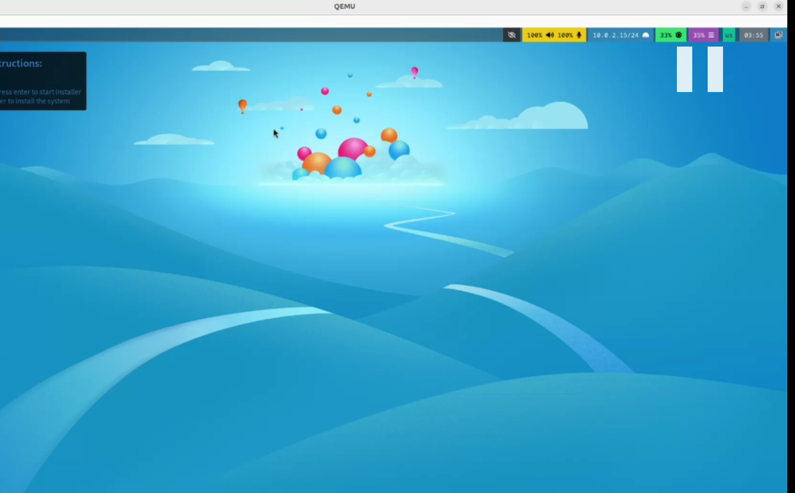
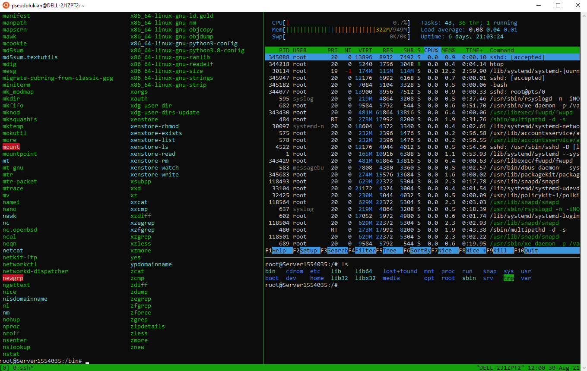
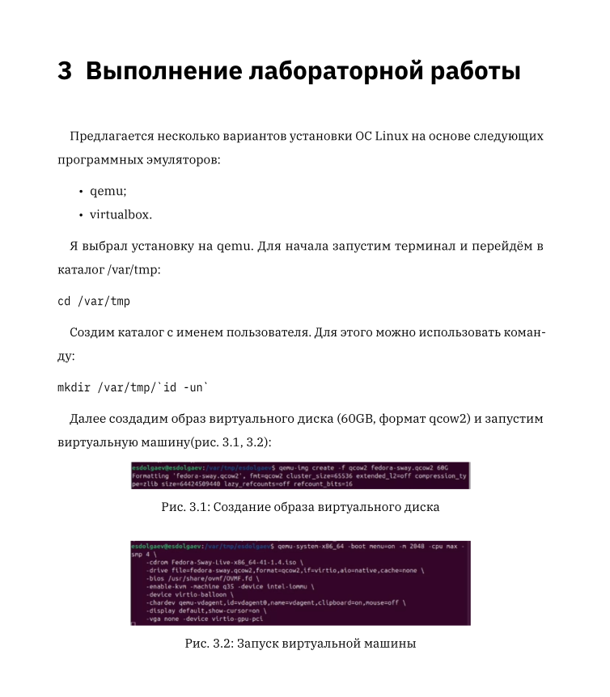

---
## Front matter
lang: ru-RU
title: "Презентация по лаборатоной работе №1"
subtitle: "*Дисциплина: Операционные системы*"
author:
  - Долгаев Е. С.
institute:
  - Российский университет дружбы народов, Москва, Россия
date: 04 марта 2025

## i18n babel
babel-lang: russian
babel-otherlangs: english

## Formatting pdf
toc: false
toc-title: Содержание
slide_level: 2
aspectratio: 169
section-titles: true
theme: metropolis
header-includes:
 - \metroset{progressbar=frametitle,sectionpage=progressbar,numbering=fraction}
---

# Информация

## Докладчик

:::::::::::::: {.columns align=center}
::: {.column width="70%"}

  * Долгаев Евгений Сергеевич
  * студент
  * Российский университет дружбы народов
  * [1132246827@rudn.ru](mailto:1132246827@rudn.ru)
  * <https://github.com/eugerne/study_2024-2024_os-intro.git>

:::
::::::::::::::
# Вводная часть

## Актуальность

- Удобство работы на Linux
- Небольшие системные требования для работы
- Приобретение полезных навыков

## Объект и предмет исследования

- Операционная система Linux (дистрибутив Fedora)
- Программное обеспечение для работы на Linux

## Цели и задачи

- Приобретение практических навыков установки операционной системы на виртуальную машину, настройки минимально необходимых для дальнейшей работы сервисов.


## Материалы и методы

- Виртуальная машина `qemu` или `virtualbox`
- ISO файл: Fedora-Sway-Live-x86_64-41-1.4.iso

# Создание презентации

## Процессор `pandoc`

- Pandoc: преобразователь текстовых файлов
- Сайт: <https://pandoc.org/>
- Репозиторий: <https://github.com/jgm/pandoc>

## Формат `pdf`

- Использование LaTeX
- Пакет для презентации: [beamer](https://ctan.org/pkg/beamer)
- Тема оформления: `metropolis`

## Код для формата `pdf`

```yaml
slide_level: 2
aspectratio: 169
section-titles: true
theme: metropolis
```

## Формат `html`

- Используется фреймворк [reveal.js](https://revealjs.com/)
- Используется [тема](https://revealjs.com/themes/) `beige`

## Код для формата `html`

- Тема задаётся в файле `Makefile`

```make
REVEALJS_THEME = beige 
```
# Результаты

## Получающиеся форматы

- Полученный `pdf`-файл можно демонстрировать в любой программе просмотра `pdf`
- Полученный `html`-файл содержит в себе все ресурсы: изображения, css, скрипты

# Элементы презентации

## Актуальность

- Лабораторная работа подразумевает установку на виртуальную машину `VirtualBox` (или `QEMU`) (<https://www.virtualbox.org/>) операционной системы Linux (дистрибутив Fedora) с минимальным набором сервисов.
- Лабораторная работа помогает понять приципы работы Linux и упрощает дельнейшую работу по созданию, например, отчетов и презентаций.

## Цели и задачи

- Научиться устанавливать операционную систему на виртуальную машину и проводить настройку минимально необходимых для дальнейшей работы сервисов.

## Содержание исследования

- **Установка Linux на qemu**

- Лабораторная работа начинается с установки самой опреционной системы. Будем использовать дистрибутив `Linux Fedora` (<https://getfedora.org>), вариант с менеджером окон `sway` (<https://fedoraproject.org/spins/sway/>).
- Установка проходит в два этапа:

1) qemu-img create -f qcow2 fedora-sway.qcow2 60G

2) qemu-system-x86_64 -boot menu=on -m 2048 -cpu max -smp 4 \
    -cdrom Fedora-Sway-Live-x86_64-41-1.4.iso \
    -drive file=fedora-sway.qcow2,format=qcow2,if=virtio,aio=native,cache=none \
    -bios /usr/share/edk2-ovmf/OVMF_CODE.fd \
    -enable-kvm -machine q35 -device intel-iommu \
    -device virtio-balloon \
    -chardev qemu-vdagent,id=vdagent0,name=vdagent,clipboard=on,mouse=off \
    -display default,show-cursor=on \
    -vga none -device virtio-gpu-pci
    
## Содержание исследования

- Первый создаёт образ виртуального диска на `60GB` в формате `qcow2`, а второй запускает виртуальную машину.
- Результатом этой работы будет запуск графического режима опреционной системы:

- {width=50%}

## Содержание исследования

- **Первичная настройка Linux**

- Далее, для комфортной работы нужно установить несколько инструментов.
- Первым будет `tmux` - это менеджер терминалов, к которому удобно подключаться и отключаться, не теряя при этом процессы и историю.

- {width=40%}

## Содержание исследования

- Потом `pandoc` - это универсальная утилита для работы с текстовыми форматами. 

- {width=40%}

## Содержание исследования

- И наконец, `texlive` - наиболее полный дистрибутив LaTeX (набор макрорасширений компьютерной верстки), поддерживаемый TeX-сообществом. TeX Live позволяет запускать и устанавливать LaTeX на различных операционных системах.
 
- {width=60%}

- Также в ходе лабораторной работы проводится настройка клавиатуры, обновлений пакетов и отключение системы безопасности SElinux.

## Результаты

- Таким образом, мы получили операционную систему, установленную на вирутальную машину, с необходимым набором приложений и инструментов для выполнения последующих лабораторных работ.
