---
## Front matter
title: "Отчёт по лабораторной работе №1"
subtitle: "Дисциплина: Операционные системы"
author: "Долгаев Евгений НММбд-01-24"

## Generic otions
lang: ru-RU
toc-title: "Содержание"

## Bibliography
bibliography: bib/cite.bib
csl: pandoc/csl/gost-r-7-0-5-2008-numeric.csl

## Pdf output format
toc: true # Table of contents
toc-depth: 2
lof: true # List of figures
lot: true # List of tables
fontsize: 12pt
linestretch: 1.5
papersize: a4
documentclass: scrreprt
## I18n polyglossia
polyglossia-lang:
  name: russian
  options:
	- spelling=modern
	- babelshorthands=true
polyglossia-otherlangs:
  name: english
## I18n babel
babel-lang: russian
babel-otherlangs: english
## Fonts
mainfont: IBM Plex Serif
romanfont: IBM Plex Serif
sansfont: IBM Plex Sans
monofont: IBM Plex Mono
mathfont: STIX Two Math
mainfontoptions: Ligatures=Common,Ligatures=TeX,Scale=0.94
romanfontoptions: Ligatures=Common,Ligatures=TeX,Scale=0.94
sansfontoptions: Ligatures=Common,Ligatures=TeX,Scale=MatchLowercase,Scale=0.94
monofontoptions: Scale=MatchLowercase,Scale=0.94,FakeStretch=0.9
mathfontoptions:
## Biblatex
biblatex: true
biblio-style: "gost-numeric"
biblatexoptions:
  - parentracker=true
  - backend=biber
  - hyperref=auto
  - language=auto
  - autolang=other*
  - citestyle=gost-numeric
## Pandoc-crossref LaTeX customization
figureTitle: "Рис."
tableTitle: "Таблица"
listingTitle: "Листинг"
lofTitle: "Список иллюстраций"
lotTitle: "Список таблиц"
lolTitle: "Листинги"
## Misc options
indent: true
header-includes:
  - \usepackage{indentfirst}
  - \usepackage{float} # keep figures where there are in the text
  - \floatplacement{figure}{H} # keep figures where there are in the text
---

# Цель работы

Целью данной работы является приобретение практических навыков установки операционной системы на виртуальную машину, настройки минимально необходимых для дальнейшей работы сервисов.

# Задание

1) Выполнение лабораторной работы
	1. Установка Linux на qemu
	2. Обновления
	3. Повышение комфорта работы
	4. Отключение SELinux
	5. Настройка раскладки клавиатуры
	6. Установка программного обеспечения для создания документации
2) Домашнее задание
3) Ответы на контрольные вопросы

# Выполнение лабораторной работы

Предлагается несколько вариантов установки ОС Linux на основе следующих программных эмуляторов:

- qemu;
- virtualbox.

Я выбрал установку на qemu. Для начала запустим терминал и перейдём в каталог /var/tmp:

```
cd /var/tmp
```

Создим каталог с именем пользователя. Для этого можно использовать команду:

```
mkdir /var/tmp/`id -un`
```

Далее создадим образ виртуального диска (60GB, формат qcow2) и запустим виртуальную машину(рис. [-@fig:001], [-@fig:002]):

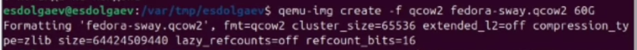{#fig:001 width=70%}

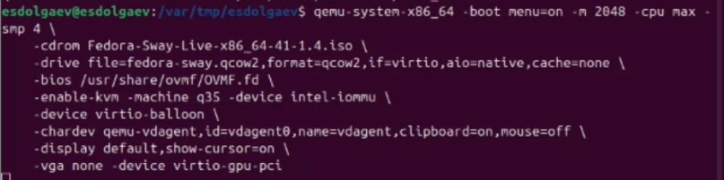{#fig:002 width=70%}

В появившемся окне выберем `Start Fedora-Sway-Live 41`. Открется графический режим, после чего нужно будет нажать сочетание клавиш `Win+D` и запустить установочный лаунчер (рис. [-@fig:003], [-@fig:004]).

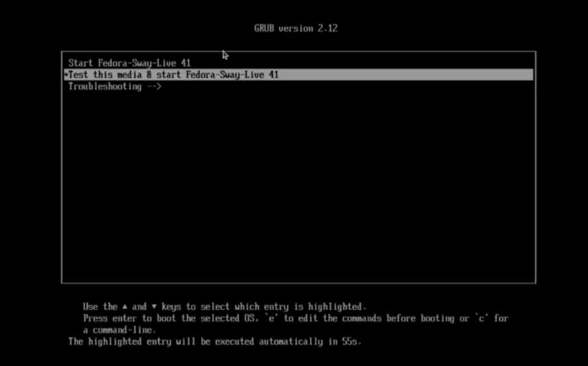{#fig:003 width=70%}

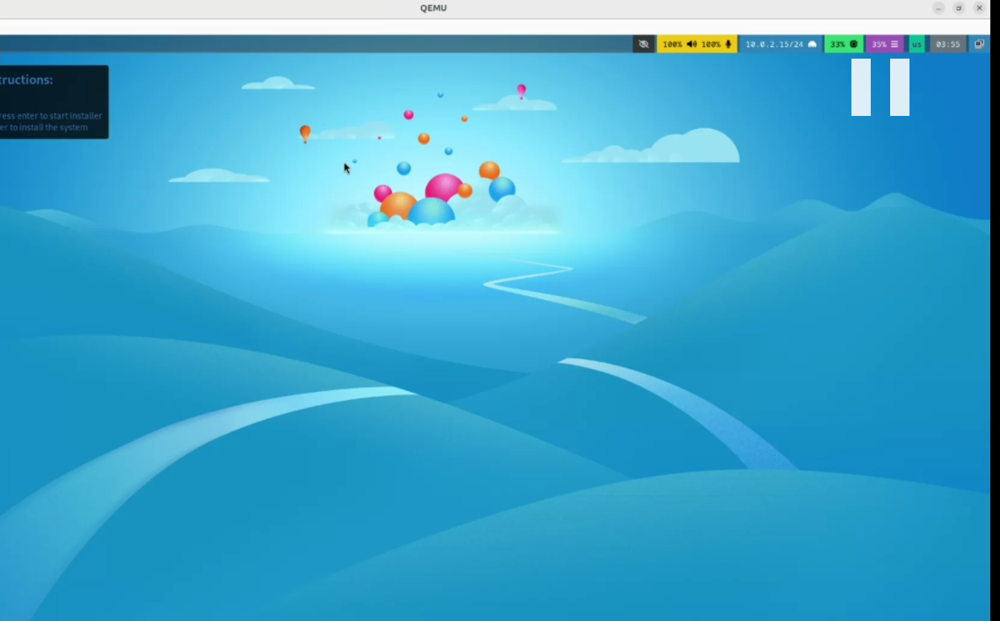{#fig:004 width=70%}

В установочном лаунчере нужно провести небольшую первоначальную настройку OC Linux и запустить сам процесс установки операционной системы (рис. [-@fig:005], [-@fig:006]).

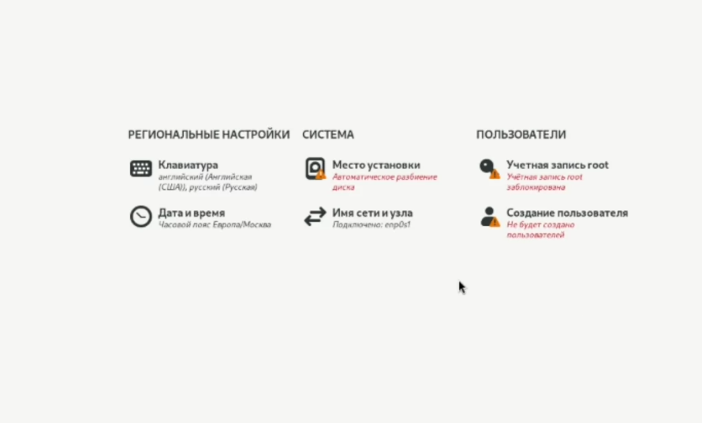{#fig:005 width=70%}

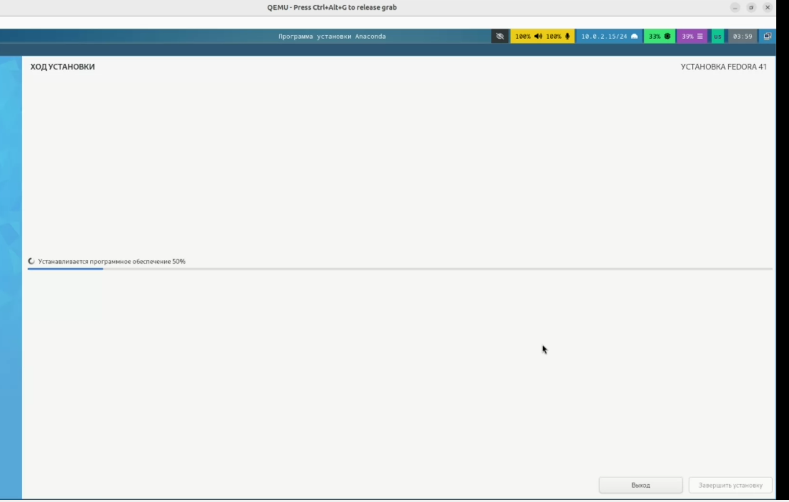{#fig:006 width=70%}

После всего вышесказанного виртуальная машина перезагрузится. Далее нужно войти в ОС под заданной при установке учётной записью (рис. [-@fig:007]).

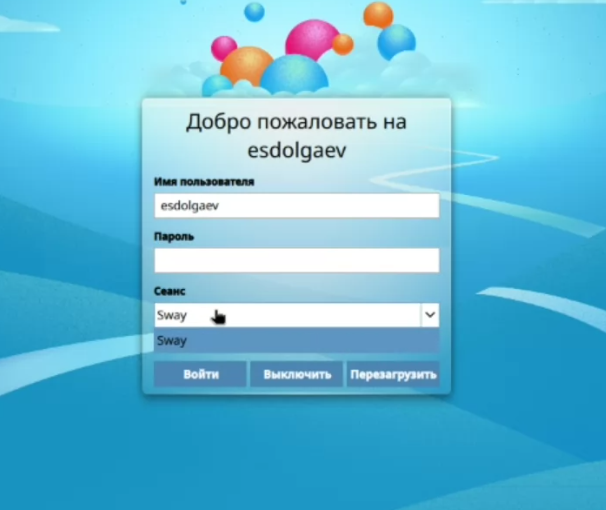{#fig:007 width=70%}

Теперь нужно установить все необходимое для работы в системе. Обновим все пакеты с помощью:

```
sudo dnf -y update
```

И установим программу для удобства работы в консоли (рис. [-@fig:008]):

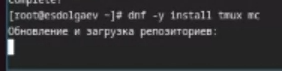{#fig:008 width=70%}

Отключим систему безопасности SELinux. Для этого в файле `/etc/selinux/config` замените значение (рис. [-@fig:009])

> SELINUX=enforcing

на значение

> SELINUX=permissive

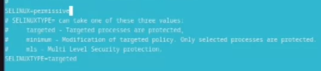{#fig:009 width=70%}

Перейдём к настройке раскладки клавиатуры. Создадим конфигурационный файл `~/.config/sway/config.d/95-system-keyboard-config.conf` (рис. [-@fig:010]):

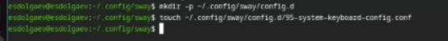{#fig:010 width=70%}

В него нужно будет записать следующую строку:

> exec_always /usr/libexec/sway-systemd/locale1-xkb-config --oneshot

Переключимся на роль супер-пользователя (рис. [-@fig:011]) и отредактируем конфигурационный файл `/etc/X11/xorg.conf.d/00-keyboard.conf` так, как показано на картинке (рис. [-@fig:012]):

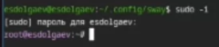{#fig:011 width=70%}

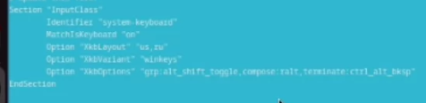{#fig:012 width=70%}

Перезагрузим виртуальную машину.

Установим pandoc и latex с помощью менеджера пакетов (рис. [-@fig:013], [-@fig:014]). Для этого введём команду:

'''
sudo dnf -y install pandoc
'''

и

```
sudo dnf -y install texlive-scheme-full
```

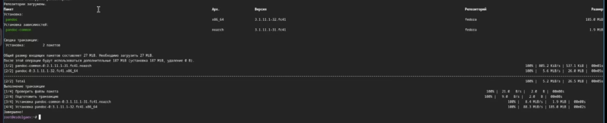{#fig:013 width=70%}

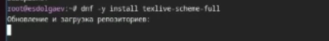{#fig:014 width=70%}

# Домашнее задание

В домашнем задании требовалось найти следующую информацию:


- Версия ядра Linux (Linux version).
- Частота процессора (Detected Mhz processor).
- Модель процессора (CPU0).
- Объём доступной оперативной памяти (Memory available).
- Тип обнаруженного гипервизора (Hypervisor detected).
- Тип файловой системы корневого раздела.
- Последовательность монтирования файловых систем.

с помощью команды:

```
dmesg | grep -i "то, что ищем"
```

Вся информация представлена на скриншотах (рис. [-@fig:015], [-@fig:016], [-@fig:017]):

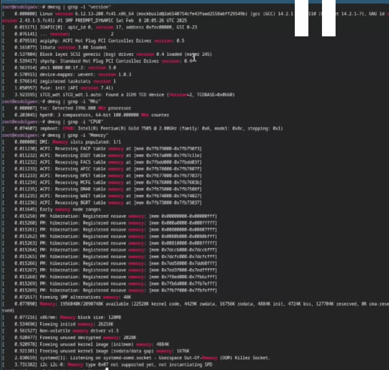{#fig:015 width=70%}

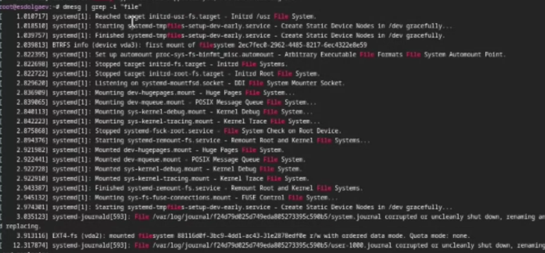{#fig:016 width=70%}

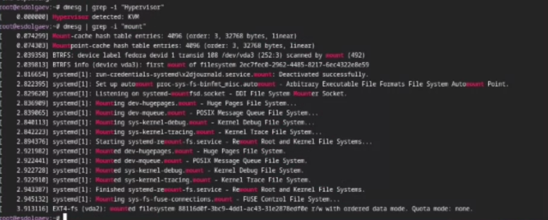{#fig:017 width=70%}

# Ответы на контрольные вопросы

1) Имя, пароль и домашний каталог

2) Команды терминала
	1. `--help` : `mv --help`
	2. `cd` : `cd ~/work`
	3. `ls` : `ls work`
	4. `du` : `du dir1`
	5. `mkdir`/`rm` : `mkdir dir1`/`rm dir1`
	6. `chmod` : `chmod a+x /dir1/1.sh`
	7. `tail .bash_history`
3) Файловая система — это структура, используемая операционной системой для организации и управления файлами на устройстве хранения, например на жестком диске. FAT — одна из старейших и простейших файловых систем. Первоначально она была разработана для MS-DOS и до сих пор используется во многих съемных устройствах хранения. Две основные версии этой системы — FAT16 и FAT32. FAT использует таблицу размещения файлов для отслеживания расположения файлов на диске.

4) Можно определить, какие файловые системы уже подмонтированы в ОС, используя команду mount . -v отображает список смонтированных файловых систем в подробном режиме.

5) Команда kill – это наиболее часто используемый инструмент для уничтожения процессов в Linux.

# Выводы

В ходе выполнения лабораторной работы я приобрёл практические навыки установки операционной системы на виртуальную машину, настройки минимально необходимых для дальнейшей работы сервисов.

# Список литературы{.unnumbered}

::: {#refs}
:::
