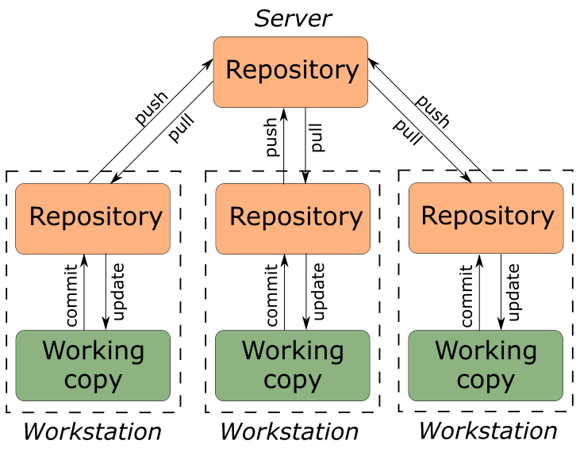
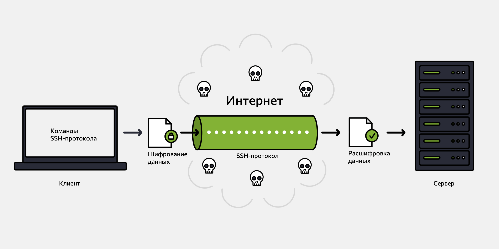
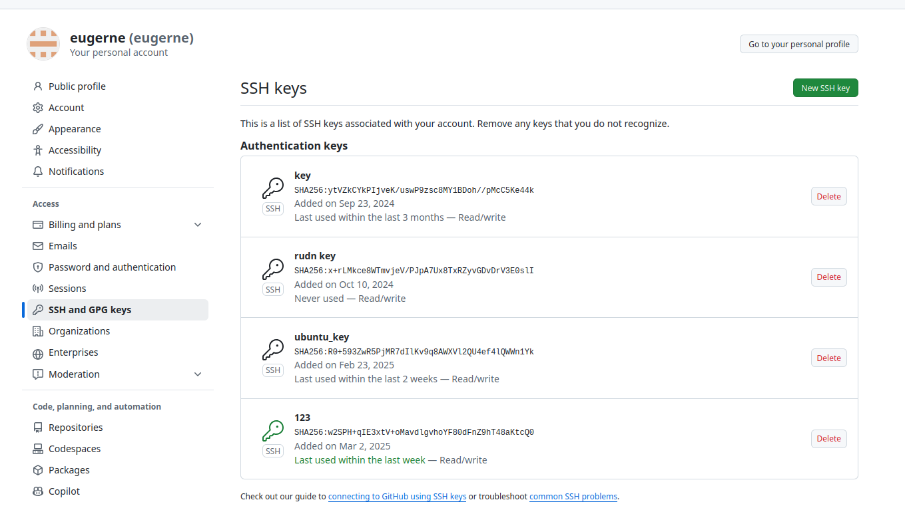
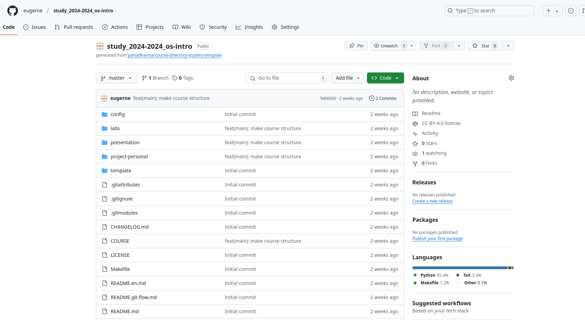

---
## Front matter
lang: ru-RU
title: "Презентация по лаборатоной работе №2"
subtitle: "*Дисциплина: Операционные системы*"
author:
  - Долгаев Е. С.
institute:
  - Российский университет дружбы народов, Москва, Россия
date: 07 марта 2025

## i18n babel
babel-lang: russian
babel-otherlangs: english

## Formatting pdf
toc: false
toc-title: Содержание
slide_level: 2
aspectratio: 169
section-titles: true
theme: metropolis
header-includes:
 - \metroset{progressbar=frametitle,sectionpage=progressbar,numbering=fraction}
---

# Информация

## Докладчик

:::::::::::::: {.columns align=center}
::: {.column width="70%"}

  * Долгаев Евгений Сергеевич
  * студент
  * Российский университет дружбы народов
  * [1132246827@rudn.ru](mailto:1132246827@rudn.ru)
  * <https://github.com/eugerne/study_2024-2024_os-intro.git>

:::
::::::::::::::

# Вводная часть

## Актуальность

- Git отслеживает изменения, которые вносятся в файлы, и позволяет вернуться к предыдущим версиям проекта, если это необходимо
- Удобство хранения большого количества файлов

## Объект и предмет исследования

- Система контроля версий Git
- Основные команды Git для работы с репозиториями

## Цели и задачи

- Изучить идеологию и применение средств контроля версий.
- Освоить умения по работе с git.


# Создание презентации

## Процессор `pandoc`

- Pandoc: преобразователь текстовых файлов
- Сайт: <https://pandoc.org/>
- Репозиторий: <https://github.com/jgm/pandoc>

## Формат `pdf`

- Использование LaTeX
- Пакет для презентации: [beamer](https://ctan.org/pkg/beamer)
- Тема оформления: `metropolis`

## Код для формата `pdf`

```yaml
slide_level: 2
aspectratio: 169
section-titles: true
theme: metropolis
```

## Формат `html`

- Используется фреймворк [reveal.js](https://revealjs.com/)
- Используется [тема](https://revealjs.com/themes/) `beige`

## Код для формата `html`

- Тема задаётся в файле `Makefile`

```make
REVEALJS_THEME = beige 
```
# Результаты

## Получающиеся форматы

- Полученный `pdf`-файл можно демонстрировать в любой программе просмотра `pdf`
- Полученный `html`-файл содержит в себе все ресурсы: изображения, css, скрипты

# Элементы презентации

## Актуальность

- Лабораторная работа предполагает создание рабочего пространства для последующего выполнения заданий по предмету
- Лабораторная работа упрощает манипуляцию с файлами, их копированием и архивацией

## Цели и задачи

- Научиться работать с системой контроля версий Git

## Содержание исследования

- Системы контроля версий (`Version Control System, VCS`) применяются при работе нескольких человек над одним проектом. Обычно основное дерево проекта хранится в локальном или удалённом репозитории, к которому настроен доступ для участников проекта. При внесении изменений в содержание проекта система контроля версий позволяет их фиксировать, совмещать изменения, произведённые разными участниками проекта, производить откат к любой более ранней версии проекта, если это требуется.

{width=30%}

## Содержание исследования

- Лабораторная работа начинается с установки и базовой настройки Git. Далее необходимо создать SSH-ключ, с помощью которого будет регулироваться обмен файлами между сервером и, непосредственно, компьютером.

- Что такое SHH?

- Это защищённый сетевой протокол для удалённого управления сервером через интернет

{width=40%}

## Содержание исследования

- После создания ключа его нужно добавить связать с учётной записью на github. Это делается разделе Settings -> SSH and GPG keys. Выглядит примерно вот так:

{width=40%}

## Содержание исследования

- Следующий шаг это настройка автоматических подписей коммитов git. А затем создание репозитория на Github и копирование его на свой компьютер с последующей настройкой.

{width=40%}

## Результаты

- Таким образом, мы получаем организованное рабочее пространство с возможностью копирование и архивации необходимых фалов

