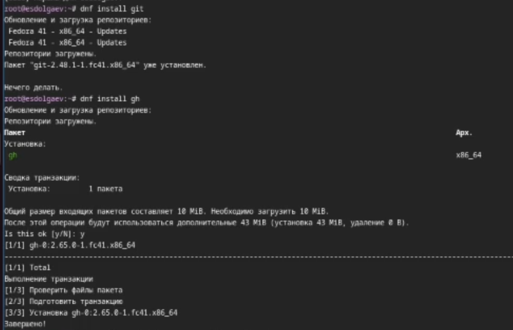
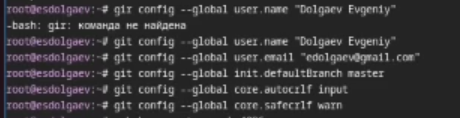
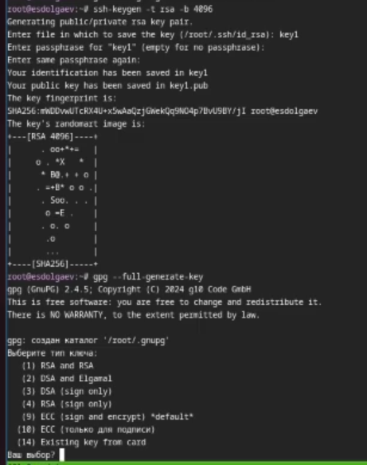
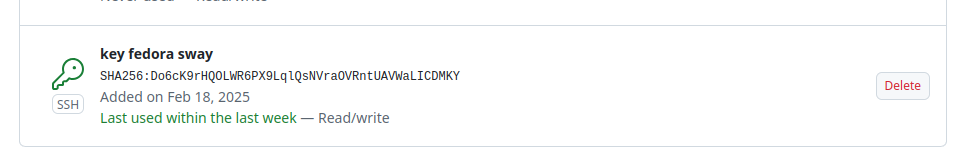
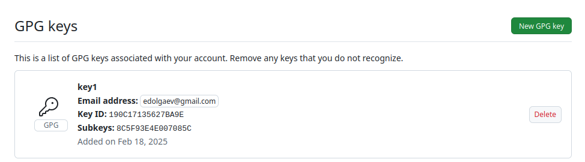
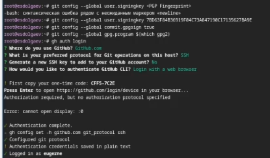
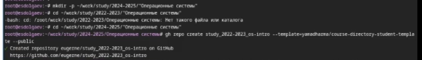
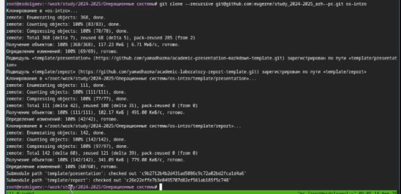
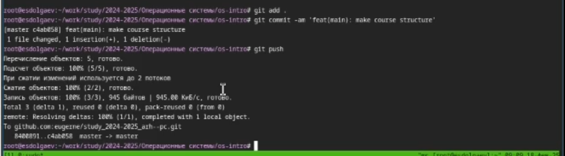

---
## Front matter
title: "Отчёт по лабораторной работе №2"
subtitle: "Дисциплина: Опреционные системы"
author: "Долгаев Евгений НММбд-01-24"

## Generic otions
lang: ru-RU
toc-title: "Содержание"

## Bibliography
bibliography: bib/cite.bib
csl: pandoc/csl/gost-r-7-0-5-2008-numeric.csl

## Pdf output format
toc: true # Table of contents
toc-depth: 2
lof: true # List of figures
lot: true # List of tables
fontsize: 12pt
linestretch: 1.5
papersize: a4
documentclass: scrreprt
## I18n polyglossia
polyglossia-lang:
  name: russian
  options:
	- spelling=modern
	- babelshorthands=true
polyglossia-otherlangs:
  name: english
## I18n babel
babel-lang: russian
babel-otherlangs: english
## Fonts
mainfont: IBM Plex Serif
romanfont: IBM Plex Serif
sansfont: IBM Plex Sans
monofont: IBM Plex Mono
mathfont: STIX Two Math
mainfontoptions: Ligatures=Common,Ligatures=TeX,Scale=0.94
romanfontoptions: Ligatures=Common,Ligatures=TeX,Scale=0.94
sansfontoptions: Ligatures=Common,Ligatures=TeX,Scale=MatchLowercase,Scale=0.94
monofontoptions: Scale=MatchLowercase,Scale=0.94,FakeStretch=0.9
mathfontoptions:
## Biblatex
biblatex: true
biblio-style: "gost-numeric"
biblatexoptions:
  - parentracker=true
  - backend=biber
  - hyperref=auto
  - language=auto
  - autolang=other*
  - citestyle=gost-numeric
## Pandoc-crossref LaTeX customization
figureTitle: "Рис."
tableTitle: "Таблица"
listingTitle: "Листинг"
lofTitle: "Список иллюстраций"
lotTitle: "Список таблиц"
lolTitle: "Листинги"
## Misc options
indent: true
header-includes:
  - \usepackage{indentfirst}
  - \usepackage{float} # keep figures where there are in the text
  - \floatplacement{figure}{H} # keep figures where there are in the text
---

# Цель работы

Изучить идеологию и применение средств контроля версий. Освоить умения по работе с git.

# Задание

1) Выполнение лабораторной работы
	1. Создать базовую конфигурацию для работы с git.
    	2. Создать ключ SSH.
    	3. Создать ключ PGP.
    	4. Настроить подписи git.
    	5. Создать локальный каталог для выполнения заданий по предмету.
2) Ответы на контрольные вопросы

# Выполнение лабораторной работы

Для начала установим git и gh (рис. [-@fig:001]).

{#fig:001 width=70%}

Проведём первоначальную настройку git (рис. [-@fig:002]).

{#fig:002 width=70%}

Создадим SSH и GPG ключи (рис. [-@fig:003]).

{#fig:003 width=70%}

Загрузим ключи на github (рис. [-@fig:004], [-@fig:005]).

{#fig:004 width=70%}

{#fig:005 width=70%}

Настроим автоматических подписей коммитов git (рис. [-@fig:006]).

{#fig:006 width=70%}

Создадим рабочий каталог и скопируем в него наш созданный репозиторий (рис. [-@fig:007], [-@fig:008]).

{#fig:007 width=70%}

{#fig:008 width=70%}

Загрузим файлы на github (рис. [-@fig:009]).

{#fig:009 width=70%}

# Ответы на контрольные вопросы

1) Системы контроля версий (Version Control System, VCS) применяются при работе нескольких человек над одним проектом. Обычно основное дерево проекта хранится в локальном или удалённом репозитории, к которому настроен доступ для участников проекта. При внесении изменений в содержание проекта система контроля версий позволяет их фиксировать, совмещать изменения, произведённые разными участниками проекта, производить откат к любой более ранней версии проекта, если это требуется.

2) Хранилище - это единый репозиторий для хранения файлов. С помощью `commit` можно сохранить в репозитории добавленные изменения. Все изменения сохраняются в `истории изменений`. Рабочей копией называется файл, находящийся в хранилище.

3) В централизованной системе все пользователи подключены к центральному владельцу сети или «серверу». Центральный владелец хранит данные, к которым могут получить доступ другие пользователи, а также информацию о пользователях. У децентрализованных систем нет единого центрального владельца. Вместо этого они используют нескольких центральных владельцев, каждый из которых обычно хранит копию ресурсов, к которым пользователи могут получить доступ. Централизованные: Subversion, децентрализованные: Git

4) Действия с VCS
	1.Стандартные процедуры работы при наличии центрального репозитория
	a) Работа пользователя со своей веткой начинается с проверки и получения изменений из центрального репозитория
	b) Затем можно вносить изменения в локальном дереве и/или ветке.
	2. Работа с локальным репозиторием
	a) Создание локального репозитория
	b) Первичная конфиграция репозитория
	3. Работа с сервером репозиториев
	a) Для идентификации пользователя на сервере репозиториев необходимо сгенерировать пару ключей (приватный и открытый)
	b) Далее ключ нужно связать с репозиторием
	с) Теперь на локальном компьютере можно выполнять стандартные процедуры для работы с git при наличии центрального репозитория

5) Стандартные процедуры работы при наличии центрального репозитория

	1.Работа пользователя со своей веткой начинается с проверки и получения изменений из центрального репозитория (при этом в локальное дерево до начала этой процедуры не должно было вноситься изменений):

```
git checkout master
git pull
git checkout -b имя_ветки
```

	2. Затем можно вносить изменения в локальном дереве и/или ветке.
	3. После завершения внесения какого-то изменения в файлы и/или каталоги проекта необходимо разместить их в центральном репозитории. Для этого необходимо проверить, какие файлы изменились к текущему моменту:

```
git status
```

	4. При необходимости удаляем лишние файлы, которые не хотим отправлять в центральный репозиторий.
	5. Затем полезно просмотреть текст изменений на предмет соответствия правилам ведения чистых коммитов:

```
git diff
```

	6. Если какие-либо файлы не должны попасть в коммит, то помечаем только те файлы, изменения которых нужно сохранить. Для этого используем команды добавления и/или удаления с нужными опциями:

```
git add …
git rm …
```

	7. Если нужно сохранить все изменения в текущем каталоге, то используем:

```
git add .
```

	8. Затем сохраняем изменения, поясняя, что было сделано:

```
git commit -am "Some commit message"
```

	9. Отправляем изменения в центральный репозиторий:

```
git push 
```
6) Основные задачи, решаемые инструментальным средством git
	1. Как не потерять файлы с исходным кодом?
	2. Как защититься от случайных исправлений и удалений?
	3. Как отменить изменения, если они оказались некорректными?
	4. Как одновременно поддерживать рабочую версию и разработку новой?

7) Основные команды git
	1. Создание основного дерева репозитория:

> git init

	2. Получение обновлений (изменений) текущего дерева из центрального репозитория:

> git pull

	3. Отправка всех произведённых изменений локального дерева в центральный репозиторий:

> git push

	4. Просмотр списка изменённых файлов в текущей директории:

> git status

	5. Просмотр текущих изменений:

> git diff

	6. Сохранение текущих изменений:

	a) добавить все изменённые и/или созданные файлы и/или каталоги:

> git add .

	b) добавить конкретные изменённые и/или созданные файлы и/или каталоги:

> git add имена_файлов

	c) удалить файл и/или каталог из индекса репозитория (при этом файл и/или каталог остаётся в локальной директории):

> git rm имена_файлов

	7. Сохранение добавленных изменений:

	a) сохранить все добавленные изменения и все изменённые файлы:

> git commit -am 'Описание коммита'

	b) сохранить добавленные изменения с внесением комментария через встроенный редактор:

> git commit

	c) создание новой ветки, базирующейся на текущей:

> git checkout -b имя_ветки

	d) переключение на некоторую ветку:

> git checkout имя_ветки

	e) отправка изменений конкретной ветки в центральный репозиторий:

> git push origin имя_ветки

	f) слияние ветки с текущим деревом:

> git merge --no-ff имя_ветки

	8. Удаление ветки:

	a) удаление локальной уже слитой с основным деревом ветки:

> git branch -d имя_ветки

	b) принудительное удаление локальной ветки:

> git branch -D имя_ветки

	c) удаление ветки с центрального репозитория:

> git push origin :имя_ветки

8) Команда status для просмотра изменений в рабочем каталоге, сделанных с момента последней ревизии:

```
git status
```
Команда, которая связывается с указанным удалённым проектом и забирает все те данные проекта, которых у вас ещё нет. 

```
git fetch []
```

9) Команда git branch — главный инструмент для работы с ветвлением. С ее помощью можно добавлять новые ветки, перечислять и переименовывать существующие и удалять их.

10) Если какие-либо файлы не должны попасть в коммит, то помечаем только те файлы, изменения которых нужно сохранить. Для этого используем команды добавления и/или удаления с нужными опциями:

```
git add …
git rm …
```

# Выводы

В ходе выполнения лабораторной работы я освоил навыки по работе с git.

# Список литературы{.unnumbered}

::: {#refs}
:::
