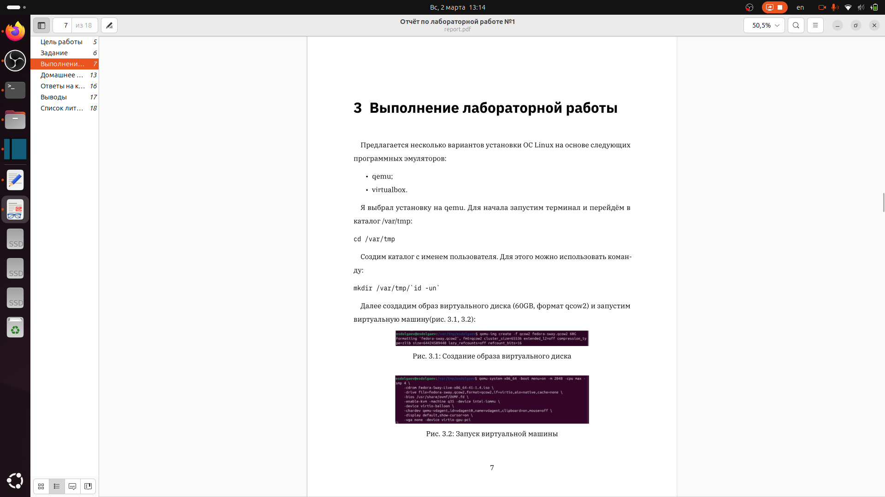
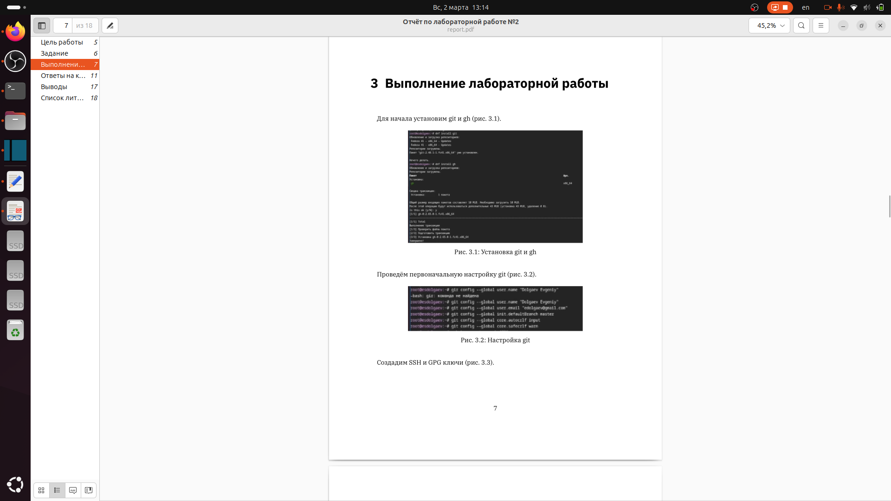

---
## Front matter
lang: ru-RU
title: "Презентация по лаборатоной работе №3"
subtitle: "*Дисциплина: Операционные системы*"
author:
  - Долгаев Е. С.
institute:
  - Российский университет дружбы народов, Москва, Россия
date: 07 марта 2025

## i18n babel
babel-lang: russian
babel-otherlangs: english

## Formatting pdf
toc: false
toc-title: Содержание
slide_level: 2
aspectratio: 169
section-titles: true
theme: metropolis
header-includes:
 - \metroset{progressbar=frametitle,sectionpage=progressbar,numbering=fraction}
---

# Информация

## Докладчик

:::::::::::::: {.columns align=center}
::: {.column width="70%"}

  * Долгаев Евгений Сергеевич
  * студент
  * Российский университет дружбы народов
  * [1132246827@rudn.ru](mailto:1132246827@rudn.ru)
  * <https://github.com/eugerne/study_2024-2024_os-intro.git>

:::
::::::::::::::

# Вводная часть

## Актуальность

- Отчет --- рабочий инструмент исследователя
- Необходимо отчет презентацию быстро
- Желательна минимизация усилий для создания отчета

## Объект и предмет исследования

- Отчет по проведенной работе
- Программное обеспечение для создания отчета
- Входные и выходные форматы отчетов

## Цели и задачи

- Создать отчет по лабораторным работам

## Материалы и методы

- Процессор `pandoc` для входного формата Markdown
- Результирующие форматы
	- `pdf`
	- `docx`
- Автоматизация процесса создания: `Makefile`

# Создание презентации

## Процессор `pandoc`

- Pandoc: преобразователь текстовых файлов
- Сайт: <https://pandoc.org/>
- Репозиторий: <https://github.com/jgm/pandoc>

## Формат `pdf`

- Использование LaTeX
- Пакет для презентации: [beamer](https://ctan.org/pkg/beamer)
- Тема оформления: `metropolis`

## Код для формата `pdf`

```yaml
slide_level: 2
aspectratio: 169
section-titles: true
theme: metropolis
```

## Формат `html`

- Используется фреймворк [reveal.js](https://revealjs.com/)
- Используется [тема](https://revealjs.com/themes/) `beige`

## Код для формата `html`

- Тема задаётся в файле `Makefile`

```make
REVEALJS_THEME = beige 
```
# Результаты

## Получающиеся форматы

- Полученный `pdf`-файл можно демонстрировать в любой программе просмотра `pdf`
- Полученный `html`-файл содержит в себе все ресурсы: изображения, css, скрипты

# Элементы презентации

## Актуальность

- Лабораторная работа является небольшой научно-исследовательской работой, которую и оформлять следует по всем утверждённым требованиям. Отчет помогает кратко рассказать об этапах работы.

## Цели и задачи

- Научиться оформлять отчёты с помощью легковесного языка разметки Markdown.

## Содержание исследования

- Отчеты по лабораторным работам создаются с помощью легковесного языка разметки Markdown.
- Markdown — это облегчённый язык разметки для форматирования текстовых документов. Markdown-файлы без потерь преобразуются в другие форматы (например, HTML и PDF), открываются в любом текстовом редакторе и будут понятны любому человеку даже в виде исходного кода.

## Содержание исследования

- **Примеры синтаксиса**

- Чтобы создать заголовок, используйте знак ( # ), например:

```
 # This is heading 1
 ## This is heading 2
 ### This is heading 3
 #### This is heading 4
```

- Чтобы задать для текста полужирное начертание, заключите его в двойные звездочки:

```
 This text is **bold**.
```

- Чтобы задать для текста курсивное начертание, заключите его в одинарные звездочки:

```
 This text is *italic*.
```

## Содержание исследования

- Лабораторная работа предполагает создание отчетов по первым двум лабораторным работам.

- Содержание отчета
	1) Титульный лист с указанием номера лабораторной работы и ФИО студента.
	2) Формулировка задания работы.
	3) Описание результатов выполнения задания:
		* скриншоты (снимки экрана), фиксирующие выполнение лабораторной работы;
		* ответы на вопросы;
	4) Выводы, согласованные с заданием работы.
	
## Содержание исследования

- Финальная версия отчета должна выглядеть примерно вот так:

{width=30%}

## Содержание исследования

{width=30%}

## Результаты

- Таким образом, мы получаем документ в форматах `pdf` и `docx`, в котором наглядно продемонстрированы основные этапы работы и её результат

