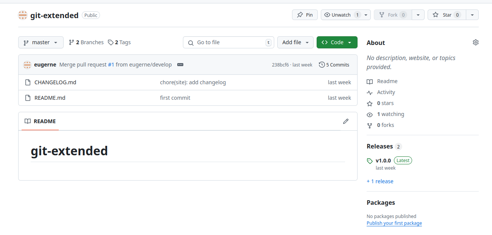
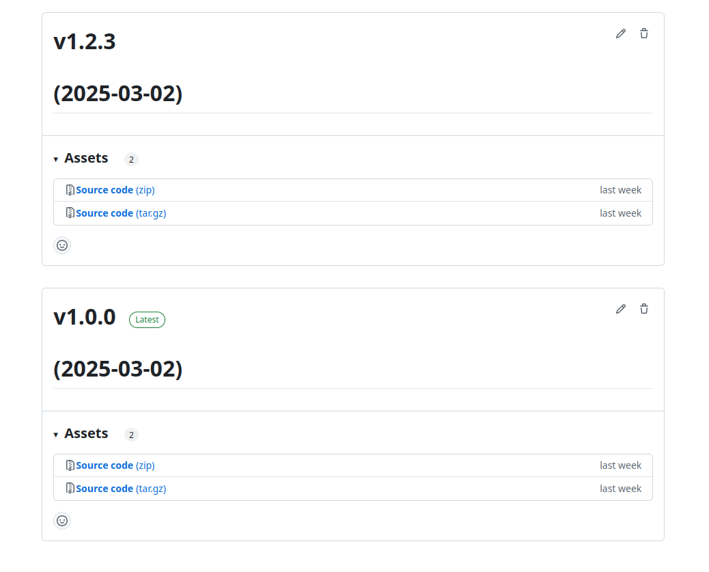

---
## Front matter
lang: ru-RU
title: "Презентация по лабораторной работе №4"
subtitle: "*Дисциплина: Операционные системы*"
author:
  - Долгаев Е. С.
institute:
  - Российский университет дружбы народов, Москва, Россия
date: 08 марта 2025

## i18n babel
babel-lang: russian
babel-otherlangs: english

## Formatting pdf
toc: false
toc-title: Содержание
slide_level: 2
aspectratio: 169
section-titles: true
theme: metropolis
header-includes:
 - \metroset{progressbar=frametitle,sectionpage=progressbar,numbering=fraction}
---

# Информация

## Докладчик

:::::::::::::: {.columns align=center}
::: {.column width="70%"}

  * Долгаев Евгений Сергеевич
  * студент
  * Российский университет дружбы народов
  * [1123246827@rudn.ru](mailto:1123246827@rudn.ru)
  * <https://github.com/eugerne/study_2024-2024_os-intro.git>

:::
::::::::::::::

# Вводная часть

# Создание презентации

## Процессор `pandoc`

- Pandoc: преобразователь текстовых файлов
- Сайт: <https://pandoc.org/>
- Репозиторий: <https://github.com/jgm/pandoc>

## Формат `pdf`

- Использование LaTeX
- Пакет для презентации: [beamer](https://ctan.org/pkg/beamer)
- Тема оформления: `metropolis`

## Код для формата `pdf`

```yaml
slide_level: 2
aspectratio: 169
section-titles: true
theme: metropolis
```

## Формат `html`

- Используется фреймворк [reveal.js](https://revealjs.com/)
- Используется [тема](https://revealjs.com/themes/) `beige`

## Код для формата `html`

- Тема задаётся в файле `Makefile`

```make
REVEALJS_THEME = beige 
```
# Результаты

## Получающиеся форматы

- Полученный `pdf`-файл можно демонстрировать в любой программе просмотра `pdf`
- Полученный `html`-файл содержит в себе все ресурсы: изображения, css, скрипты

# Лабораторная работа

## Актуальность

- Для выполнения лабораторных работы важно уметь правильно работать с системой контроля версий Git

## Цели и задачи

- Получение навыков правильной работы с репозиториями git.
- Выполнить работу для тестового репозитория.
- Преобразовать рабочий репозиторий в репозиторий с git-flow и conventional commits.


## Объект и предмет исследования

- Система контроля версий git
- Продвинутые команды git
- Процесс работы с gitflow

## Программное обеспечение

- Пакет Conventional Changelog
  * Пакет Conventional Changelog является комплексным решением по управлению коммитами и генерации журнала изменений.
  * Содержит набор утилит, которые можно использовать по-отдельности.

## Содержание исследования

- Лабораторная работа начинается с установки `gitflow` и `Node.js`.
- `Gitflow` — альтернативная модель ветвления `git`, в которой используются функциональные ветки и несколько основных веток. `Gitflow` представляет собой стратегию работы с ветками и процессами в системе управления версиями, которая упрощает и структурирует распределение задач и выпуск новых версий проекта.
- Ветвление в `gitflow` выглядит так:

{width=40%}

## Содержание исследования

- `Node.js` — программная платформа, основанная на движке `ChromeV8`, превращающая `JavaScript` из узкоспециализированного языка в язык общего назначения. То есть, `Node.js` позволяет использовать язык программирования `JavaScript` не только в браузере.
- Далее идёт непосредственная работа с репозиторием на `github`. Его необходимо будет создать и создать в нём два релиза.

{width=70%}

## Содержание исследования

{width=70%}

## Результаты

- Результатом этой лабораторной работы являются навыки правильной работы с `git`, приобретённые в ходе её выполнения.

