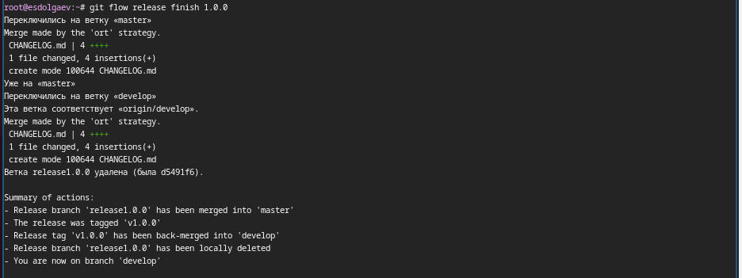
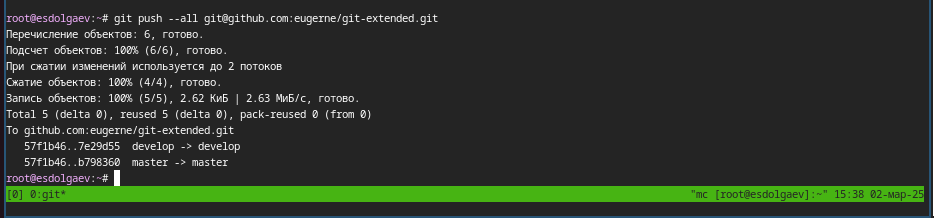
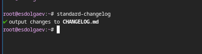

---
## Front matter
title: "Отчёт по лабораторной работе №4"
subtitle: "*Дисциплина: Операционные системы*"
author: "Долгаев Евгений НММбд-01-24"

## Generic otions
lang: ru-RU
toc-title: "Содержание"

## Bibliography
bibliography: bib/cite.bib
csl: pandoc/csl/gost-r-7-0-5-2008-numeric.csl

## Pdf output format
toc: true # Table of contents
toc-depth: 2
lof: true # List of figures
lot: true # List of tables
fontsize: 12pt
linestretch: 1.5
papersize: a4
documentclass: scrreprt
## I18n polyglossia
polyglossia-lang:
  name: russian
  options:
	- spelling=modern
	- babelshorthands=true
polyglossia-otherlangs:
  name: english
## I18n babel
babel-lang: russian
babel-otherlangs: english
## Fonts
mainfont: IBM Plex Serif
romanfont: IBM Plex Serif
sansfont: IBM Plex Sans
monofont: IBM Plex Mono
mathfont: STIX Two Math
mainfontoptions: Ligatures=Common,Ligatures=TeX,Scale=0.94
romanfontoptions: Ligatures=Common,Ligatures=TeX,Scale=0.94
sansfontoptions: Ligatures=Common,Ligatures=TeX,Scale=MatchLowercase,Scale=0.94
monofontoptions: Scale=MatchLowercase,Scale=0.94,FakeStretch=0.9
mathfontoptions:
## Biblatex
biblatex: true
biblio-style: "gost-numeric"
biblatexoptions:
  - parentracker=true
  - backend=biber
  - hyperref=auto
  - language=auto
  - autolang=other*
  - citestyle=gost-numeric
## Pandoc-crossref LaTeX customization
figureTitle: "Рис."
tableTitle: "Таблица"
listingTitle: "Листинг"
lofTitle: "Список иллюстраций"
lotTitle: "Список таблиц"
lolTitle: "Листинги"
## Misc options
indent: true
header-includes:
  - \usepackage{indentfirst}
  - \usepackage{float} # keep figures where there are in the text
  - \floatplacement{figure}{H} # keep figures where there are in the text
---

# Цель работы

Получение навыков правильной работы с репозиториями git.

# Задание

1) Выполнить работу для тестового репозитория.
2) Преобразовать рабочий репозиторий в репозиторий с git-flow и conventional commits.


# Выполнение лабораторной работы

## Установка программного обеспечения

Для начала установим Gitflow (рис. [-@fig:001]).

{#fig:001 width=70%}

Далее установим Node.js и настроим его (рис. [-@fig:002], [-@fig:003], [-@fig:004])

{#fig:002 width=70%}

{#fig:003 width=70%}

{#fig:004 width=70%}

Настроим общепринятые коммиты (рис. [-@fig:005], [-@fig:006]):

1) commitizen

{#fig:005 width=70%}

2) standard-changelog

{#fig:006 width=70%}

## Практический сценарий использования git

Создим репозиторий на GitHub. Для примера назовём его git-extended (рис. [-@fig:007]).

{#fig:007 width=70%}

Сделаем первый коммит (рис. [-@fig:008], [-@fig:009]).

{#fig:008 width=70%}

{#fig:009 width=70%}

Далее произведем конфигурацию для пакетов Node.js с помощью команды:

```
pnpm init
```

Сконфигурим формат коммитов. Для этого добавим в файл package.json команду для формирования коммитов:

```
 "config": {
        "commitizen": {
            "path": "cz-conventional-changelog"
       }
 }
```

Добавим новые файлы (рис. [-@fig:010]):

{#fig:010 width=70%}

Выполним коммит и отправим на github (рис. [-@fig:011]):

{#fig:011 width=70%}

Инициализируем git-flow (рис. [-@fig:012]):

{#fig:012 width=70%}

Проверим, что мы на ветке develop: (рис. [-@fig:013]):

{#fig:013 width=70%}

Загрузим весь репозиторий в хранилище: (рис. [-@fig:014]):

{#fig:014 width=70%}

Установим внешнюю ветку как вышестоящую для этой ветки (рис. [-@fig:015]):

{#fig:015 width=70%}

Создадим релиз с версией 1.0.0 (рис. [-@fig:016]):

{#fig:016 width=70%}

Создадим журнал изменений (рис. [-@fig:017]):

{#fig:017 width=70%}

Добавим журнал изменений в индекс (рис. [-@fig:018]):

{#fig:018 width=70%}
 
Зальём релизную ветку в основную ветку (рис. [-@fig:019]):

{#fig:019 width=70%}

Отправим данные на github (рис. [-@fig:020], [-@fig:021]):

{#fig:020 width=70%}

{#fig:021 width=70%}


Создадим ветку для новой функциональности (рис. [-@fig:022]):

{#fig:022 width=70%}

Далее, продолжаем работу c git как обычно.
По окончании разработки новой функциональности следующим шагом следует объединить ветку feature_branch c develop (рис. [-@fig:023]):

{#fig:023 width=70%}

Создадим релиз с версией 1.2.3 (рис. [-@fig:024]):	

{#fig:024 width=70%}

Обновим номер версии в файле package.json (рис. [-@fig:025]).

{#fig:025 width=70%}

Создадим журнал изменений (рис. [-@fig:026]):

{#fig:026 width=70%}

Добавим журнал изменений в индекс (рис. [-@fig:027]):

{#fig:027 width=70%}

Создадим релиз на github с комментарием из журнала изменений. Для этого будем использовать утилиты работы с github: (рис. [-@fig:028]):

{#fig:028 width=70%}

# Выводы

В ходе выполнения лаборатоной работы я получил навыки управления репозиториями git.

# Список литературы{.unnumbered}

::: {#refs}
:::
