---
## Front matter
lang: ru-RU
title: "Презентация к лабораторной работе №5"
subtitle: "Дисциплина: Операционные системы"
author:
  - Долгаев Е. С.
institute:
  - Российский университет дружбы народов, Москва, Россия
date: 14 марта 2025

## i18n babel
babel-lang: russian
babel-otherlangs: english

## Formatting pdf
toc: false
toc-title: Содержание
slide_level: 2
aspectratio: 169
section-titles: true
theme: metropolis
header-includes:
 - \metroset{progressbar=frametitle,sectionpage=progressbar,numbering=fraction}
---

# Информация

## Докладчик

:::::::::::::: {.columns align=center}
::: {.column width="30%"}

  * Долгаев Евгений Сергеевич
  * студент
  * Российский университет дружбы народов
  * [1132246827@rudn.ru](mailto:1132246827@rudn.ru)
  * <https://github.com/eugerne/dotfiles.git>

:::
::::::::::::::

# Вводная часть

## Актуальность

- Улучшение рабочей среды

## Объект и предмет исследования

- Рабочая среда для выполнения лабораторных работ

## Цели и задачи

- Настроить рабочую среду

# Лабораторная работа

## Содержание исследования

### Менеджер паролей pass

#### Установка

Установим менеджер паролей pass.

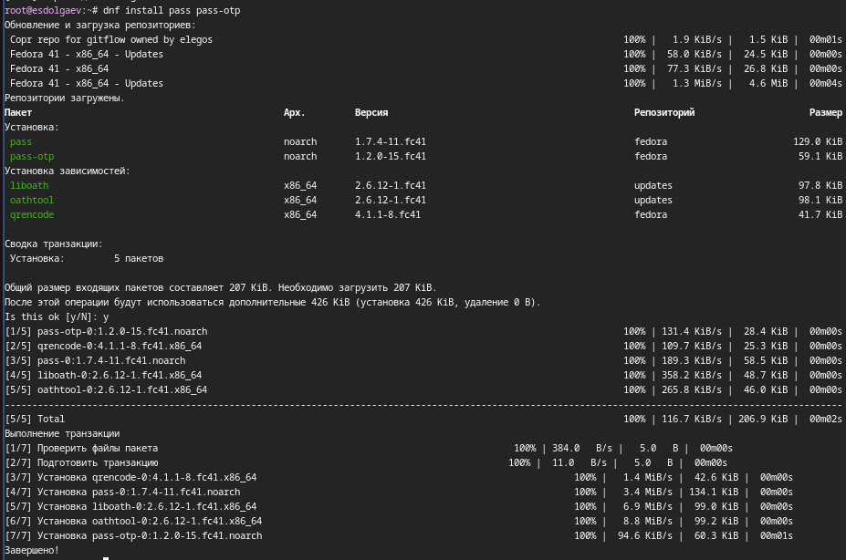{width=40%}

## Содержание исследования

#### Настройка

Выведем список GPG-ключей.

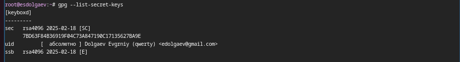{width=40%}

## Содержание исследования

Инициализируем хранилище.

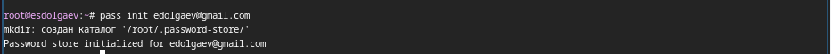{width=40%}

## Содержание исследования

Создадим структуру git.

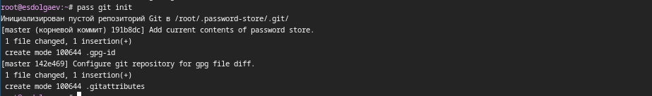{width=40%}

## Содержание исследования

#### Настройка интерфейса с броузером

Для взаимодействия с броузером используется интерфейс native messaging, кроме того нужно установить плагин к браузеру.

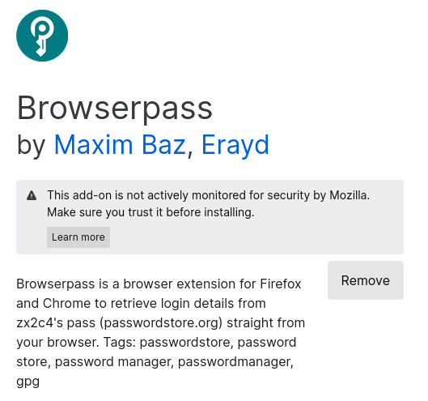{width=40%}

## Содержание исследования

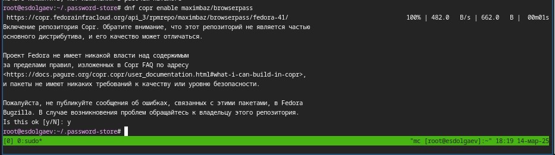{width=40%}

## Содержание исследования

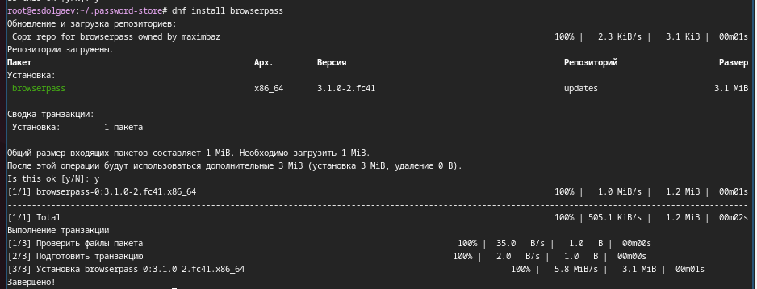{width=40%}

## Содержание исследования

#### Сохранение пароля

Добавим новый пароль в файл parol в каталоге passwords.

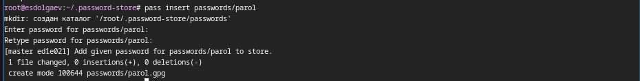{width=40%}

## Содержание исследования

Отобразим пароль для указанного имени файла.

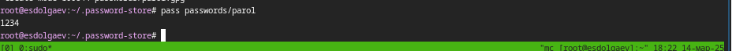{width=40%}

## Содержание исследования

Заменим существующий пароль.

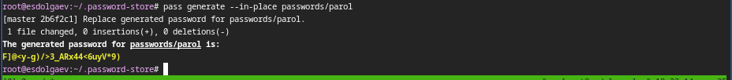{width=40%}

## Содержание исследования

### Управление файлами конфигурации

### Дополнительное программное обеспечение

Установим дополнительное программное обеспечение.

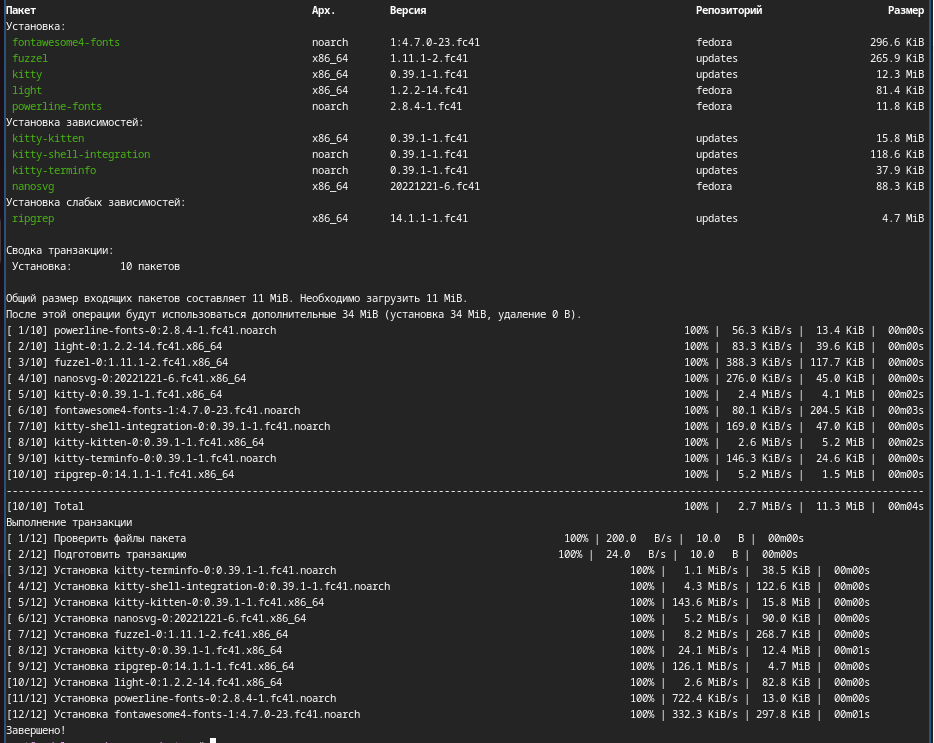{width=40%}

## Содержание исследования

Установите шрифты.

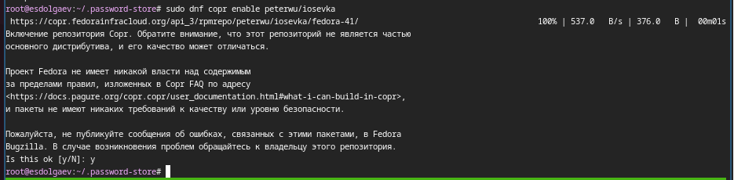{width=40%}

## Содержание исследования

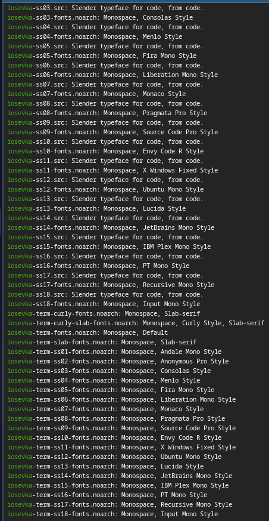{width=20%}

## Содержание исследования

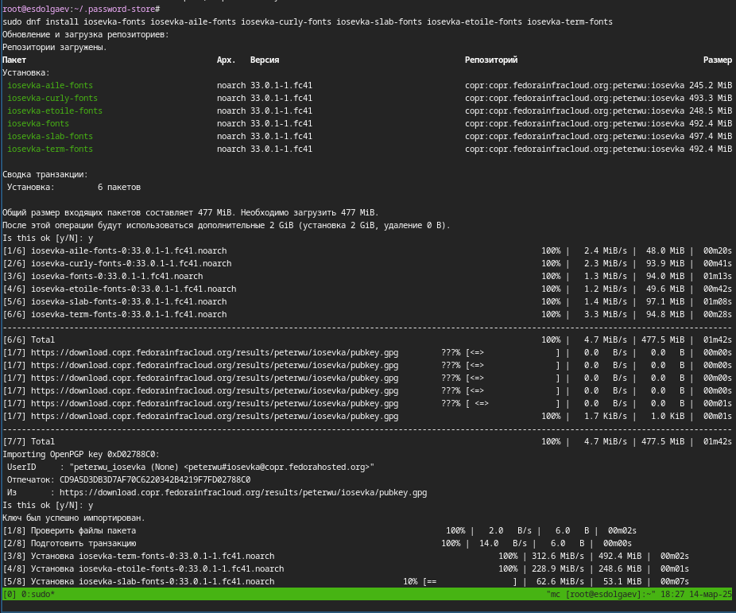{width=40%}

## Содержание исследования

#### Установка

Установим бинарный файл. Скрипт определяет архитектуру процессора и операционную систему и скачивает необходимый файл.

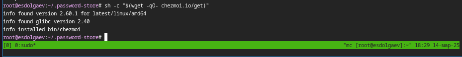{width=40%}

## Содержание исследования

#### Создание собственного репозитория с помощью утилит

Будем использовать утилиты командной строки для работы с github. Создадим свой репозиторий для конфигурационных файлов на основе шаблона. 

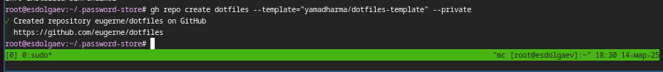{width=40%}

## Содержание исследования

#### Подключение репозитория к своей системе

Инициализируем chezmoi с нашим репозиторием dotfiles.

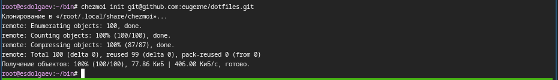{width=40%}

## Содержание исследования

Проверим, какие изменения внесёт chezmoi в домашний каталог, запустив.

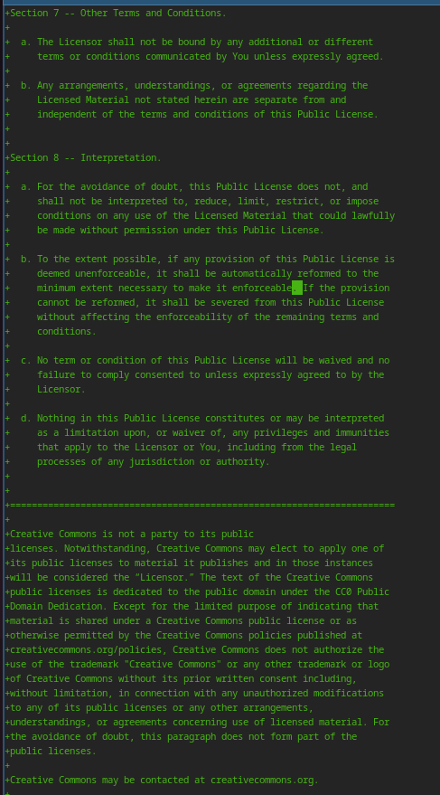{width=20%}

## Содержание исследования

#### Использование chezmoi на нескольких машинах

Сделаем всё то же самое, что и в прошлом шаге на второй машине. Поскольку OC Linux Fedora установлена у меня на виртуальной машине, поэтому в качестве второй машины я выбрал свою осноную ОС (Linux Ubuntu).

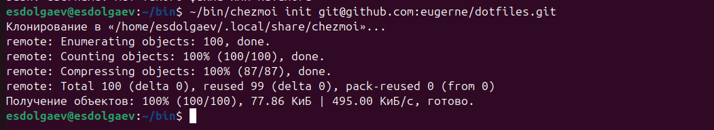{width=40%}

## Содержание исследования

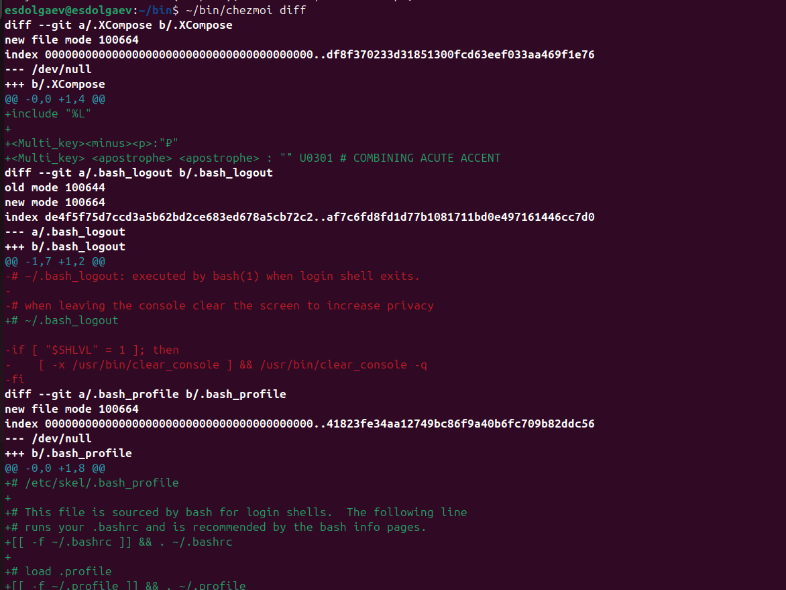{width=40%}

## Содержание исследования

#### Настройка новой машины с помощью одной команды

Можно установить свои dotfiles на новый компьютер с помощью одной команды.

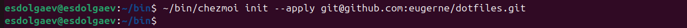{width=60%}

## Содержание исследования

#### Ежедневные операции c chezmoi

Ивлечём изменения из репозитория и применить их одной командой.

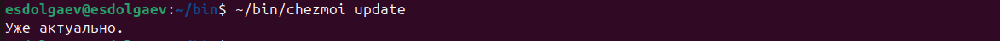{width=60%}

## Содержание исследования

Извлечём последние изменения из своего репозитория и посмотрим, что изменится, фактически не применяя изменения. 

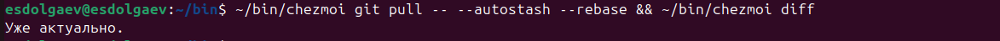{width=60%}

## Содержание исследования

Применим изменения.

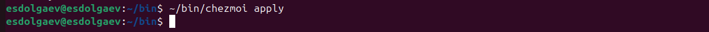{width=60%}

## Содержание исследования

Включим автоматическую фиксацию и отправку изменений, добавив в файл конфигурации ~/.config/chezmoi/chezmoi.toml следующее.

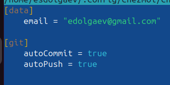{width=40%}

## Результаты

- Таким образом, мы получаем настроенную рабочую среду.

