---
## Front matter
title: "Отчет по лабораторной работе №5"
subtitle: "*Дисциплина: Архитектура компьютера*"
author: "Долгаев Евгений НММбд-01-24"

## Generic otions
lang: ru-RU
toc-title: "Содержание"

## Bibliography
bibliography: bib/cite.bib
csl: pandoc/csl/gost-r-7-0-5-2008-numeric.csl

## Pdf output format
toc: true # Table of contents
toc-depth: 2
lof: true # List of figures
lot: true # List of tables
fontsize: 12pt
linestretch: 1.5
papersize: a4
documentclass: scrreprt
## I18n polyglossia
polyglossia-lang:
  name: russian
  options:
	- spelling=modern
	- babelshorthands=true
polyglossia-otherlangs:
  name: english
## I18n babel
babel-lang: russian
babel-otherlangs: english
## Fonts
mainfont: IBM Plex Serif
romanfont: IBM Plex Serif
sansfont: IBM Plex Sans
monofont: IBM Plex Mono
mathfont: STIX Two Math
mainfontoptions: Ligatures=Common,Ligatures=TeX,Scale=0.94
romanfontoptions: Ligatures=Common,Ligatures=TeX,Scale=0.94
sansfontoptions: Ligatures=Common,Ligatures=TeX,Scale=MatchLowercase,Scale=0.94
monofontoptions: Scale=MatchLowercase,Scale=0.94,FakeStretch=0.9
mathfontoptions:
## Biblatex
biblatex: true
biblio-style: "gost-numeric"
biblatexoptions:
  - parentracker=true
  - backend=biber
  - hyperref=auto
  - language=auto
  - autolang=other*
  - citestyle=gost-numeric
## Pandoc-crossref LaTeX customization
figureTitle: "Рис."
tableTitle: "Таблица"
listingTitle: "Листинг"
lofTitle: "Список иллюстраций"
lotTitle: "Список таблиц"
lolTitle: "Листинги"
## Misc options
indent: true
header-includes:
  - \usepackage{indentfirst}
  - \usepackage{float} # keep figures where there are in the text
  - \floatplacement{figure}{H} # keep figures where there are in the text
---

# Цель работы

Настроить рабочую среду.

# Задание

1) Установить менеджера паролей pass
	- Установка
	- Настройка
	- Настройка интерфейса с броузером
	- Сохранение пароля
2) Поработать с файлами конфигурации
3) Установить дополнительное программное обеспечение
	- Установка
	- Создание собственного репозитория с помощью утилит
	- Подключение репозитория к своей системе
	- Использование chezmoi на нескольких машинах
	- Настройка новой машины с помощью одной команды
	- Ежедневные операции c chezmoi

# Выполнение лабораторной работы

## Менеджер паролей pass

### Установка

Установим менеджер паролей pass (рис. [-@fig:001]).

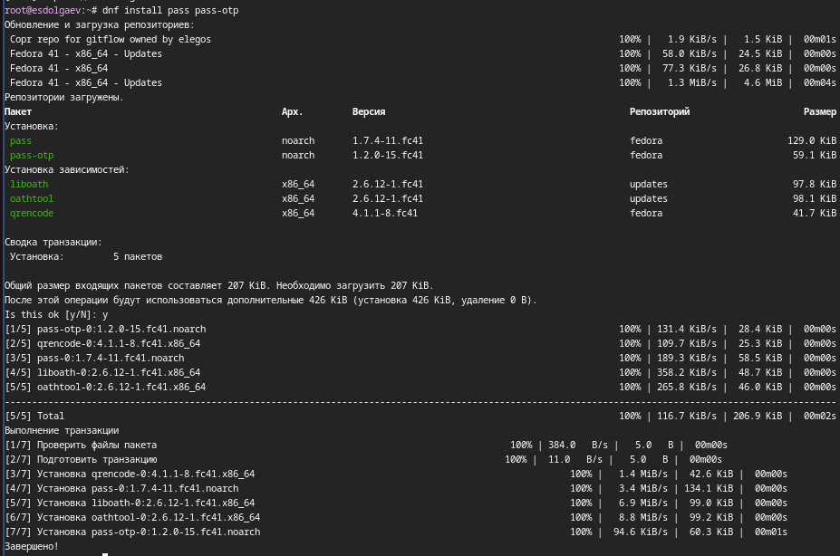{#fig:001 width=70%}

### Настройка

Выведем список GPG-ключей (рис. [-@fig:002]).

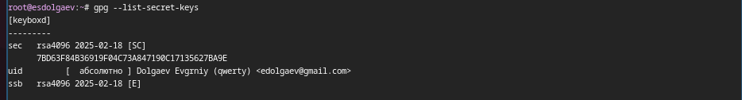{#fig:002 width=70%}

Инициализируем хранилище (рис. [-@fig:003]).

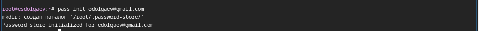{#fig:003 width=70%}

Создадим структуру git (рис. [-@fig:004]).

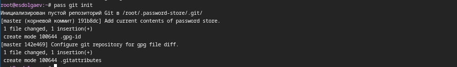{#fig:004 width=70%}

### Настройка интерфейса с броузером

Для взаимодействия с броузером используется интерфейс native messaging, кроме того нужно установить плагин к браузеру (рис. [-@fig:005], [-@fig:006], [-@fig:007]).

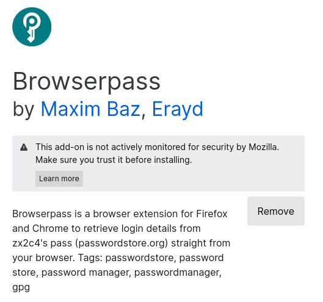{#fig:005 width=70%}

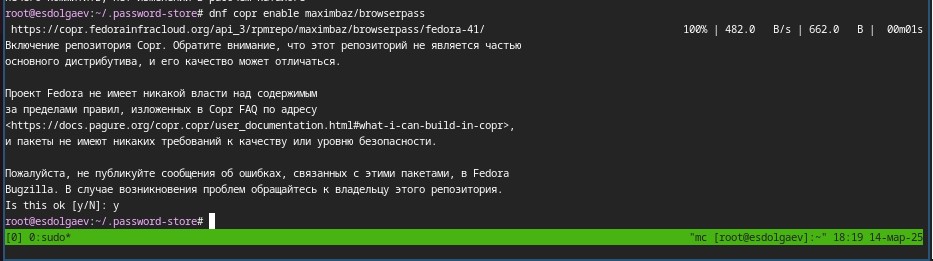{#fig:006 width=70%}

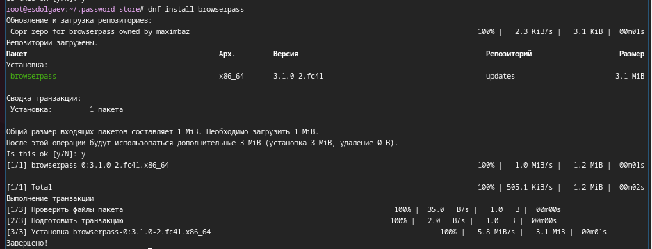{#fig:007 width=70%}

### Сохранение пароля

Добавим новый пароль в файл parol в каталоге passwords (рис. [-@fig:008]).

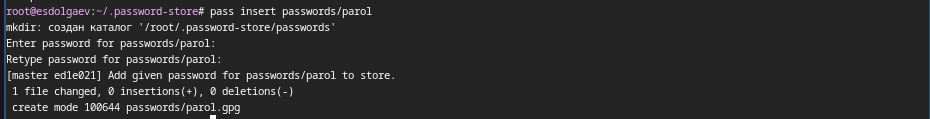{#fig:008 width=70%}

Отобразим пароль для указанного имени файла (рис. [-@fig:009]).

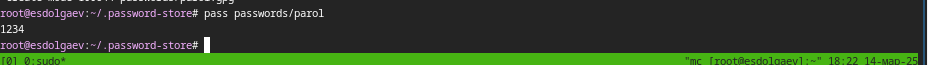{#fig:009 width=70%}

Заменим существующий пароль (рис. [-@fig:010]).

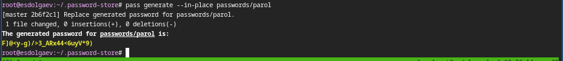{#fig:010 width=70%}

## Управление файлами конфигурации

## Дополнительное программное обеспечение

Установим дополнительное программное обеспечение (рис. [-@fig:011]).

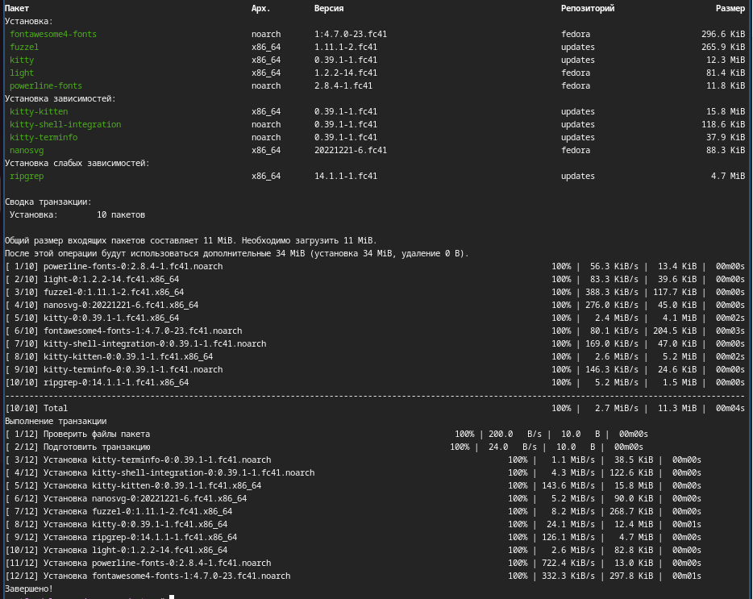{#fig:011 width=70%}

Установите шрифты (рис. [-@fig:012], [-@fig:013], [-@fig:014]).

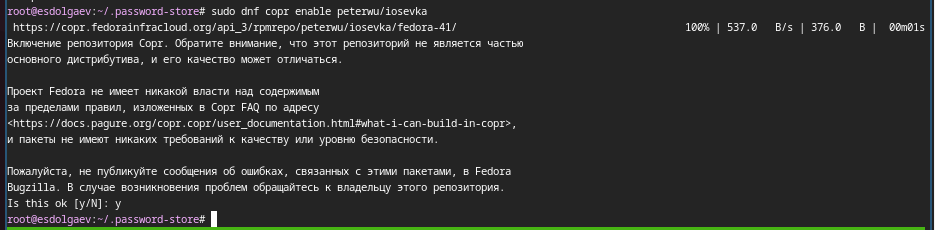{#fig:012 width=70%}

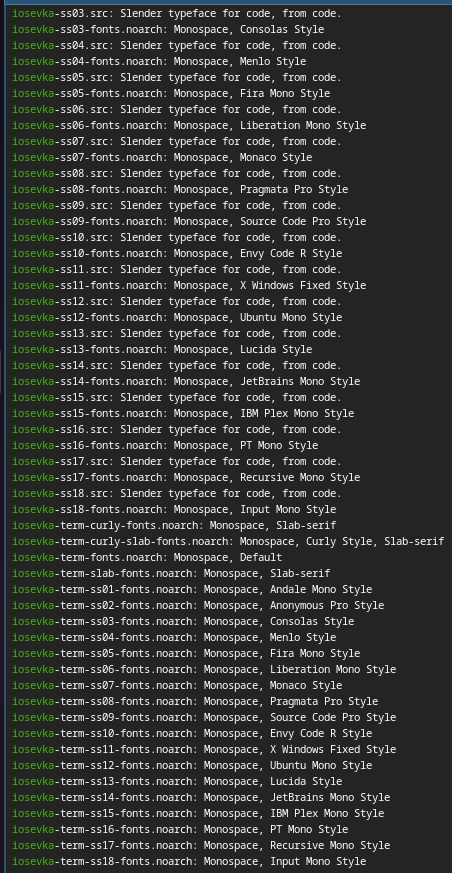{#fig:013 width=70%}

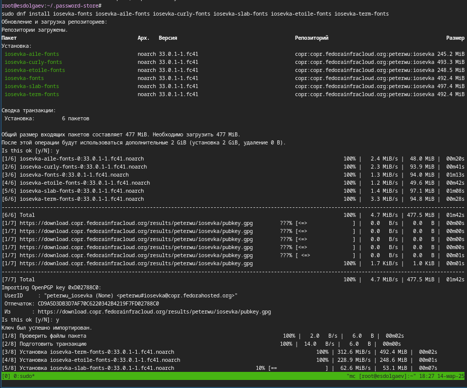{#fig:014 width=70%}

### Установка

Установим бинарный файл. Скрипт определяет архитектуру процессора и операционную систему и скачивает необходимый файл (рис. [-@fig:015]).

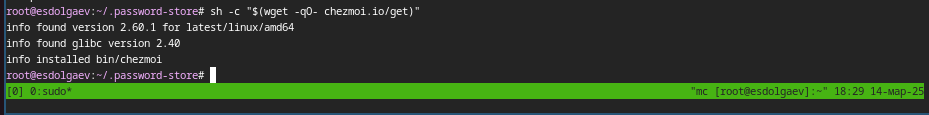{#fig:015 width=70%}

### Создание собственного репозитория с помощью утилит

Будем использовать утилиты командной строки для работы с github. Создадим свой репозиторий для конфигурационных файлов на основе шаблона (рис. [-@fig:016]). 

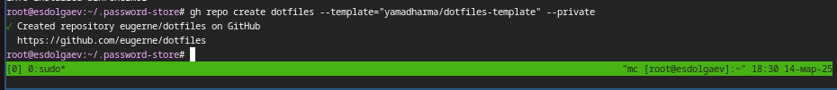{#fig:016 width=70%}

### Подключение репозитория к своей системе

Инициализируем chezmoi с нашим репозиторием dotfiles (рис. [-@fig:017]).

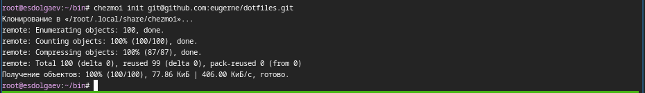{#fig:017 width=70%}

Проверим, какие изменения внесёт chezmoi в домашний каталог, запустив (рис. [-@fig:018]).

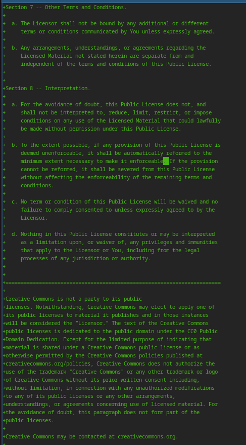{#fig:018 width=70%}

### Использование chezmoi на нескольких машинах

Сделаем всё то же самое, что и в прошлом шаге на второй машине. Поскольку OC Linux Fedora установлена у меня на виртуальной машине, поэтому в качестве второй машины я выбрал свою осноную ОС (Linux Ubuntu) (рис. [-@fig:019], [-@fig:020]).

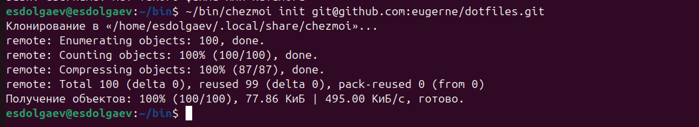{#fig:019 width=70%}

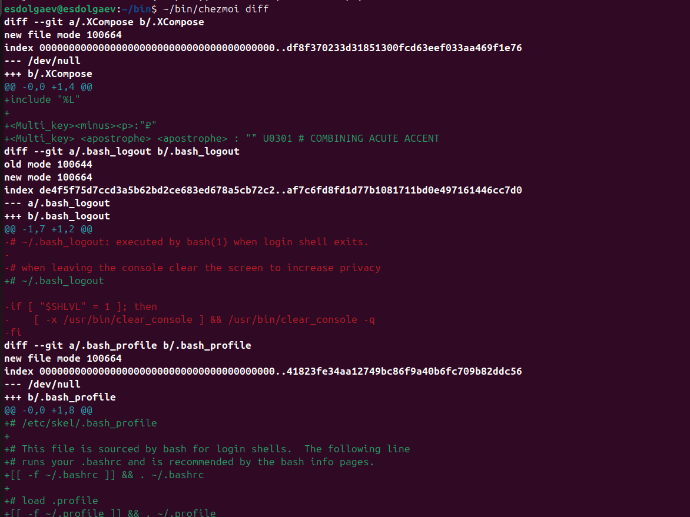{#fig:020 width=70%}

### Настройка новой машины с помощью одной команды

Можно установить свои dotfiles на новый компьютер с помощью одной команды (рис. [-@fig:021]).

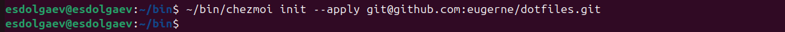{#fig:021 width=70%}

### Ежедневные операции c chezmoi

Ивлечём изменения из репозитория и применить их одной командой (рис. [-@fig:022]).

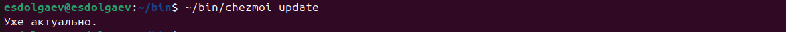{#fig:022 width=70%}

Извлечём последние изменения из своего репозитория и посмотрим, что изменится, фактически не применяя изменения (рис. [-@fig:023]). 

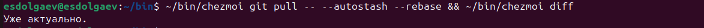{#fig:023 width=70%}

Применим изменения (рис. [-@fig:024]).

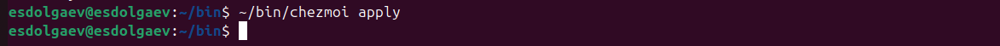{#fig:024 width=70%}

Включим автоматическую фиксацию и отправку изменений, добавив в файл конфигурации ~/.config/chezmoi/chezmoi.toml следующее (рис. [-@fig:025]).

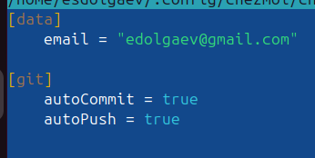{#fig:025 width=70%}

# Выводы

Таким образом, мы получаем настроенную рабочую среду.

# Список литературы{.unnumbered}

::: {#refs}
:::
