---
## Front matter
lang: ru-RU
title: "Презентация к лабораторной работе №6"
subtitle: "*Дисциплина: Архитектура компьютера*"
author:
  - Долгаев Е. С.
institute:
  - Российский университет дружбы народов, Москва, Россия
date: 22 марта 2025

## i18n babel
babel-lang: russian
babel-otherlangs: english

## Formatting pdf
toc: false
toc-title: Содержание
slide_level: 2
aspectratio: 169
section-titles: true
theme: metropolis
header-includes:
 - \metroset{progressbar=frametitle,sectionpage=progressbar,numbering=fraction}
---

# Информация

## Докладчик

:::::::::::::: {.columns align=center}
::: {.column width="40%"}

  * Долгаев Евгений Сергеевич
  * студент
  * Российский университет дружбы народов
  * [1132246827@rudn.ru](mailto:1132246827@rudn.ru)
  * <https://github.com/eugerne/study_2024-2024_os-intro.git>

:::
::::::::::::::

# Лабораторная работа

## Актуальность

- Навыки работы с командной строкой необходимы для администрирования, автоматизации и разработки.

## Цели и задачи

- Приобретение практических навыков взаимодействия пользователя с системой посредством командной строки.

## Содержание исследования

Определим полное имя вашего домашнего каталога.

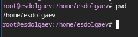{#fig:001 width=40%}

## Содержание исследования

Перейдём в каталог /tmp.

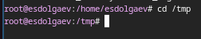{#fig:002 width=40%}

## Содержание исследования

Выведем на экран содержимое каталога /tmp. Используя команду ls с аргументами можно получить разные результаты.

- -a - отобразить имена скрытых файлов
- -l - вывести на экран подробную информацию о файлах и каталогах
- -F - получить информацию о типах файлов (каталог, исполняемый файл, ссылка)

## Содержание исследования

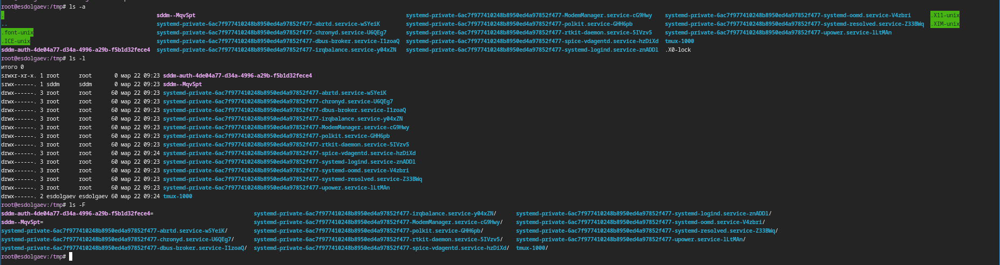{#fig:003 width=40%}

## Содержание исследования

Определим, есть ли в каталоге /var/spool подкаталог с именем cron? Ответ: Да, есть.

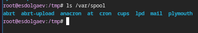{#fig:004 width=40%}

## Содержание исследования

Перейдём в домашний каталог и выведите на экран его содержимое. Владельцем каталогов является пользователь с именем esdolgaev.

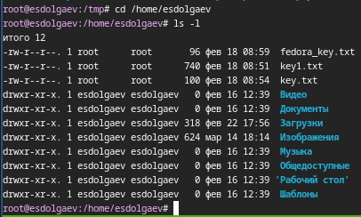{#fig:005 width=40%}

## Содержание исследования

В домашнем каталоге создим новый каталог с именем newdir.

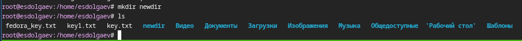{#fig:006 width=40%}

## Содержание исследования

В каталоге ~/newdir создим новый каталог с именем morefun.

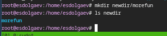{#fig:007 width=40%}

## Содержание исследования

В домашнем каталоге создим одной командой три новых каталога с именами letters, memos, misk. Затем удалите эти каталоги одной командой. 

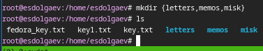{#fig:008 width=40%}

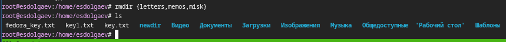{#fig:009 width=40%}

## Содержание исследования

Попробуем удалить ранее созданный каталог ~/newdir командой rm.

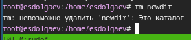{#fig:010 width=40%}

## Содержание исследования

Удалим каталог ~/newdir/morefun из домашнего каталога.

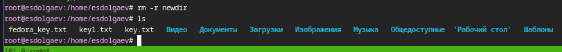{#fig:011 width=40%}

## Содержание исследования

С помощью команды man определим, какую опцию команды ls нужно использовать для просмотра содержимое не только указанного каталога, но и подкаталогов, входящих в него. Ответ: Нужно использовать опцию -R(-r).

## Содержание исследования

С помощью команды man определим набор опций команды ls, позволяющий отсортировать по времени последнего изменения выводимый список содержимого каталога с развёрнутым описанием файлов. Ответ: Нужно использовать опцию -lt.

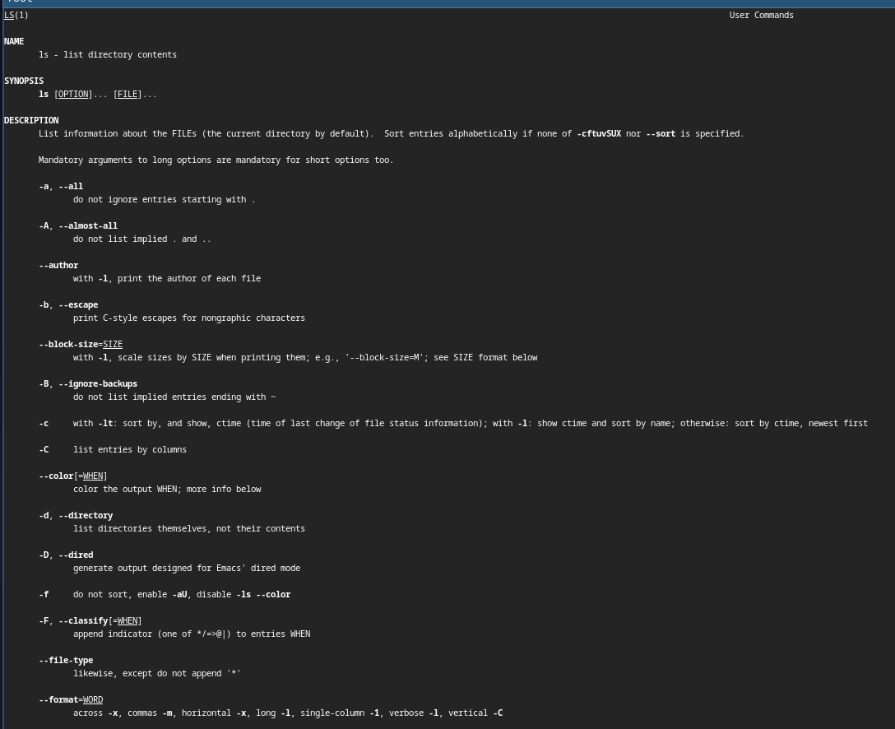{#fig:012 width=40%}

## Содержание исследования

Используйте команду man для просмотра описания следующих команд: cd, pwd, mkdir, rmdir, rm.

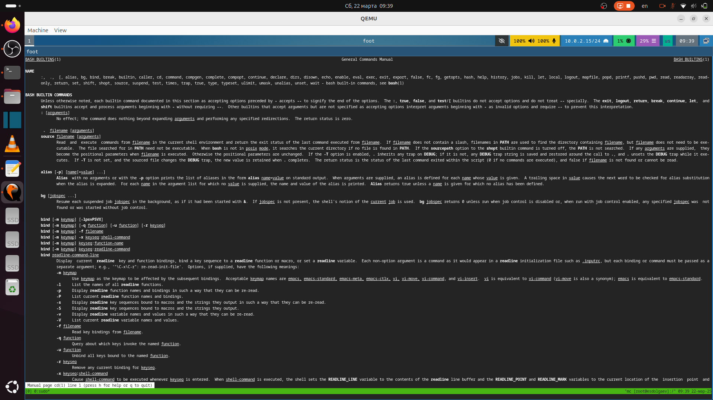{#fig:013 width=40%}

## Содержание исследования

{#fig:014 width=40%}

## Содержание исследования

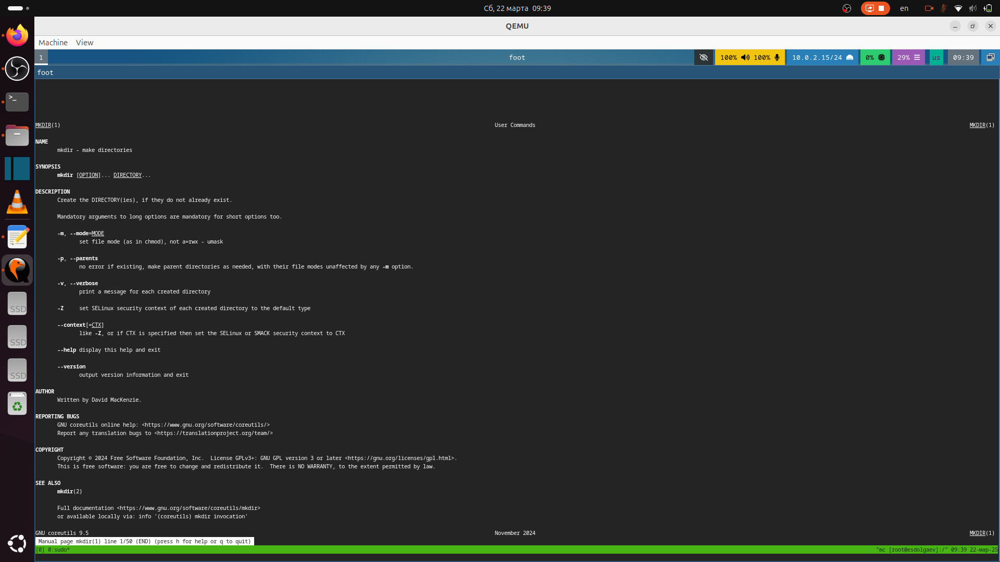{#fig:015 width=40%}

## Содержание исследования

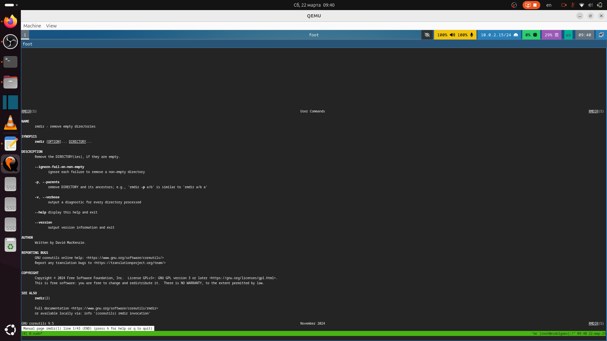{#fig:016 width=40%}

## Содержание исследования

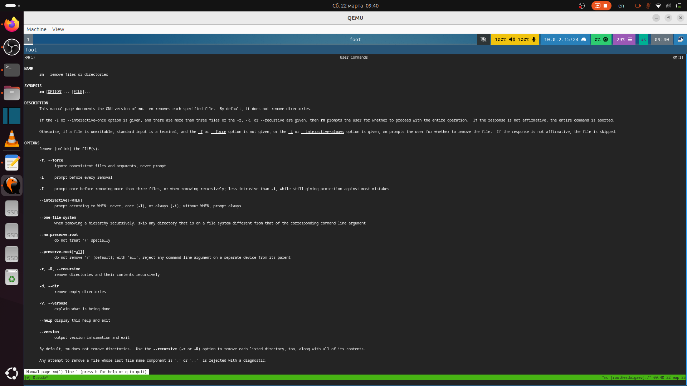{#fig:017 width=40%}

## Содержание исследования

### Команда cd

- cd - переносит вас в ваш домашний каталог
- cd ~ - также переносит вас в ваш домашний каталог
- cd / - переносит вас в корневой каталог всей системы
- cd /root - переносит вас в домашний каталог пользователя root, или супер-пользователя, учётной записи, созданной во время установки системы

## Содержание исследования

### Команда pwd

pwd - отображает полный путь к текущей рабочей директории

## Содержание исследования

### Команда mkdir

- m (--mode=режим) - назначить режим доступа (права). По умолчанию mod принимает значение 0777, что обеспечивает неограниченные права.
- -p (--parents) - не показывать ошибки, а также их игнорировать.
- -z  (--context=CTX ) принимает контекст SELinux для каталога по умолчанию.
- -v (--verbose) - выводить сообщение о каждом новым каталоге.
- --help - вывести справочную информацию.
- --version - выводит информацию о текущей версии утилиты.

## Содержание исследования

### Команда rmdir

- --ignore-fail-on-non-empty - Игнорировать каждый сбой, который происходит исключительно из-за того, что каталог не пуст
- -p, --parents - Удалить каталог и его родителей
- -v, --verbose - Выводить диагностику для каждого обработанного каталога

## Содержание исследования

### Команда rm

- -f - дает возможность игнорировать несуществующие аргументы и определенные типы файлов. В ОС Linux никогда не появится запрос на подтверждение изъятия файлов/директорий, которые вы предварительно указали.
- -i - перед удалением выводится запрос на подтверждение.
- -I - такая функция позволяет вывести на экран 1 запрос на удаление определенной группы файлов. Она пригодится в том случае, когда вам необходимо убрать более трех файлов или провести рекурсивное удаление. Опция «-I» является более бережной версией «-i».
- -d -  удалить пустые директории.
- -r - рекурсивное удаление.

## Содержание исследования

Используя информацию, полученную при помощи команды history, выполним модификацию и исполнение нескольких команд из буфера команд.

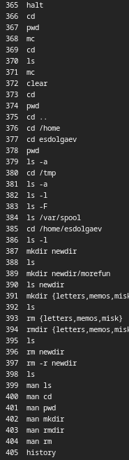{#fig:018 width=20%}

## Содержание исследования

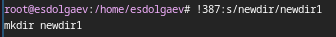{#fig:019 width=40%}

## Содержание исследования

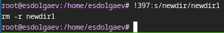{#fig:020 width=40%}

## Ответы на контрольные вопросы

1) Командная строка — текстовый интерфейс пользователя для взаимодействия с операционной системой компьютера и/или другим программным обеспечением с помощью команд, вводимых с клавиатуры.
2) pwd (cd ~/work; pwd)
3) ls c опциями -a, -l, -F (ls -a dir1)
4) ls c опцией -alF (ls -alF dir1)
5) rm и rmdir; да, можно, для этого нужно использовать опцию -r (rm -r dir1)
6) history
7) !`[номер_команды_в_списке]`:`s/[что_меняем]/[на_что_меняем] (!5:s/a/F)`
8) mkdir dir1; rmdir dir1
9) Если в заданном контексте встречаются специальные символы (типа «.», «/», «*» и т.д.), надо перед ними поставить символ экранирования \ (обратный слэш) (!7:s/\-/\*)
10) Выводит на экран подробную информацию о файлах и каталогах

## Ответы на контрольные вопросы

11) Относительный путь — это путь к файлу относительно текущего каталога (cd /var/tmp)
12) С помощью команды man [интересующая_вас_команда]
13) Клавиша tab

## Результаты

- В ходе выполнения лабораторной работы я приобрел практические навыки взаимодействия с системой посредством командной строки.

