---
## Front matter
title: "Отчет по лабораторной работе №6"
subtitle: "*Дисциплина: Операционные системы*"
author: "Долгаев Евгений НММбд-01-24"

## Generic otions
lang: ru-RU
toc-title: "Содержание"

## Bibliography
bibliography: bib/cite.bib
csl: pandoc/csl/gost-r-7-0-5-2008-numeric.csl

## Pdf output format
toc: true # Table of contents
toc-depth: 2
lof: true # List of figures
lot: true # List of tables
fontsize: 12pt
linestretch: 1.5
papersize: a4
documentclass: scrreprt
## I18n polyglossia
polyglossia-lang:
  name: russian
  options:
	- spelling=modern
	- babelshorthands=true
polyglossia-otherlangs:
  name: english
## I18n babel
babel-lang: russian
babel-otherlangs: english
## Fonts
mainfont: IBM Plex Serif
romanfont: IBM Plex Serif
sansfont: IBM Plex Sans
monofont: IBM Plex Mono
mathfont: STIX Two Math
mainfontoptions: Ligatures=Common,Ligatures=TeX,Scale=0.94
romanfontoptions: Ligatures=Common,Ligatures=TeX,Scale=0.94
sansfontoptions: Ligatures=Common,Ligatures=TeX,Scale=MatchLowercase,Scale=0.94
monofontoptions: Scale=MatchLowercase,Scale=0.94,FakeStretch=0.9
mathfontoptions:
## Biblatex
biblatex: true
biblio-style: "gost-numeric"
biblatexoptions:
  - parentracker=true
  - backend=biber
  - hyperref=auto
  - language=auto
  - autolang=other*
  - citestyle=gost-numeric
## Pandoc-crossref LaTeX customization
figureTitle: "Рис."
tableTitle: "Таблица"
listingTitle: "Листинг"
lofTitle: "Список иллюстраций"
lotTitle: "Список таблиц"
lolTitle: "Листинги"
## Misc options
indent: true
header-includes:
  - \usepackage{indentfirst}
  - \usepackage{float} # keep figures where there are in the text
  - \floatplacement{figure}{H} # keep figures where there are in the text
---

# Цель работы

Приобретение практических навыков взаимодействия пользователя с системой посредством командной строки.

# Задание

1. Определить полное имя вашего домашнего каталога.
2. Выполнить следующие действия:
 - Перейти в каталог /tmp.
 - Вывести на экран содержимое каталога /tmp. 
 - Определить, есть ли в каталоге /var/spool подкаталог с именем cron?
 - Перейти в домашний каталог и вывести на экран его содержимое. Определите, кто является владельцем файлов и подкаталогов?
3. Выполнить следующие действия:
 - В домашнем каталоге создать новый каталог с именем newdir.
 - В каталоге ~/newdir создать новый каталог с именем morefun.
 - В домашнем каталоге создать одной командой три новых каталога с именами letters, memos, misk. Затем удалить эти каталоги одной командой.
 -  Попробовать удалить ранее созданный каталог ~/newdir командой rm. Проверить, был ли каталог удалён.
 -  Удалить каталог ~/newdir/morefun из домашнего каталога. Проверить, был ли каталог удалён.
4. С помощью команды man определить, какую опцию команды ls нужно использовать для просмотра содержимое не только указанного каталога, но и подкаталогов, входящих в него.
5. С помощью команды man определить набор опций команды ls, позволяющий отсортировать по времени последнего изменения выводимый список содержимого каталога с развёрнутым описанием файлов.
6. Использовать команду man для просмотра описания следующих команд: cd, pwd, mkdir, rmdir, rm. Поясните основные опции этих команд.
7. Используя информацию, полученную при помощи команды history, выполнить модификацию и исполнение нескольких команд из буфера команд.

# Выполнение лабораторной работы

Определим полное имя вашего домашнего каталога (рис. [-@fig:001]).

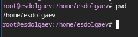{#fig:001 width=70%}

Перейдём в каталог /tmp (рис. [-@fig:002]).

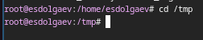{#fig:002 width=70%}

Выведем на экран содержимое каталога /tmp. Используя команду ls с аргументами можно получить разные результаты (рис. [-@fig:003]).

- -a - отобразить имена скрытых файлов
- -l - вывести на экран подробную информацию о файлах и каталогах
- -F - получить информацию о типах файлов (каталог, исполняемый файл, ссылка)

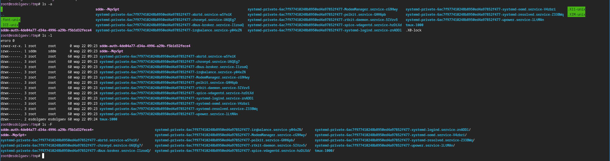{#fig:003 width=70%}

Определим, есть ли в каталоге /var/spool подкаталог с именем cron? Ответ: Да, есть (рис. [-@fig:004]).

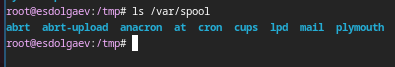{#fig:004 width=70%}

Перейдём в домашний каталог и выведите на экран его содержимое. Владельцем каталогов является пользователь с именем esdolgaev (рис. [-@fig:005]).

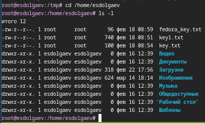{#fig:005 width=70%}

В домашнем каталоге создим новый каталог с именем newdir (рис. [-@fig:006]).

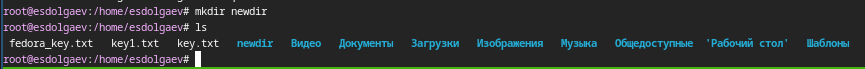{#fig:006 width=70%}

В каталоге ~/newdir создим новый каталог с именем morefun (рис. [-@fig:007]).

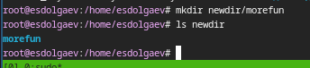{#fig:007 width=70%}

В домашнем каталоге создим одной командой три новых каталога с именами letters, memos, misk. Затем удалите эти каталоги одной командой (рис. [-@fig:008], [-@fig:009]). 

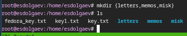{#fig:008 width=70%}

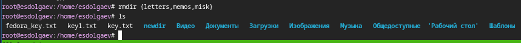{#fig:009 width=70%}

Попробуем удалить ранее созданный каталог ~/newdir командой rm (рис. [-@fig:010]).

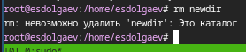{#fig:010 width=70%}

Удалим каталог ~/newdir/morefun из домашнего каталога (рис. [-@fig:011]).

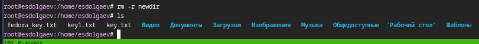{#fig:011 width=70%}

С помощью команды man определите, какую опцию команды ls нужно использовать для просмотра содержимое не только указанного каталога, но и подкаталогов, входящих в него. Ответ: Нужно использовать опцию -R(-r).

С помощью команды man определите набор опций команды ls, позволяющий отсортировать по времени последнего изменения выводимый список содержимого каталога с развёрнутым описанием файлов. Ответ: Нужно использовать опцию -lt. (рис. [-@fig:012]).

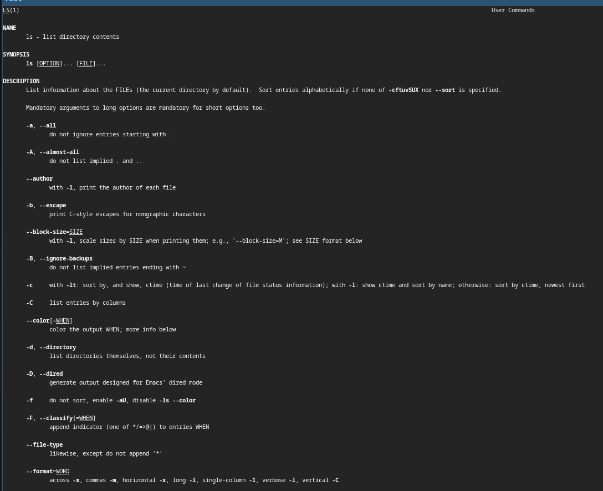{#fig:012 width=70%}

Используйте команду man для просмотра описания следующих команд: cd, pwd, mkdir, rmdir, rm (рис. [-@fig:013], [-@fig:014], [-@fig:015], [-@fig:016], [-@fig:017]).

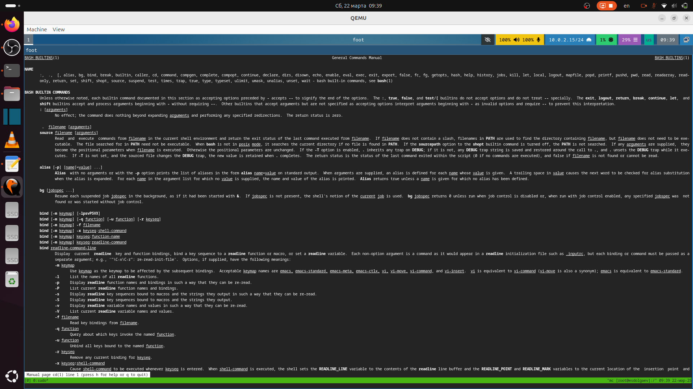{#fig:013 width=70%}

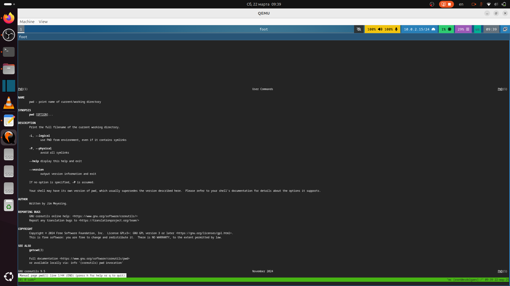{#fig:014 width=70%}

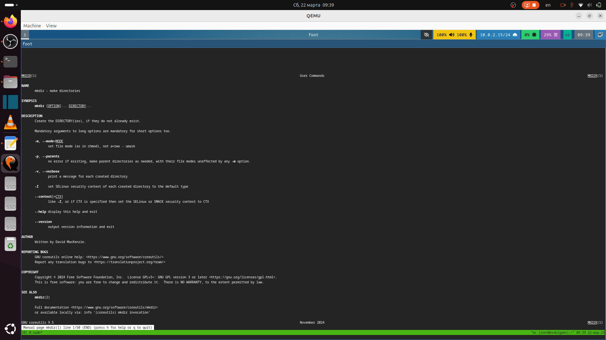{#fig:015 width=70%}

{#fig:016 width=70%}

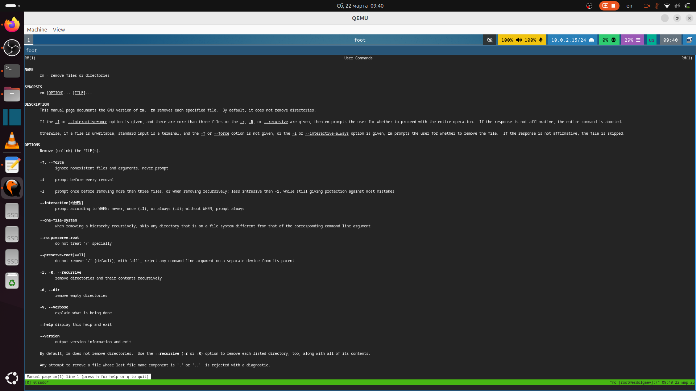{#fig:017 width=70%}

### Команда cd

- cd - переносит вас в ваш домашний каталог
- cd ~ - также переносит вас в ваш домашний каталог
- cd / - переносит вас в корневой каталог всей системы
- cd /root - переносит вас в домашний каталог пользователя root, или супер-пользователя, учётной записи, созданной во время установки системы

### Команда pwd

pwd - отображает полный путь к текущей рабочей директории

### Команда mkdir

- m (--mode=режим) - назначить режим доступа (права). По умолчанию mod принимает значение 0777, что обеспечивает неограниченные права.
- -p (--parents) - не показывать ошибки, а также их игнорировать.
- -z  (--context=CTX ) принимает контекст SELinux для каталога по умолчанию.
- -v (--verbose) - выводить сообщение о каждом новым каталоге.
- --help - вывести справочную информацию.
- --version - выводит информацию о текущей версии утилиты.

### Команда rmdir

- --ignore-fail-on-non-empty - Игнорировать каждый сбой, который происходит исключительно из-за того, что каталог не пуст
- -p, --parents - Удалить каталог и его родителей
- -v, --verbose - Выводить диагностику для каждого обработанного каталога

### Команда rm

- -f - дает возможность игнорировать несуществующие аргументы и определенные типы файлов. В ОС Linux никогда не появится запрос на подтверждение изъятия файлов/директорий, которые вы предварительно указали.
- -i - перед удалением выводится запрос на подтверждение.
- -I - такая функция позволяет вывести на экран 1 запрос на удаление определенной группы файлов. Она пригодится в том случае, когда вам необходимо убрать более трех файлов или провести рекурсивное удаление. Опция «-I» является более бережной версией «-i».
- -d -  удалить пустые директории.
- -r - рекурсивное удаление.
- «--interactive[=ХХХ]» - вместо букв «ХХХ» можно установить различие задачи. Формулировка «never» запретит выдавать запросы для подтверждения удаления файла. «Once» позволит вывести запрос только один раз. «Always» приводит к тому, что запросы будут выводиться всегда. Если вы не установите значение «КОГДА», в автоматическом режиме будет задана формулировка «always».
- «--one-file-system» - такая опция применяется при рекурсивном удалении. Она позволит пропустить определенные группы директорий, которые могут размещаться в иных файловых системах.
- «--no-preserve-root» - опция пригодиться в том случае, когда при изъятии директорий задан определенный корневой раздел. Команда посчитает, что это классическая директория, начнет совершать изъятие.
- «--preserve-root» - такая опция дает возможность исключить вероятность выполнения команды «rm» выше корневого раздела. Эта особенность установлена по молчанию.
- «-v или --verbose» - с помощью такой опции можно посмотреть информацию об удаленных ранее данных.

Используя информацию, полученную при помощи команды history, выполним модификацию и исполнение нескольких команд из буфера команд (рис. [-@fig:018], [-@fig:019], [-@fig:020]).

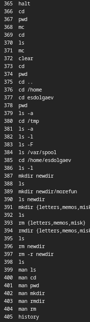{#fig:018 width=40%}

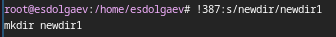{#fig:019 width=70%}

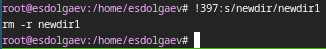{#fig:020 width=70%}

# Ответы на контрольные вопросы

1) Командная строка — текстовый интерфейс пользователя для взаимодействия с операционной системой компьютера и/или другим программным обеспечением с помощью команд, вводимых с клавиатуры.
2) pwd (cd ~/work; pwd)
3) ls c опциями -a, -l, -F (ls -a dir1)
4) ls c опцией -alF (ls -alF dir1)
5) rm и rmdir; да, можно, для этого нужно использовать опцию -r (rm -r dir1)
6) history
7) !`[номер_команды_в_списке]`:`s/[что_меняем]/[на_что_меняем] (!5:s/a/F)`
8) mkdir dir1; rmdir dir1
9) Если в заданном контексте встречаются специальные символы (типа «.», «/», «*» и т.д.), надо перед ними поставить символ экранирования \ (обратный слэш) (!7:s/\-/\*)
10) Выводит на экран подробную информацию о файлах и каталогах
11) Относительный путь — это путь к файлу относительно текущего каталога (cd /var/tmp)
12) С помощью команды man [интересующая_вас_команда]
13) Клавиша tab

# Выводы

В ходе выполнения лабораторной работы я приобрел практические навыки взаимодействия с системой посредством командной строки.

# Список литературы{.unnumbered}

::: {#refs}
:::
