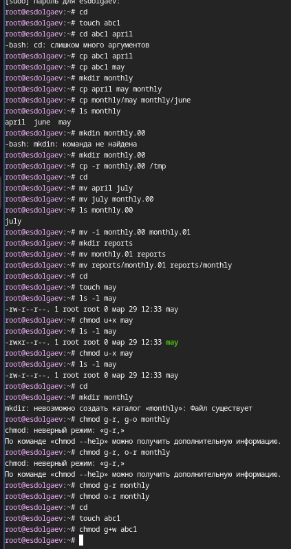
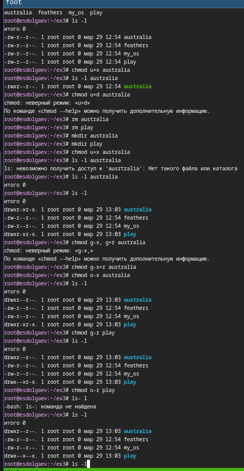
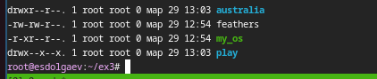
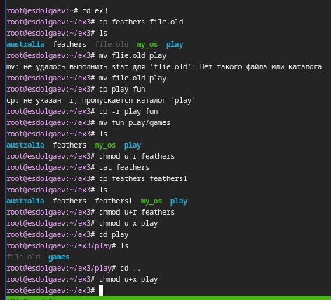

---
## Front matter
lang: ru-RU
title: "Презентация к лабораторной работе №7"
subtitle: "*Дисциплина: Операционные системы*"
author:
  - Долгаев Е. С.
institute:
  - Российский университет дружбы народов, Москва, Россия
date: 29 марта 2025

## i18n babel
babel-lang: russian
babel-otherlangs: english

## Formatting pdf
toc: false
toc-title: Содержание
slide_level: 2
aspectratio: 169
section-titles: true
theme: metropolis
header-includes:
 - \metroset{progressbar=frametitle,sectionpage=progressbar,numbering=fraction}
---

# Информация

## Докладчик

:::::::::::::: {.columns align=center}
::: {.column width="70%"}

  * Долгаев Евгений Сергеевич
  * Российский университет дружбы народов
  * [1132246827@rudn.ru](mailto:1132246827@rudn.ru)
  * <https://github.com/eugerne/study_2024-2024_os-intro.git>

:::
::::::::::::::

## Актуальность

- Освоение практических навыков навыков управления файлами, каталогами, процессами и дисковым пространством.

## Цели и задачи

- Ознакомление с файловой системой Linux, её структурой, именами и содержанием каталогов. 
- Приобретение практических навыков по применению команд для работы с файлами и каталогами, по управлению процессами (и работами), по проверке использования диска и обслуживанию файловой системы.

## Содержание исследования

На следующем скриншоте приведены результаты выполнения команд, которые давались как примеры в теоретической части содержания лабораторной работы.

## Содержание исследования

{width=30%}

## Содержание исследования

Далее идут упражнения, направленные на отработку навыков работы с файловой системой.

## Содержание исследования

{width=50%}

## Содержание исследования

Задание 3 позволяет попробовать в действии команду chmod.

## Содержание исследования

{width=30%}

## Содержание исследования

{width=50%}

## Содержание исследования

Задание 4 является небольшой самостоятельной работой. Вот результат её выполнения.

## Содержание исследования

{width=50%}

## Результаты

- В ходе выполнения лабораторной работы я приобрел практические навыки по применению команд для работы с файлами и каталогами, по управлению процессами (и работами), по проверке использования диска и обслуживанию файловой системы.

