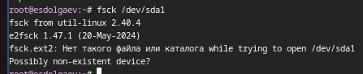

---
## Front matter
title: " Лабораторная работа №7"
subtitle: "*Дисциплина: Операционные системы*"
author: "Долгаев Евгений НММбд-01-24"

## Generic otions
lang: ru-RU
toc-title: "Содержание"

## Bibliography
bibliography: bib/cite.bib
csl: pandoc/csl/gost-r-7-0-5-2008-numeric.csl

## Pdf output format
toc: true # Table of contents
toc-depth: 2
lof: true # List of figures
lot: true # List of tables
fontsize: 14pt
linestretch: 1.5
papersize: a4
documentclass: scrreprt
## I18n polyglossia
polyglossia-lang:
  name: russian
  options:
	- spelling=modern
	- babelshorthands=true
polyglossia-otherlangs:
  name: english
## I18n babel
babel-lang: russian
babel-otherlangs: english
## Fonts
mainfont: IBM Plex Serif
romanfont: IBM Plex Serif
sansfont: IBM Plex Sans
monofont: IBM Plex Mono
mathfont: STIX Two Math
mainfontoptions: Ligatures=Common,Ligatures=TeX,Scale=0.94
romanfontoptions: Ligatures=Common,Ligatures=TeX,Scale=0.94
sansfontoptions: Ligatures=Common,Ligatures=TeX,Scale=MatchLowercase,Scale=0.94
monofontoptions: Scale=MatchLowercase,Scale=0.94,FakeStretch=0.9
mathfontoptions:
## Biblatex
biblatex: true
biblio-style: "gost-numeric"
biblatexoptions:
  - parentracker=true
  - backend=biber
  - hyperref=auto
  - language=auto
  - autolang=other*
  - citestyle=gost-numeric
## Pandoc-crossref LaTeX customization
figureTitle: "Рис."
tableTitle: "Таблица"
listingTitle: "Листинг"
lofTitle: "Список иллюстраций"
lotTitle: "Список таблиц"
lolTitle: "Листинги"
## Misc options
indent: true
header-includes:
  - \usepackage{indentfirst}
  - \usepackage{float} # keep figures where there are in the text
  - \floatplacement{figure}{H} # keep figures where there are in the text
---

# Цель работы

Ознакомление с файловой системой Linux, её структурой, именами и содержанием каталогов. Приобретение практических навыков по применению команд для работы с файлами и каталогами, по управлению процессами (и работами), по проверке использования диска и обслуживанию файловой системы.

# Задание

1) Выполнить все примеры, приведённые в первой части описания лабораторной работы.
2) Упражнения.
3) Определить опции команды chmod, необходимые для того, чтобы присвоить файлам выделенные права доступа.
4) Упражнения.
5) Прочитать man по командам mount, fsck, mkfs, kill и кратко их охарактеризовать, приведя примеры.

# Выполнение лабораторной работы

На следующих скриншотах приведеные результаты выполнения команд, которые давались как примеры в теоретической части содержания лабораторной работы (рис. [-@fig:001], [-@fig:002], [-@fig:003], [-@fig:004], [-@fig:005]).

{#fig:001 width=25%}

{#fig:002 width=60%}

{#fig:003 width=60%}

{#fig:004 width=60%}

{#fig:005 width=60%}

Далее идут упражнения, направленные на отработку навыков работы с файловой системой (рис. [-@fig:006]).

{#fig:006 width=70%}

Задание 3 позволяет попробовать в действии команду chmod (рис. [-@fig:007], [-@fig:008]).

{#fig:007 width=30%}

{#fig:008 width=60%}

Задание 4 является небольшой самостоятельной работой. Вот результат её выполнения (рис. [-@fig:009]):

{#fig:009 width=60%}

## Краткая характеристика команд mount, fsck, mkfs и kill

### mount

Команда mount предназначена для подключения (монтирования) файловых систем и переносных накопителей (usb-флешка, карта памяти) к конкретным точкам монтирования в дереве директорий. При запуске без аргументов команда показывает все подключенные в данный момент файловые системы.

{width=40%}

### fsck

Можно проверять согласованность файловых систем и исправлять нарушения целостности в интерактивном режиме с помощью команды fsck.

Если целостность файловой системы нарушена, то команда fsck выдает информацию об обнаруженных несоответствиях и запрашивает у вас разрешения исправить их. Команда fsck прежде всего пытается всеми возможными способами исправить ситуацию и избежать действий, которые могут привести к утере данных.

{width=40%}

### mkfs

Это универсальный инструмент, позволяющий форматировать диски и разделы с заданной файловой системой. Если вы устанавливаете новый диск, создаете новый раздел или переформатируете существующий, mkfs – незаменимая команда для настройки файловой системы.

{width=40%}

### kill

Она позволяют прекратить выполнение запущенных процессов.

Команда kill отправляет сигнал (по умолчанию сигнал SIGTERM) запущенному процессу . Это действие по умолчанию обычно останавливает процессы. Если вы хотите остановить процесс, укажите идентификатор процесса (PID) в переменной ProcessID.

{width=40%}

# Ответы на контрольные вопросы

### Вопрос 1

1) sysfs — виртуальная файловая система в операционной системе Linux. Экспортирует в пространство пользователя информацию ядра Linux о присутствующих в системе устройствах и драйверах. Впервые появилась в ядре версии 2.6. Необходимость создания была вызвана устаревшей системой работы ядра с устройствами.

2) TraceFS — новая файловая система для ядра Linux, ориентированная на подсистему трассировки

### Вопрос 2

Файловая система в Linux определяет также организацию расположения файлов, по сути представляя собой иерархическую структуру «дерева»: начинается с корневого каталога «/» и разрастается ветвями в зависимости от работы системы.

{width=50%}

/ — root каталог. Содержит в себе всю иерархию системы;

/bin — здесь находятся двоичные исполняемые файлы. Основные общие команды, хранящиеся отдельно от других программ в системе (прим.: pwd, ls, cat, ps);

/boot — тут расположены файлы, используемые для загрузки системы (образ initrd, ядро vmlinuz);

/dev — в данной директории располагаются файлы устройств (драйверов). С помощью этих файлов можно взаимодействовать с устройствами. К примеру, если это жесткий диск, можно подключить его к файловой системе. В файл принтера же можно написать напрямую и отправить задание на печать;

/etc — в этой директории находятся файлы конфигураций программ. Эти файлы позволяют настраивать системы, сервисы, скрипты системных демонов;

/home — каталог, аналогичный каталогу Users в Windows. Содержит домашние каталоги учетных записей пользователей (кроме root). При создании нового пользователя здесь создается одноименный каталог с аналогичным именем и хранит личные файлы этого пользователя;

/lib — содержит системные библиотеки, с которыми работают программы и модули ядра;

/lost+found — содержит файлы, восстановленные после сбоя работы системы. Система проведет проверку после сбоя и найденные файлы можно будет посмотреть в данном каталоге;

/media — точка монтирования внешних носителей. Например, когда вы вставляете диск в дисковод, он будет автоматически смонтирован в директорию /media/cdrom;

/mnt — точка временного монтирования. Файловые системы подключаемых устройств обычно монтируются в этот каталог для временного использования;

/opt — тут расположены дополнительные (необязательные) приложения. Такие программы обычно не подчиняются принятой иерархии и хранят свои файлы в одном подкаталоге (бинарные, библиотеки, конфигурации);

/proc — содержит файлы, хранящие информацию о запущенных процессах и о состоянии ядра ОС;

/root — директория, которая содержит файлы и личные настройки суперпользователя;

/run — содержит файлы состояния приложений. Например, PID-файлы или UNIX-сокеты;

/sbin — аналогично /bin содержит бинарные файлы. Утилиты нужны для настройки и администрирования системы суперпользователем;

/srv — содержит файлы сервисов, предоставляемых сервером (прим. FTP или Apache HTTP);

/sys — содержит данные непосредственно о системе. Тут можно узнать информацию о ядре, драйверах и устройствах;

/tmp — содержит временные файлы. Данные файлы доступны всем пользователям на чтение и запись. Стоит отметить, что данный каталог очищается при перезагрузке;

/usr — содержит пользовательские приложения и утилиты второго уровня, используемые пользователями, а не системой. Содержимое доступно только для чтения (кроме root). Каталог имеет вторичную иерархию и похож на корневой;

/var — содержит переменные файлы. Имеет подкаталоги, отвечающие за отдельные переменные. Например, логи будут храниться в /var/log, кэш в /var/cache, очереди заданий в /var/spool/ и так далее.

### Вопрос 3

Монтирование тома.

### Вопрос 4

Отсутствие синхронизации между образом файловой системы в памяти и ее данными на диске в случае аварийного останова может привести к появлению следующих ошибок:

1. Один блок адресуется несколькими mode (принадлежит нескольким файлам).

2. Блок помечен как свободный, но в то же время занят (на него ссылается onode).

3. Блок помечен как занятый, но в то же время свободен (ни один inode на него не ссылается).

4. Неправильное число ссылок в inode (недостаток или избыток ссылающихся записей в каталогах).

5. Несовпадение между размером файла и суммарным размером адресуемых inode блоков.

6. Недопустимые адресуемые блоки (например, расположенные за пределами файловой системы).

7. "Потерянные" файлы (правильные inode, на которые не ссылаются записи каталогов).

8. Недопустимые или неразмещенные номера inode в записях каталогов.

### Вопрос 5

mkfs - позволяет создать файловую систему Linux.

### Вопрос 6

cat - выводит содержимое файла на стандартное устройство вывода

### Вопрос 7

cp – копирует или перемещает директорию, файлы.

### Вопрос 8

mv - переименовать или переместить файл или директорию

### Вопрос 9

Права доступа к файлу или каталогу можно изменить, воспользовавшись командой chmod. Сделать это может владелец файла (или каталога) или пользователь с правами администратора.

# Выводы

В ходе выполнения лабораторной работы я приобрел практические навыки по применению команд для работы с файлами и каталогами, по управлению процессами (и работами), по проверке использования диска и обслуживанию файловой системы.

# Список литературы{.unnumbered}

::: {#refs}
:::
