---
## Front matter
lang: ru-RU
title: "Презентация к лабораторной работе №8"
subtitle: "*Дисциплина: Операционные системы*"
author:
  - Долгаев Е. С.
institute:
  - Российский университет дружбы народов, Москва, Россия
date: 05 апреля 2025

## i18n babel
babel-lang: russian
babel-otherlangs: english

## Formatting pdf
toc: false
toc-title: Содержание
slide_level: 2
aspectratio: 169
section-titles: true
theme: metropolis
header-includes:
 - \metroset{progressbar=frametitle,sectionpage=progressbar,numbering=fraction}
---

# Информация

## Докладчик

:::::::::::::: {.columns align=center}
::: {.column width="70%"}

  * Долгаев Евгений Сергеевич
  * студент
  * Российский университет дружбы народов
  * [1132246827@rudn.ru](mailto:1132246827@rudn.ru)
  * <https://github.com/eugerne/study_2024-2024_os-intro.git>

:::
::::::::::::::

# Вводная часть

## Актуальность

- Необходимость владения навыками работы с инструментами поиска файлов и фильтрации текстовых данных, а также с методами обслуживания файловых систем.

## Цели и задачи

- Ознакомление с инструментами поиска файлов и фильтрации текстовых данных. Приобретение практических навыков: по управлению процессами (и заданиями), по проверке использования диска и обслуживанию файловых систем.

# Лабораторная работа

## Задание 1

:::::::::::::: {.columns align=center}
::: {.column width="80%"}

{width=40%}

:::
::::::::::::::

## Задание 2

- Запишем в файл file.txt названия файлов, содержащихся в каталоге /etc и в домашнем каталоге.

## Задание 2

:::::::::::::: {.columns align=center}
::: {.column width="80%"}

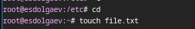

:::
::::::::::::::

## Задание 2

:::::::::::::: {.columns align=center}
::: {.column width="80%"}

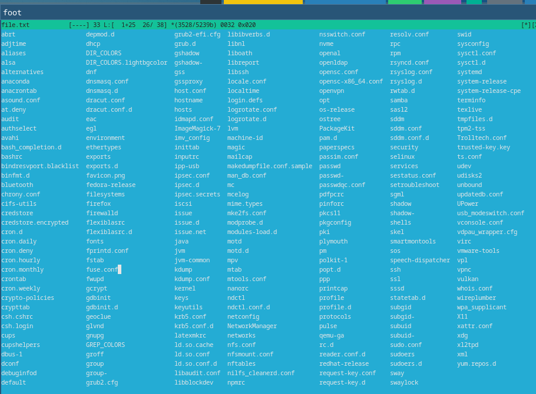{width=50%}

:::
::::::::::::::

## Задание 3

Выведем имена всех файлов из file.txt, имеющих расширение .conf, после чего запишем их в новый текстовой файл conf.txt.

## Задание 3

:::::::::::::: {.columns align=center}
::: {.column width="80%"}

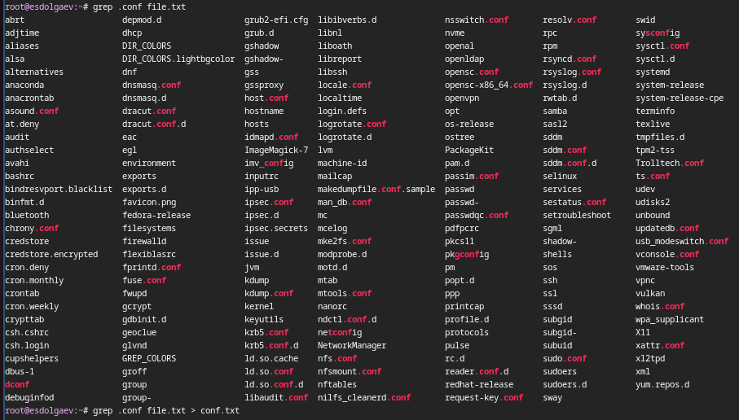

:::
::::::::::::::

## Задание 3

:::::::::::::: {.columns align=center}
::: {.column width="80%"}

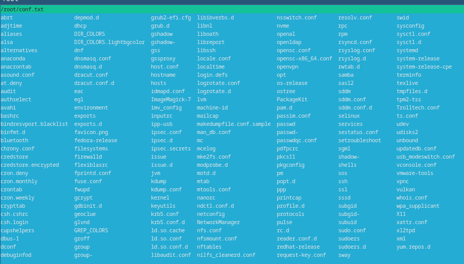

:::
::::::::::::::

## Задание 4

Определим, какие файлы в вашем домашнем каталоге имеют имена, начинавшиеся с символа c.

## Задание 4

:::::::::::::: {.columns align=center}
::: {.column width="80%"}

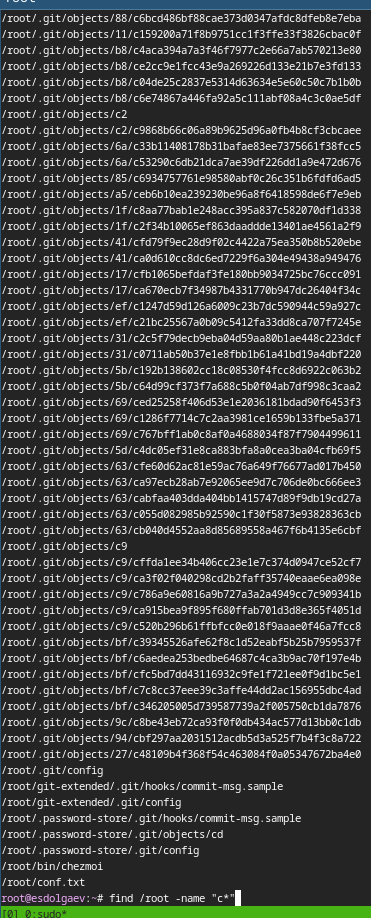{width=50%}

:::
::::::::::::::

## Задание 4

:::::::::::::: {.columns align=center}
::: {.column width="80%"}

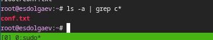

:::
::::::::::::::

## Задание 5

Выведем на экран (по странично) имена файлов из каталога /etc, начинающиеся с символа h.

## Задание 5

:::::::::::::: {.columns align=center}
::: {.column width="80%"}

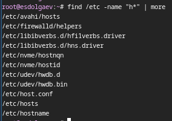{width=40%}

:::
::::::::::::::

## Задания 6 и 7

Запустить в фоновом режиме процесс, который будет записывать в файл ~/logfile файлы, имена которых начинаются с log. Удалим logfile.

## Задания 6 и 7

:::::::::::::: {.columns align=center}
::: {.column width="80%"}

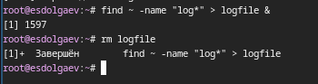

:::
::::::::::::::

## Задание 8

Запустим из консоли в фоновом режиме редактор gedit (я запускал nano).

# Задание 8

:::::::::::::: {.columns align=center}
::: {.column width="80%"}

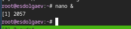

:::
::::::::::::::

## Задание 9

Определим идентификатор процесса gedit(nano), используя команду ps, конвейер и фильтр grep.

## Задание 9

:::::::::::::: {.columns align=center}
::: {.column width="80%"}

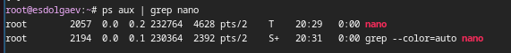

:::
::::::::::::::

## Задание 10

Прочитаем справку (man) команды kill, после чего используем её для завершения процесса gedit.

## Задание 10

:::::::::::::: {.columns align=center}
::: {.column width="80%"}

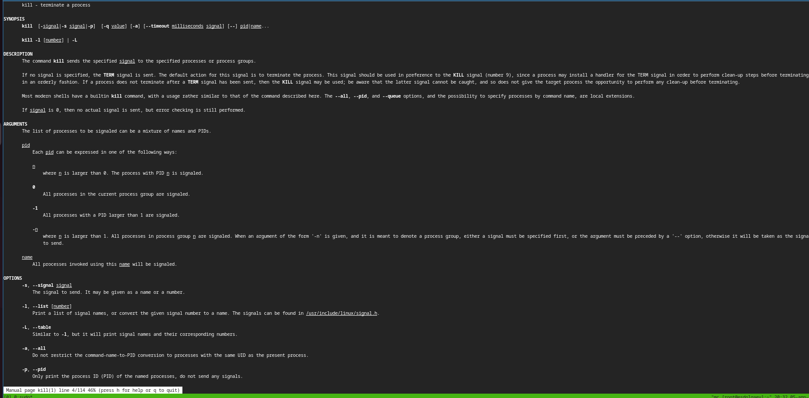

:::
::::::::::::::

## Задание 11

Выполним команды df и du, предварительно получив более подробную информацию об этих командах, с помощью команды man.

## Задание 11

:::::::::::::: {.columns align=center}
::: {.column width="80%"}

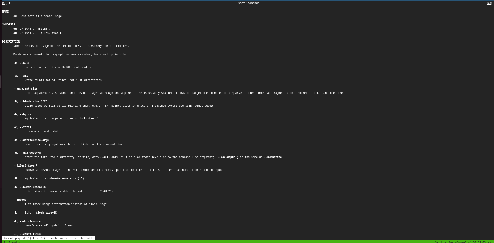

:::
::::::::::::::

## Задание 11

:::::::::::::: {.columns align=center}
::: {.column width="80%"}

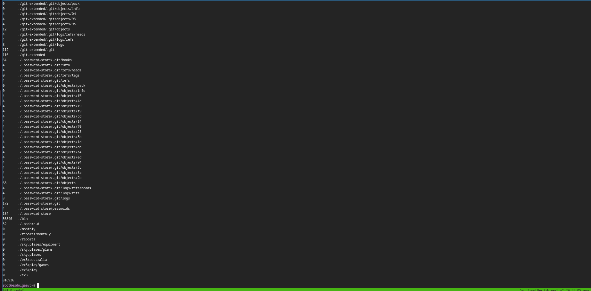

:::
::::::::::::::

## Задание 11

:::::::::::::: {.columns align=center}
::: {.column width="80%"}

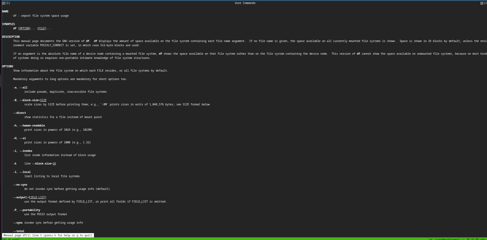

:::
::::::::::::::

## Задание 11

:::::::::::::: {.columns align=center}
::: {.column width="80%"}

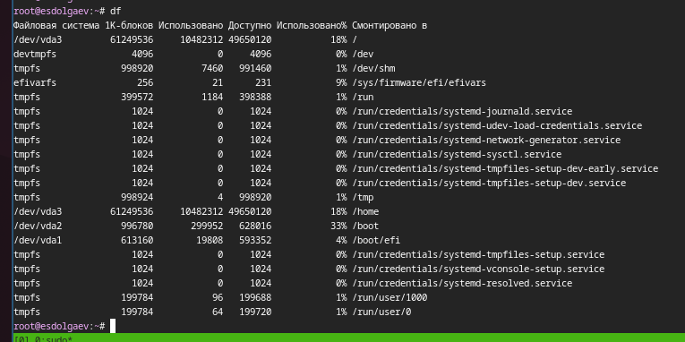

:::
::::::::::::::

## Задание 12

Воспользовавшись справкой команды find, выведем имена всех директорий, имеющихся в вашем домашнем каталоге.

## Задание 12

:::::::::::::: {.columns align=center}
::: {.column width="80%"}

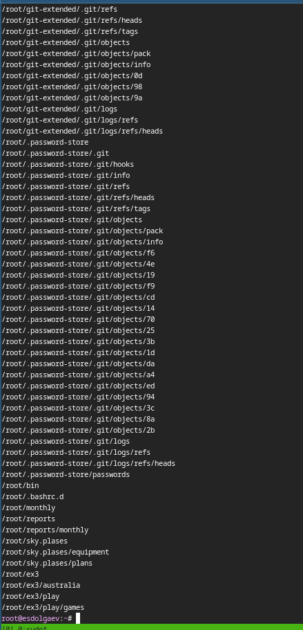{width=50%}

:::
::::::::::::::

## Результаты

- Таким образом, в ходе выполнения лабораторной работы я ознакомлся с инструментами поиска файлов и фильтрации текстовых данных. Приобрёл практические навыки: по управлению процессами (и заданиями), по проверке использования диска и обслуживанию файловых систем.

