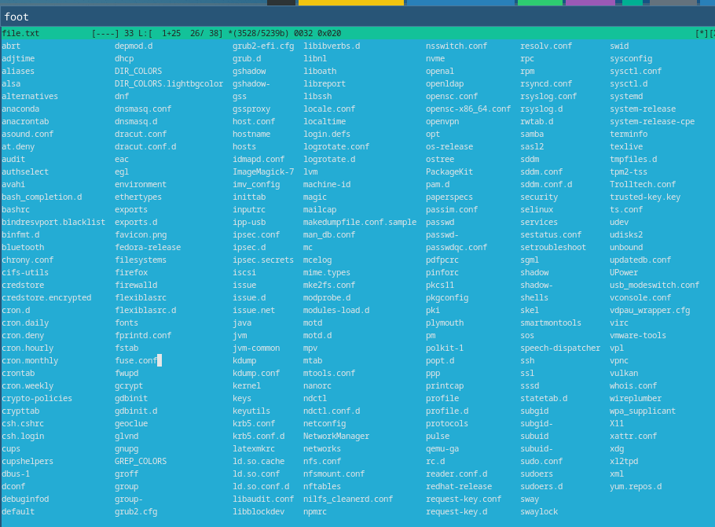

---
## Front matter
title: "Лабораторная работа №8"
subtitle: "*Дисциплина: Операционные системы*"
author: "Долгаев Евгений НММбд-01-24"

## Generic otions
lang: ru-RU
toc-title: "Содержание"

## Bibliography
bibliography: bib/cite.bib
csl: pandoc/csl/gost-r-7-0-5-2008-numeric.csl

## Pdf output format
toc: true # Table of contents
toc-depth: 2
lof: true # List of figures
lot: true # List of tables
fontsize: 12pt
linestretch: 1.5
papersize: a4
documentclass: scrreprt
## I18n polyglossia
polyglossia-lang:
  name: russian
  options:
	- spelling=modern
	- babelshorthands=true
polyglossia-otherlangs:
  name: english
## I18n babel
babel-lang: russian
babel-otherlangs: english
## Fonts
mainfont: IBM Plex Serif
romanfont: IBM Plex Serif
sansfont: IBM Plex Sans
monofont: IBM Plex Mono
mathfont: STIX Two Math
mainfontoptions: Ligatures=Common,Ligatures=TeX,Scale=0.94
romanfontoptions: Ligatures=Common,Ligatures=TeX,Scale=0.94
sansfontoptions: Ligatures=Common,Ligatures=TeX,Scale=MatchLowercase,Scale=0.94
monofontoptions: Scale=MatchLowercase,Scale=0.94,FakeStretch=0.9
mathfontoptions:
## Biblatex
biblatex: true
biblio-style: "gost-numeric"
biblatexoptions:
  - parentracker=true
  - backend=biber
  - hyperref=auto
  - language=auto
  - autolang=other*
  - citestyle=gost-numeric
## Pandoc-crossref LaTeX customization
figureTitle: "Рис."
tableTitle: "Таблица"
listingTitle: "Листинг"
lofTitle: "Список иллюстраций"
lotTitle: "Список таблиц"
lolTitle: "Листинги"
## Misc options
indent: true
header-includes:
  - \usepackage{indentfirst}
  - \usepackage{float} # keep figures where there are in the text
  - \floatplacement{figure}{H} # keep figures where there are in the text
---

# Цель работы

Ознакомление с инструментами поиска файлов и фильтрации текстовых данных. Приобретение практических навыков: по управлению процессами (и заданиями), по проверке использования диска и обслуживанию файловых систем.

# Задание

1. Осуществить вход в систему, используя соответствующее имя пользователя.
2. Записать в файл file.txt названия файлов, содержащихся в каталоге /etc и в домашнем каталоге.
3. Вывести имена всех файлов из file.txt, имеющих расширение .conf, после чего записать их в новый текстовой файл conf.txt.
4. Определить, какие файлы в вашем домашнем каталоге имеют имена, начинавшиеся с символа c.
5. Вывести на экран (по странично) имена файлов из каталога /etc, начинающиеся с символа h.
6. Запустить в фоновом режиме процесс, который будет записывать в файл ~/logfile файлы, имена которых начинаются с log.
7. Удалить файл ~/logfile.
8. Запустить из консоли в фоновом режиме редактор gedit.
9. Определить идентификатор процесса gedit, используя команду ps, конвейер и фильтр grep.
10. Прочитать справку (man) команды kill, после чего использовать её для завершения процесса gedit.
11. Выполнить команды df и du, предварительно получив более подробную информацию об этих командах, с помощью команды man.
12. Воспользовавшись справкой команды find, вывести имена всех директорий, имеющихся в вашем домашнем каталоге.

# Выполнение лабораторной работы

Далее в этом разделе будут показаны результаты выполнения заданий и некоторые комментарии к ним.

## Задание 1

{#fig:016 width=70%}

## Задание 2

Запишем в файл file.txt названия файлов, содержащихся в каталоге /etc и в домашнем каталоге (рис. [-@fig:001],  [-@fig:002]).

{#fig:001 width=70%}

{#fig:002 width=70%}

## Задание 3

Выведем имена всех файлов из file.txt, имеющих расширение .conf, после чего запишем их в новый текстовой файл conf.txt (рис. [-@fig:003],  [-@fig:004]).

{#fig:003 width=70%}

{#fig:004 width=70%}

## Задание 4

Определим, какие файлы в вашем домашнем каталоге имеют имена, начинавшиеся с символа c (рис. [-@fig:005], [-@fig:006]).

{#fig:005 width=70%}

{#fig:006 width=70%}

## Задание 5

Выведем на экран (по странично) имена файлов из каталога /etc, начинающиеся с символа h (рис. [-@fig:007]).

{#fig:007 width=70%}

## Задания 6 и 7

Запустить в фоновом режиме процесс, который будет записывать в файл ~/logfile файлы, имена которых начинаются с log. Удалим logfile (рис. [-@fig:008]).

{#fig:008 width=70%}

## Задание 8

Запустим из консоли в фоновом режиме редактор gedit (я запускал nano) (рис. [-@fig:009]).

{#fig:009 width=70%}

## Задание 9

Определим идентификатор процесса gedit(nano), используя команду ps, конвейер и фильтр grep (рис. [-@fig:010]).

{#fig:010 width=70%}

## Задание 10

Прочитаем справку (man) команды kill, после чего используем её для завершения процесса gedit (рис. [-@fig:011]).

{#fig:011 width=70%}

## Задание 11

Выполним команды df и du, предварительно получив более подробную информацию об этих командах, с помощью команды man (рис. [-@fig:012], [-@fig:013], [-@fig:014], [-@fig:015]).

{#fig:012 width=70%}

{#fig:013 width=70%}

{#fig:014 width=70%}

{#fig:015 width=70%}

## Задание 12

Воспользовавшись справкой команды find, выведем имена всех директорий, имеющихся в вашем домашнем каталоге (рис. [-@fig:017]).

{#fig:017 width=70%}

# Выводы

В ходе выполнения лабораторной работы я ознакомлся с инструментами поиска файлов и фильтрации текстовых данных. Приобрёл практические навыки: по управлению процессами (и заданиями), по проверке использования диска и обслуживанию файловых систем.

# Список литературы{.unnumbered}

::: {#refs}
:::
