---
## Front matter
lang: ru-RU
title: "Презентация к лабораторной работе №9"
subtitle: "*Дисциплина: Операционные системы*"
author:
  - Долгаев Е. С.
institute:
  - Российский университет дружбы народов, Москва, Россия
date: 12 апреля 2025

## i18n babel
babel-lang: russian
babel-otherlangs: english

## Formatting pdf
toc: false
toc-title: Содержание
slide_level: 2
aspectratio: 169
section-titles: true
theme: metropolis
header-includes:
 - \metroset{progressbar=frametitle,sectionpage=progressbar,numbering=fraction}
---

# Информация

## Докладчик

:::::::::::::: {.columns align=center}
::: {.column width="70%"}

  * Долгаев Евгений Сергеевич
  * Российский университет дружбы народов
  * [1132246827@rudn.ru](mailto:1132246827@rudn.ru)
  * <https://github.com/eugerne/study_2024-2024_os-intro.git>

:::
::::::::::::::

# Вводная часть

## Актуальность

- Необходимость умения работы с Midnight Commander
- Упрощение навигации по системе

## Цели и задачи

- Освоение основных возможностей командной оболочки Midnight Commander. Приобретение навыков практической работы по просмотру каталогов и файлов; манипуляций с ними.

# Лабораторная рабоата

## Процесс выполнения

- На следующих картинках вы можете у видеть результат работы некоторых горячих клавич в mc.

## Процесс выполнения

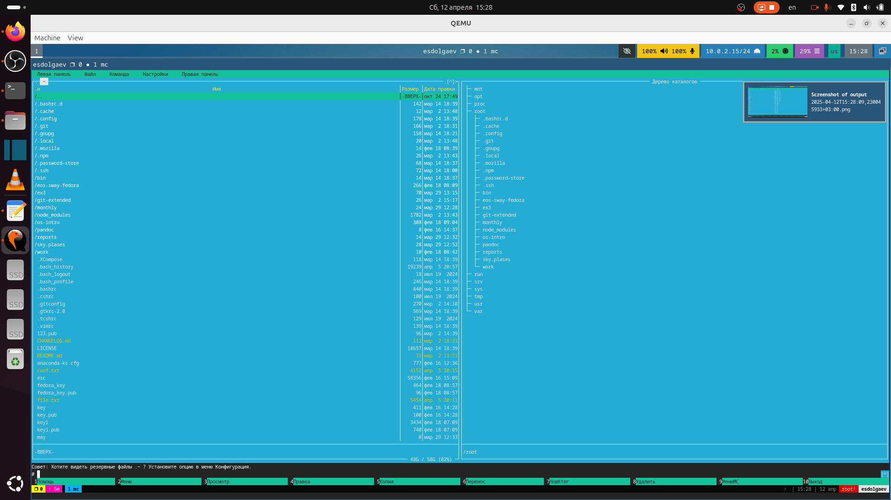{width=50%}

## Процесс выполнения

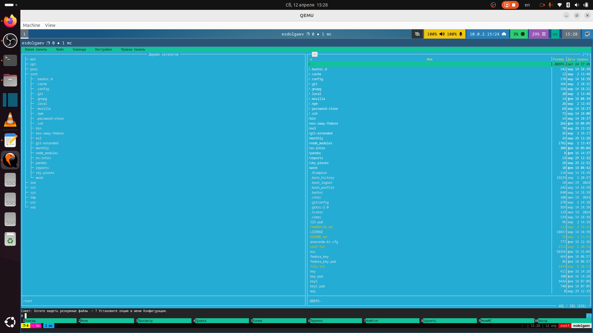{width=50%}

## Процесс выполнения

- Далее будут показаны некоторые режимы работы левой и правой панели в mc.

## Процесс выполнения

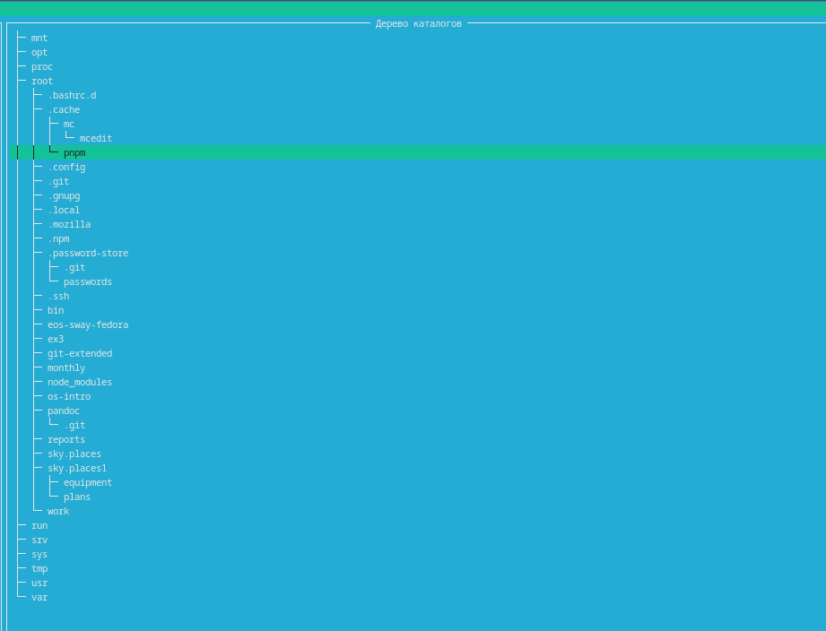{width=50%}

## Процесс выполнения

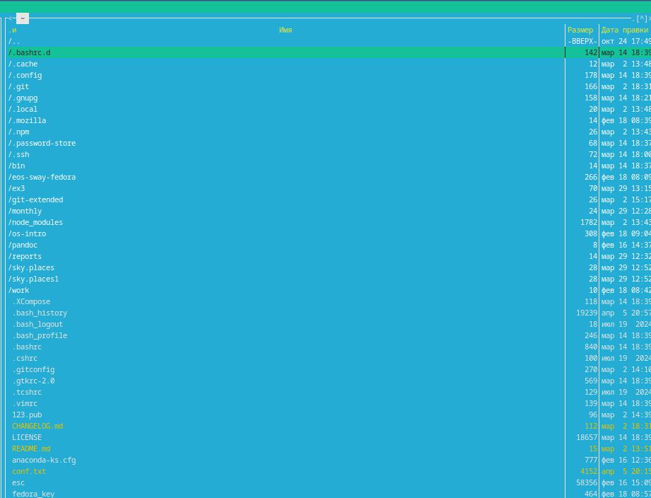{width=50%}

## Процесс выполнения

- Больше всего информации о файле или каталоге можно узнать в режиме "Информация"

## Процесс выполнения

- Далее показана часть возможностей под меню Файл и подменю Команда.

## Процесс выполнения

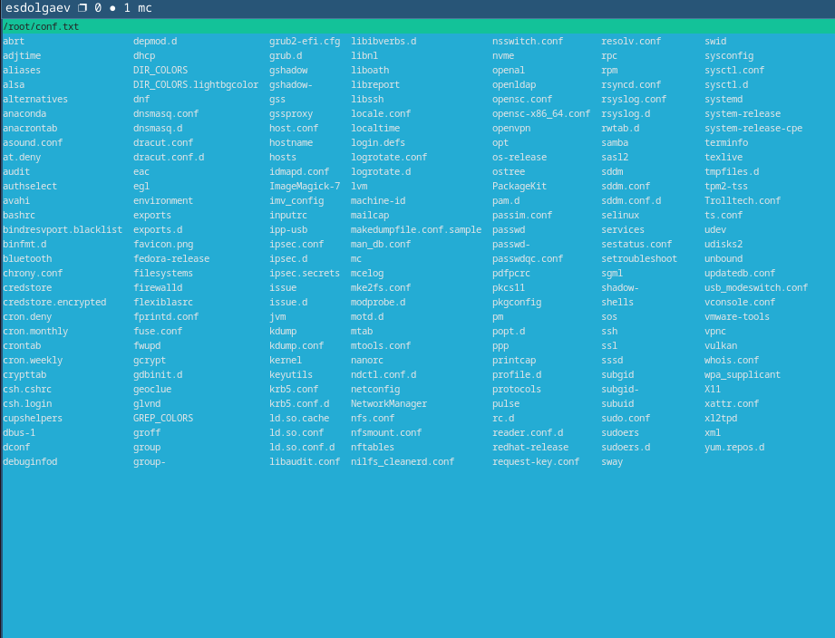{width=50%}

## Процесс выполнения

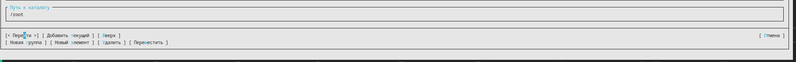{width=50%}

## Процесс выполнения

- В mc также можно настроить внешний вид окна в подменю Найстройки.

## Процесс выполнения

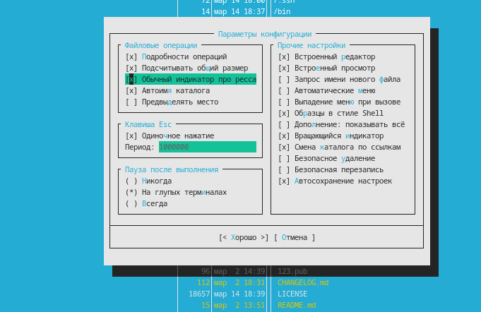{width=50%}

## Процесс выполнения

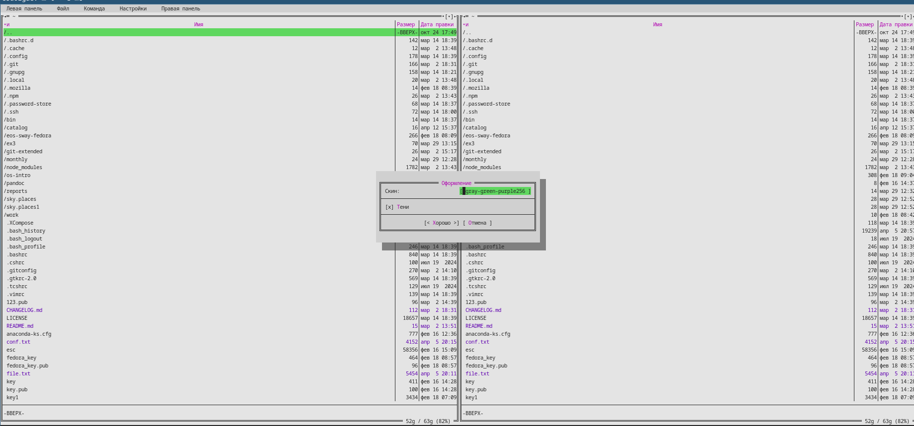{width=50%}

## Процесс выполнения

- Перейдем к выполнению заданий в текстовом редакторе mc. Часть результатов их выполнения представлена ниже.

## Процесс выполнения

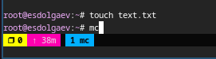{width=50%}

## Процесс выполнения

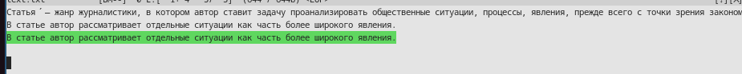{width=50%}

## Процесс выполнения

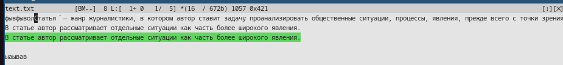{width=50%}

## Результаты

- В ходе выполнения лаборатной работы я освоил основные возможности командной оболочки Midnight Commander и приобрел навыки практической работы по просмотру каталогов и файлов; манипуляций с ними.

