---
## Front matter
title: "Отчет по лабораторной работе №9"
subtitle: "*Дициплина: Опреационные системы*"
author: "Долгаев Евгений НММбд-01-24"

## Generic otions
lang: ru-RU
toc-title: "Содержание"

## Bibliography
bibliography: bib/cite.bib
csl: pandoc/csl/gost-r-7-0-5-2008-numeric.csl

## Pdf output format
toc: true # Table of contents
toc-depth: 2
lof: true # List of figures
lot: true # List of tables
fontsize: 12pt
linestretch: 1.5
papersize: a4
documentclass: scrreprt
## I18n polyglossia
polyglossia-lang:
  name: russian
  options:
	- spelling=modern
	- babelshorthands=true
polyglossia-otherlangs:
  name: english
## I18n babel
babel-lang: russian
babel-otherlangs: english
## Fonts
mainfont: IBM Plex Serif
romanfont: IBM Plex Serif
sansfont: IBM Plex Sans
monofont: IBM Plex Mono
mathfont: STIX Two Math
mainfontoptions: Ligatures=Common,Ligatures=TeX,Scale=0.94
romanfontoptions: Ligatures=Common,Ligatures=TeX,Scale=0.94
sansfontoptions: Ligatures=Common,Ligatures=TeX,Scale=MatchLowercase,Scale=0.94
monofontoptions: Scale=MatchLowercase,Scale=0.94,FakeStretch=0.9
mathfontoptions:
## Biblatex
biblatex: true
biblio-style: "gost-numeric"
biblatexoptions:
  - parentracker=true
  - backend=biber
  - hyperref=auto
  - language=auto
  - autolang=other*
  - citestyle=gost-numeric
## Pandoc-crossref LaTeX customization
figureTitle: "Рис."
tableTitle: "Таблица"
listingTitle: "Листинг"
lofTitle: "Список иллюстраций"
lotTitle: "Список таблиц"
lolTitle: "Листинги"
## Misc options
indent: true
header-includes:
  - \usepackage{indentfirst}
  - \usepackage{float} # keep figures where there are in the text
  - \floatplacement{figure}{H} # keep figures where there are in the text
---

# Цель работы

Освоение основных возможностей командной оболочки Midnight Commander. Приобретение навыков практической работы по просмотру каталогов и файлов; манипуляций с ними.

# Задание

## Задание по mc

- Выполнить несколько операций в mc, используя управляющие клавиши (операции с панелями; выделение/отмена выделения файлов, копирование/перемещение файлов, получение информации о размере и правах доступа на файлы и/или каталоги и т.п.)
- Выполнить основные команды меню левой (или правой) панели. Оценить степень подробности вывода информации о файлах.
- Используя возможности подменю Файл , выполнить: просмотр содержимого текстового файла; редактирование содержимого текстового файла (без сохранения результатов редактирования); создание каталога; копирование в файлов в созданный каталог.
- С помощью соответствующих средств подменю Команда осуществить: поиск в файловой системе файла с заданными условиями (например, файла с расширением .c или .cpp, содержащего строку main); выбор и повторение одной из предыдущих команд; переход в домашний каталог; анализ файла меню и файла расширений.
- Вызвать подменю Настройки . Освоить операции, определяющие структуру экрана mc

## Задание по встроенному редактору mc

- Создать текстовой файл text.txt.
- Открыть этот файл с помощью встроенного в mc редактора.
- Вставить в открытый файл небольшой фрагмент текста.
- Проделать с текстом следующие манипуляции, используя горячие клавиши:
 - Удалить строку текста.
 - Выделить фрагмент текста и скопировать его на новую строку.
 - Выделить фрагмент текста и перенести его на новую строку.
 - Сохранить файл.
 - Отменить последнее действие.
 - Перейти в конец файла (нажав комбинацию клавиш) и напишите некоторый текст.
 - Перейти в начало файла (нажав комбинацию клавиш) и напишите некоторый текст.
 - Сохранить и закрыть файл.

# Выполнение лабораторной работы

Выведем информацию о mc с помощбю команды man (рис. [-@fig:001]).

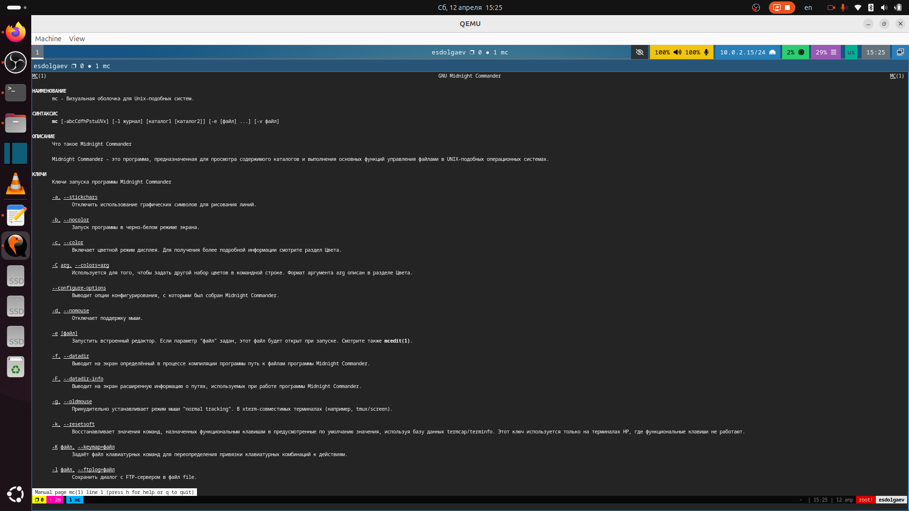{#fig:001 width=70%}

На следующих картинках вы можете у видеть результат работы некоторых горячих клавич в mc (рис. [-@fig:002], [-@fig:003], [-@fig:004], [-@fig:005], [-@fig:006]).

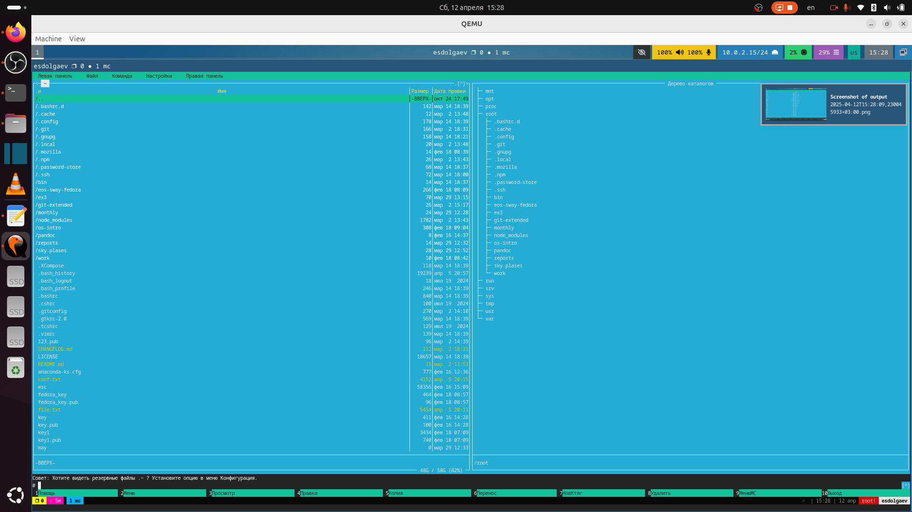{#fig:002 width=70%}

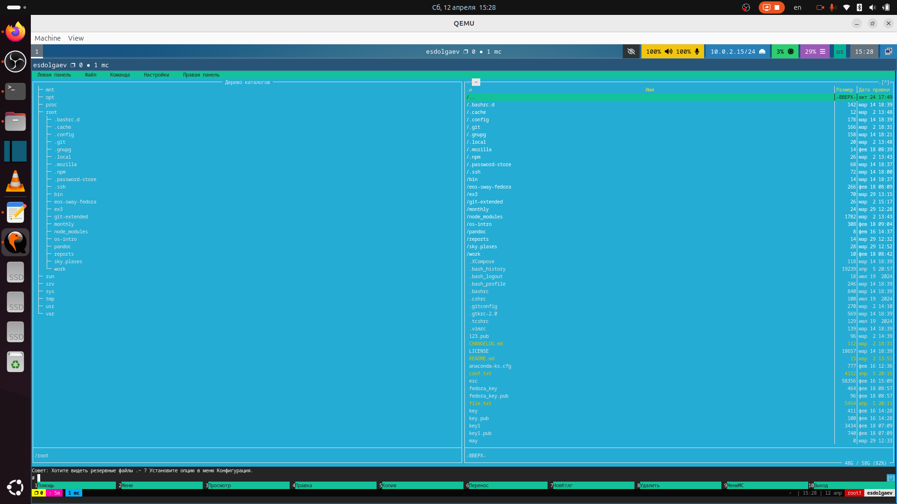{#fig:003 width=70%}

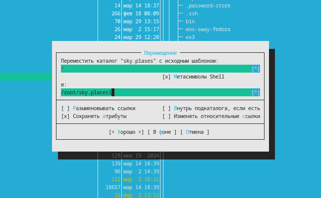{#fig:004 width=70%}

{#fig:005 width=70%}

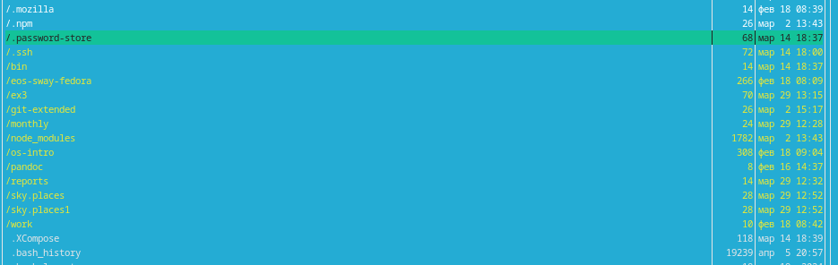{#fig:006 width=70%}

Ниже показаны режимы работы левой и правой панели в mc (рис. [-@fig:007], [-@fig:008], [-@fig:009], [-@fig:010]).

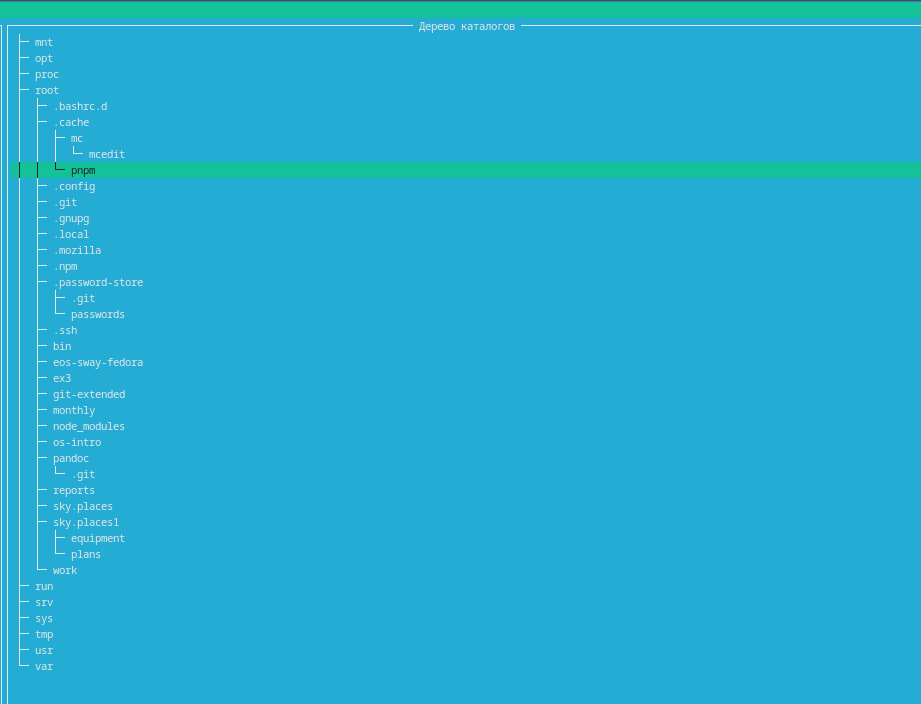{#fig:007 width=70%}

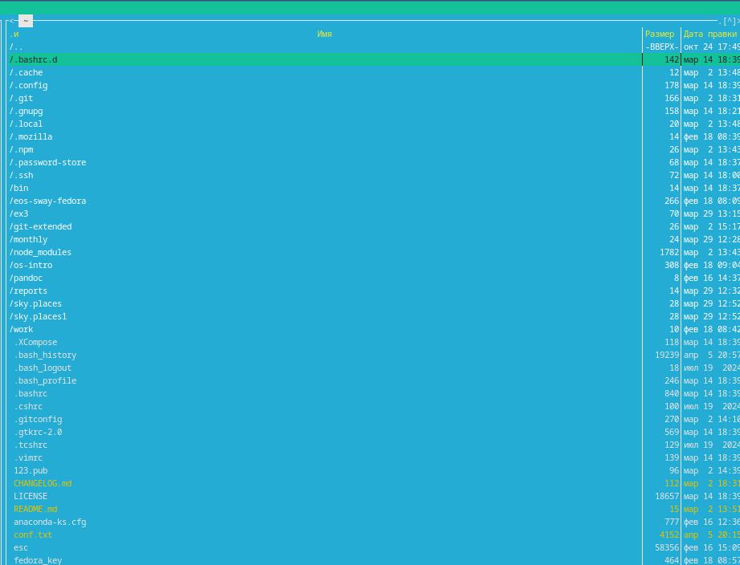{#fig:008 width=70%}

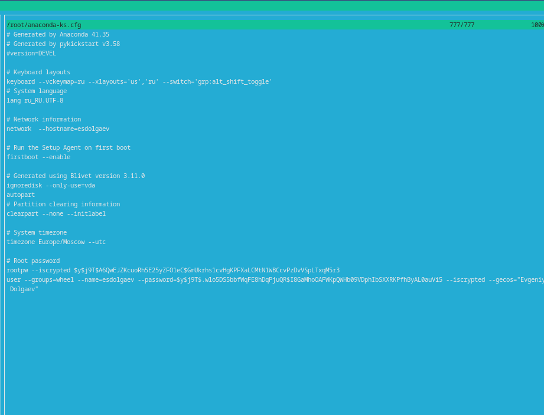{#fig:009 width=70%}

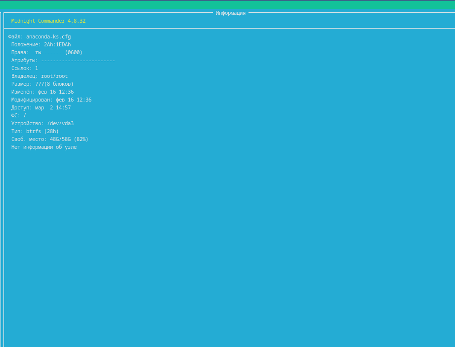{#fig:010 width=70%}

Больше всего информации о файле или каталоге можно узнать в режиме "Информация"

Далее показаны возможности под меню Файл и подменю Команда (рис. [-@fig:011], [-@fig:012], [-@fig:013], [-@fig:014], [-@fig:015])

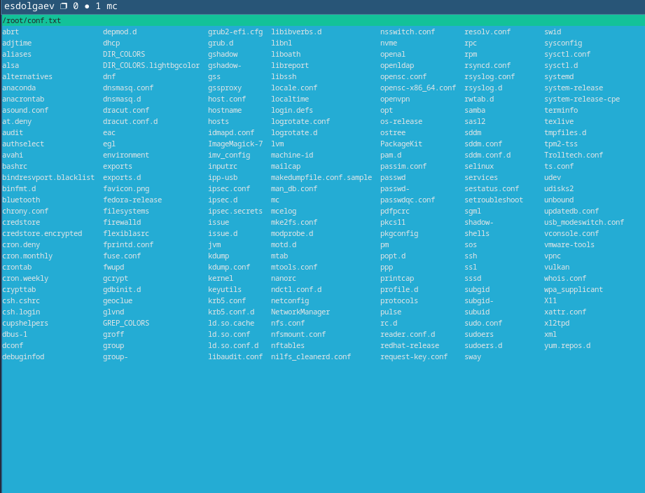{#fig:011 width=70%}

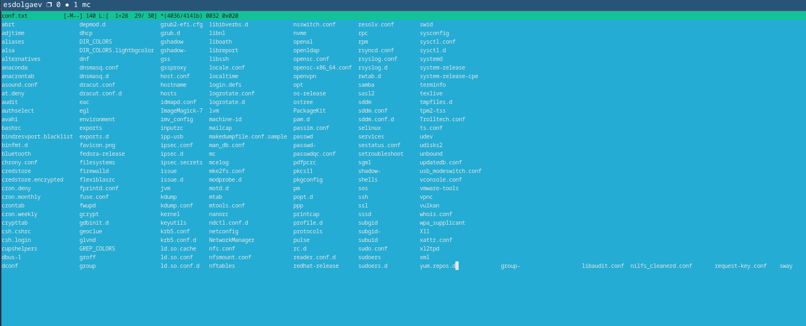{#fig:012 width=70%}

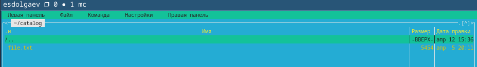{#fig:013 width=70%}

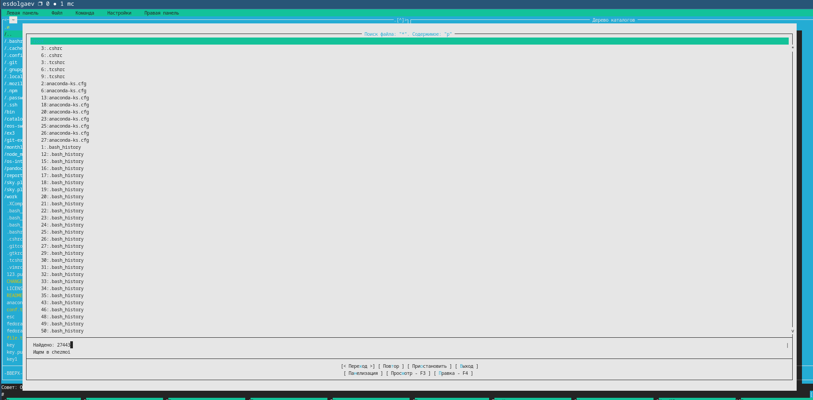{#fig:014 width=70%}

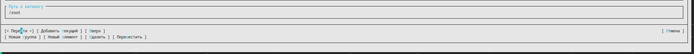{#fig:015 width=70%}

В mc также можно настроить внешний вид окна в подменю Найстройки (рис. [-@fig:016], [-@fig:016]).

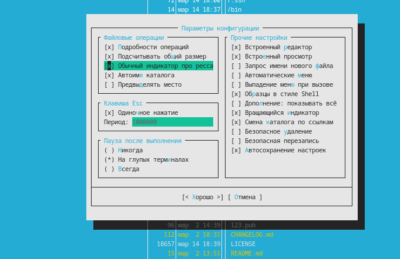{#fig:016 width=70%}

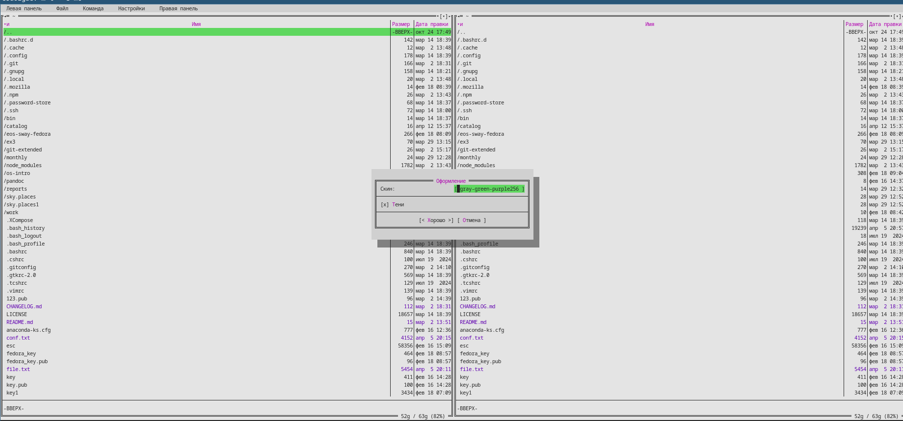{#fig:017 width=70%}

Перейдем к выполнению заданий в текстовом редакторе mc. Результаты их выполнения представлены ниже (рис. [-@fig:018], [-@fig:019], [-@fig:020], [-@fig:021], [-@fig:022], [-@fig:023], [-@fig:024],)

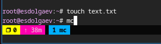{#fig:018 width=70%}

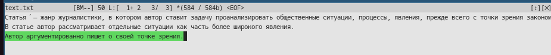{#fig:019 width=70%}

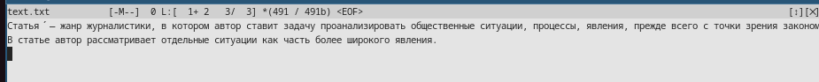{#fig:020 width=70%}

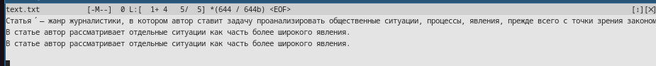{#fig:021 width=70%}

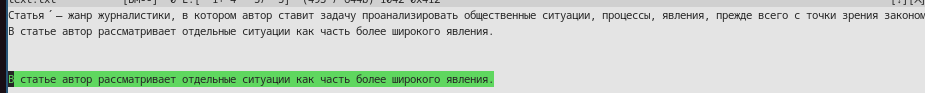{#fig:022 width=70%}

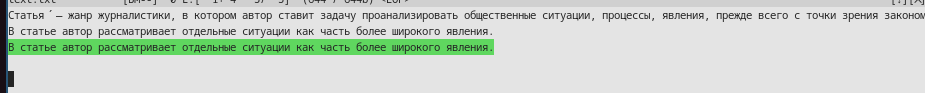{#fig:023 width=70%}

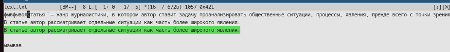{#fig:024 width=70%}

# Выводы

В ходе выполнения лаборатной работы я освоил основные возможности командной оболочки Midnight Commander и приобрел навыки практической работы по просмотру каталогов и файлов; манипуляций с ними.

# Список литературы{.unnumbered}

::: {#refs}
:::
