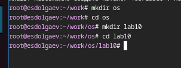
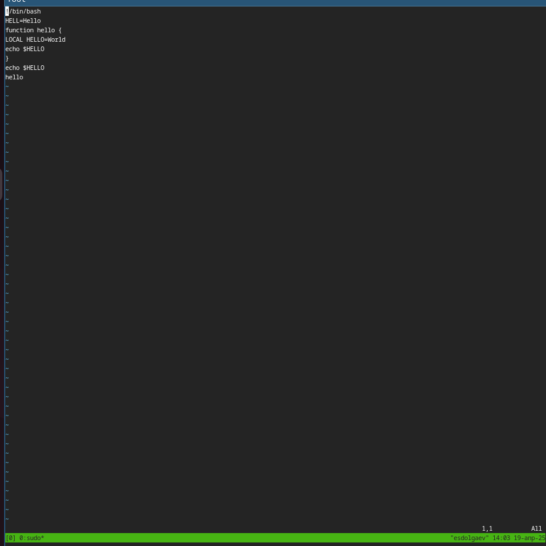
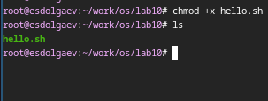
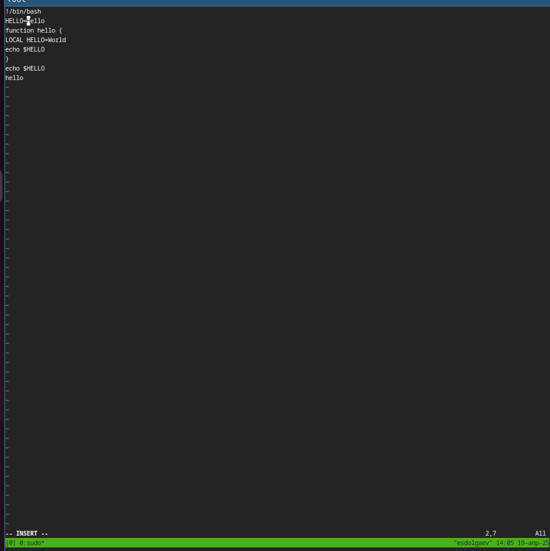
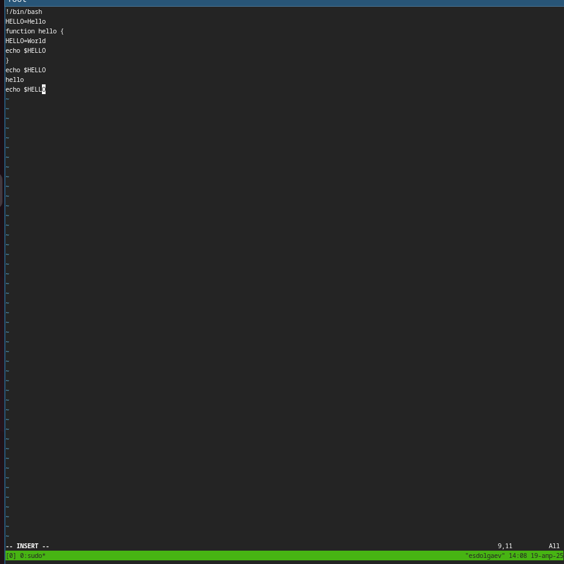
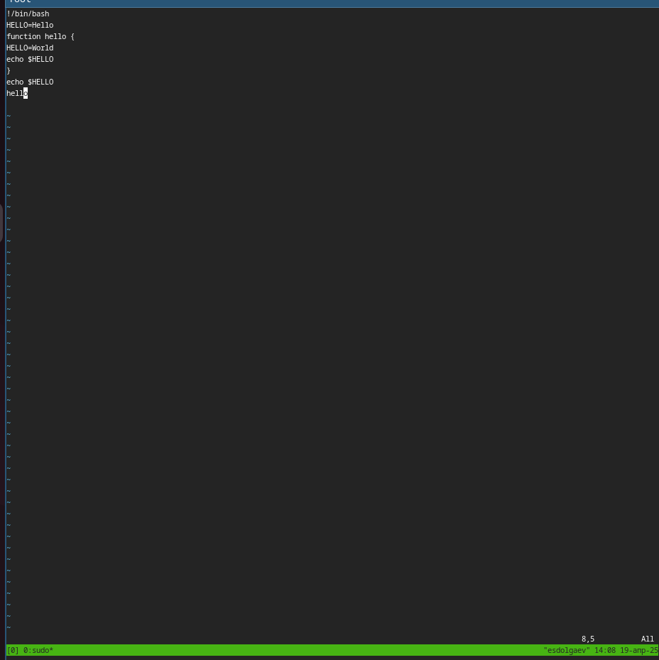
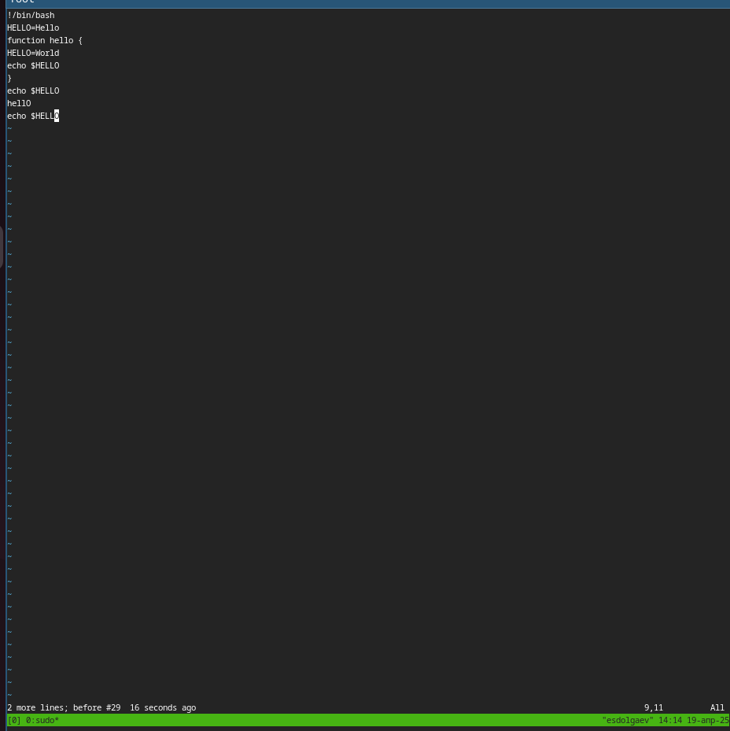
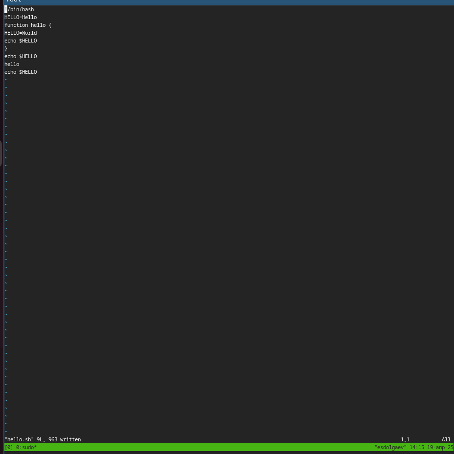

---
## Front matter
lang: ru-RU
title: "Презентация к лабораторной работе №10"
subtitle: "*Дисциплина: Операционные системы*"
author:
  - Долгаев Е. С.
institute:
  - Российский университет дружбы народов, Москва, Россия
date: 19 апреля 2025

## i18n babel
babel-lang: russian
babel-otherlangs: english

## Formatting pdf
toc: false
toc-title: Содержание
slide_level: 2
aspectratio: 169
section-titles: true
theme: metropolis
header-includes:
 - \metroset{progressbar=frametitle,sectionpage=progressbar,numbering=fraction}
---

# Информация

## Докладчик

:::::::::::::: {.columns align=center}
::: {.column width="70%"}

  * Долгаев Евгений Сергеевич
  * студент
  * Российский университет дружбы народов
  * [1132246827@rudn.ru](mailto:1132246827@rudn.ru)
  * <https://github.com/eugerne/study_2024-2024_os-intro.git>

:::
::::::::::::::

# Вводная часть

## Актуальность

- Работа с редактором vi в Linux остаётся актуальной благодаря его универсальности, лёгкости и наличию практически в любой Unix-системе.

## Цели и задачи

- Получить практические навыки работы с редактором vi, установленным по умолчанию практически во всех дистрибутивах.

## Материалы и методы

- Виртуальная машина qemu
- Тектовый редактор vi

# Лабораторная работа. Процесс выполнения.

## Задание 1.

- Создадим каталог с именем ~/work/os/lab10 и перейдём в него.

## Задание 1.

{#fig:001 width=70%}

## Задание 1.

- Далее, создадим файл hello.sh с помощью команды: 

```
vi hello.sh
```

## Задание 1.

- Нажав клавишу `i` передем в режим вставки и вставим в файл следующую программу:

```
#!/bin/bash
HELL=Hello
function hello {
LOCAL HELLO=World
echo $HELLO
}
echo $HELLO
hello
```

## Задание 1.

{#fig:002 width=70%}

## Задание 1.

- Нажмём клавишу `Esc`, чтобы перейти в командный режим, и в последней строке введем `:wq`, чтобы сохранить изменения и закрыть редактор vi. Сделаем файл hello.sh исполняемым.

## Задание 1.

{#fig:003 width=70%}

## Задание 2

- Вызовем vi на редактирование файла командой:

``` 
vi ~/work/os/lab06/hello.sh
```

## Задание 2

- Установим курсор в конец слова HELL второй строки. Перейдём в режим вставки и заменим на HELLO. Нажмём Esc для возврата в командный режим.

## Задание 2

{#fig:004 width=70%}

## Задание 2

- Установим курсор на четвертую строку и сотрём слово LOCAL. Перейдём в режим вставки и наберём следующий текст: local, нажмём Esc для возврата в командный режим.

## Задание 2

{#fig:005 width=70%}

## Задание 2

- Установим курсор на последней строке файла. Вставим после неё строку, содержащую следующий текст: echo $HELLO. Нажмём Esc для перехода в командный режим.

## Задание 2

{#fig:006 width=70%}

## Задание 2

- Удалим последнюю строку.

## Задание 2

{#fig:007 width=70%}

## Задание 2

- Введём команду отмены изменений u для отмены последней команды.

## Задание 2

{#fig:008 width=70%}

## Задание 2

- Введём символ : для перехода в режим последней строки. Запишем произведённые изменения и выйдем из vi.

## Задание 2

{#fig:009 width=70%}

## Результаты

- Таким образом, я получил практические навыки работы с редактором vi.

