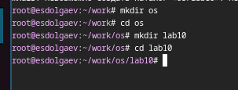
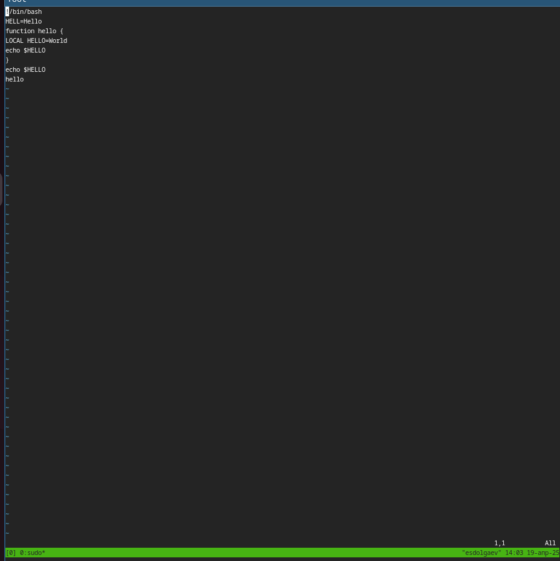
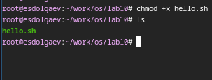
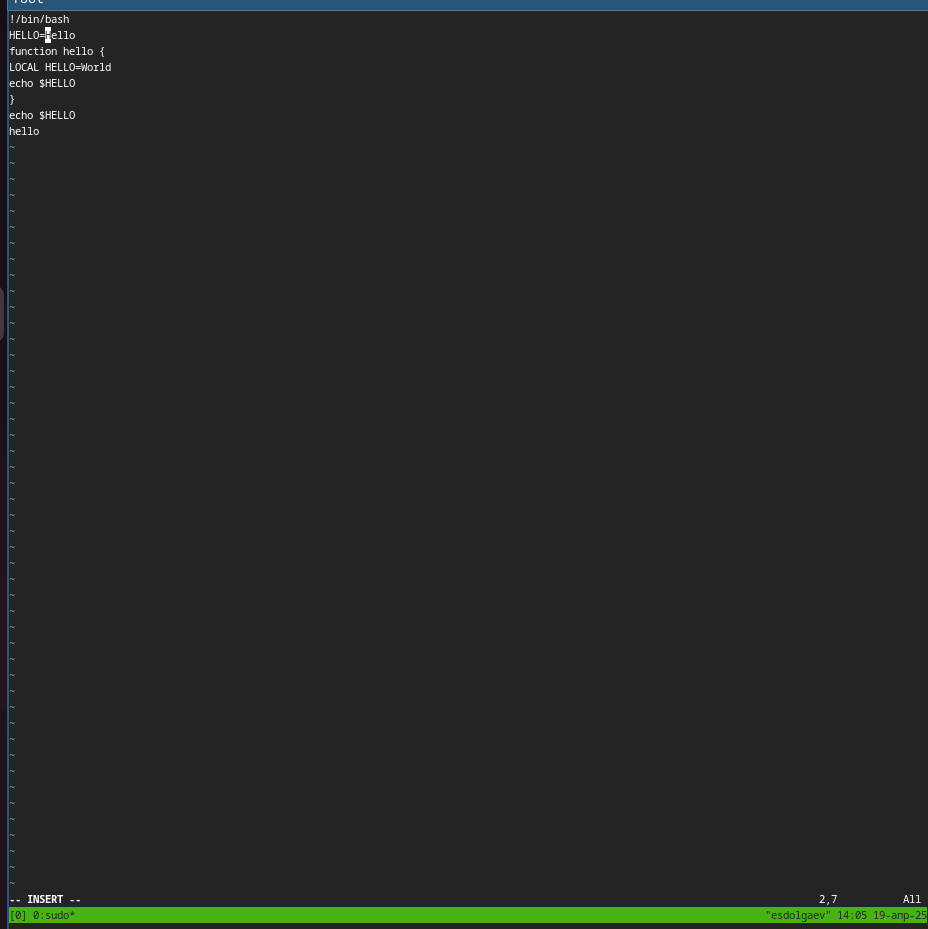
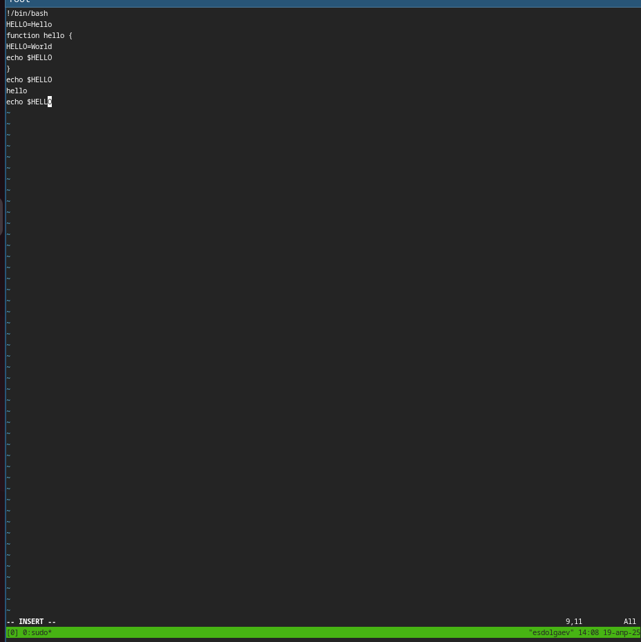
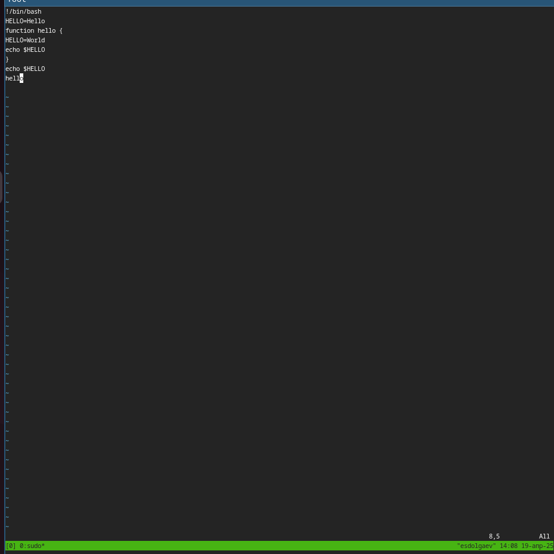
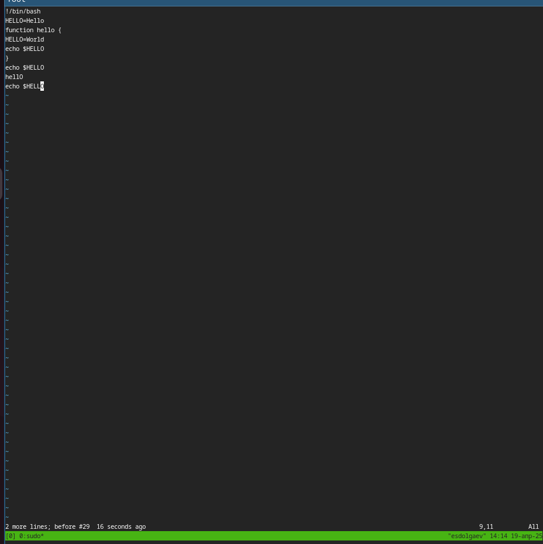
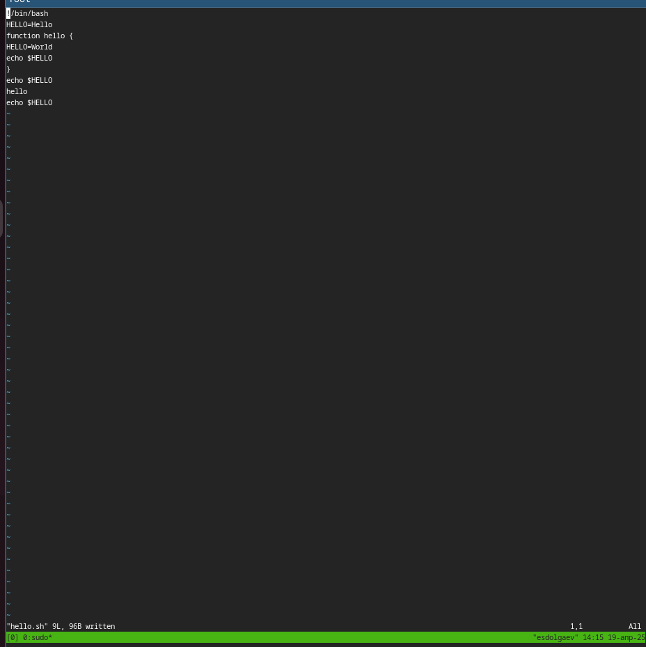

---
## Front matter
title: "Отчёт по лабораторной работе №10"
subtitle: "*Дисцисплина: Операционные системы*"
author: "Долгаев Евгений НММбд-01-24"

## Generic otions
lang: ru-RU
toc-title: "Содержание"

## Bibliography
bibliography: bib/cite.bib
csl: pandoc/csl/gost-r-7-0-5-2008-numeric.csl

## Pdf output format
toc: true # Table of contents
toc-depth: 2
lof: true # List of figures
lot: true # List of tables
fontsize: 12pt
linestretch: 1.5
papersize: a4
documentclass: scrreprt
## I18n polyglossia
polyglossia-lang:
  name: russian
  options:
	- spelling=modern
	- babelshorthands=true
polyglossia-otherlangs:
  name: english
## I18n babel
babel-lang: russian
babel-otherlangs: english
## Fonts
mainfont: IBM Plex Serif
romanfont: IBM Plex Serif
sansfont: IBM Plex Sans
monofont: IBM Plex Mono
mathfont: STIX Two Math
mainfontoptions: Ligatures=Common,Ligatures=TeX,Scale=0.94
romanfontoptions: Ligatures=Common,Ligatures=TeX,Scale=0.94
sansfontoptions: Ligatures=Common,Ligatures=TeX,Scale=MatchLowercase,Scale=0.94
monofontoptions: Scale=MatchLowercase,Scale=0.94,FakeStretch=0.9
mathfontoptions:
## Biblatex
biblatex: true
biblio-style: "gost-numeric"
biblatexoptions:
  - parentracker=true
  - backend=biber
  - hyperref=auto
  - language=auto
  - autolang=other*
  - citestyle=gost-numeric
## Pandoc-crossref LaTeX customization
figureTitle: "Рис."
tableTitle: "Таблица"
listingTitle: "Листинг"
lofTitle: "Список иллюстраций"
lotTitle: "Список таблиц"
lolTitle: "Листинги"
## Misc options
indent: true
header-includes:
  - \usepackage{indentfirst}
  - \usepackage{float} # keep figures where there are in the text
  - \floatplacement{figure}{H} # keep figures where there are in the text
---

# Цель работы

Познакомиться с операционной системой Linux. Получить практические навыки работы с редактором vi, установленным по умолчанию практически во всех дистрибутивах.

# Задание

1. Ознакомиться с теоретическим материалом.
2. Ознакомиться с редактором vi.
3. Выполнить упражнения, используя команды vi

# Выполнение лабораторной работы

## Задание 1

Создадим каталог с именем ~/work/os/lab10 и перейдём в него. (рис. [-@fig:001]).

{#fig:001 width=70%}

Далее, создадим файл hello.sh с помощью команды: 

```
vi hello.sh
```

Нажав клавишу `i` передем в режим вставки и вставим в файл следующую программу:

```
#!/bin/bash
HELL=Hello
function hello {
LOCAL HELLO=World
echo $HELLO
}
echo $HELLO
hello
```

{#fig:002 width=70%}

Нажмём клавишу `Esc`, чтобы перейти в командный режим, и в последней строке введем `:wq`, чтобы сохранить изменения и закрыть редактор vi. Сделаем файл hello.sh исполняемым (рис. [-@fig:003]).

{#fig:003 width=70%}

## Задание 2

Вызовем vi на редактирование файла командой:

``` 
vi ~/work/os/lab06/hello.sh
```

Установим курсор в конец слова HELL второй строки. Перейдём в режим вставки и заменим на HELLO. Нажмём Esc для возврата в командный режим (рис. [-@fig:004]).

{#fig:004 width=70%}

Установим курсор на четвертую строку и сотрём слово LOCAL. Перейдём в режим вставки и наберём следующий текст: local, нажмём Esc для возврата в командный режим (рис. [-@fig:005]).

{#fig:005 width=70%}

Установим курсор на последней строке файла. Вставим после неё строку, содержащую следующий текст: echo $HELLO. Нажмём Esc для перехода в командный режим (рис. [-@fig:006]).

{#fig:006 width=70%}

Удалим последнюю строку (рис. [-@fig:007]).

{#fig:007 width=70%}

Введём команду отмены изменений u для отмены последней команды (рис. [-@fig:008]).

{#fig:008 width=70%}

Введём символ : для перехода в режим последней строки. Запишем произведённые изменения и выйдем из vi (рис. [-@fig:009]).

{#fig:009 width=70%}

# Контрольные вопросы

1. Редактор vi имеет три режима работы:
 	- командный режим — предназначен для ввода команд редактирования и навигации по редактируемому файлу;
 	- режим вставки — предназначен для ввода содержания редактируемого файла;
 	- режим последней (или командной) строки — используется для записи изменений в файл и выхода из редактора.
2. :q! — выйти из редактора без записи
3. Команды позиционирования
 	- 0 (ноль) — переход в начало строки;
 	- $ — переход в конец строки;
 	- G — переход в конец файла;
 	- nG — переход на строку с номером n
4. —
5. С помощью команд:
 	- G — переход в конец файла;
 	- n G — переход на строку с номером n.
6. 
 * Вставка текста
  	- а — вставить текст после курсора;
  	- А — вставить текст в конец строки;
  	- i — вставить текст перед курсором;
  	- ni — вставить текст n раз;
  	- I — вставить текст в начало строки.
 * Вставка строки
  	- о — вставить строку под курсором;
  	- О — вставить строку над курсором.
 * Удаление текста
	- x — удалить один символ в буфер;
	- dw — удалить одно слово в буфер;
	- d$ — удалить в буфер текст от курсора до конца строки;
	- d0 — удалить в буфер текст от начала строки до позиции курсора;
	- dd — удалить в буфер одну строку;
	- ndd — удалить в буфер n строк.
 * Отмена и повтор произведённых изменений
	- u — отменить последнее изменение;
	- . — повторить последнее изменение.
	- Копирование текста в буфер
	- Y — скопировать строку в буфер;
	- n Y — скопировать n строк в буфер;
	- y w — скопировать слово в буфер.
 * Вставка текста из буфера
	- p — вставить текст из буфера после курсора;
	- P — вставить текст из буфера перед курсором.
 * Замена текста
	- c w — заменить слово;
	- n c w — заменить n слов;
	- c $ — заменить текст от курсора до конца строки;
	- r — заменить слово;
	- R — заменить текст.
 * Поиск текста
	- / текст — произвести поиск вперёд по тексту указанной строки символов текст;
	- ? текст — произвести поиск назад по тексту указанной строки символов текст.
7. Команды редактирования в режиме командной строки
 * Копирование и перемещение текста
	- :n,m d — удалить строки с n по m;
	- :i,j m k — переместить строки с i по j, начиная со строки k;
	- :i,j t k — копировать строки с i по j в строку k;
	- :i,j w имя-файла — записать строки с i по j в файл с именем имя-файла.
 * Запись в файл и выход из редактора
	- :w — записать изменённый текст в файл, не выходя из vi;
	- :w имя-файла — записать изменённый текст в новый файл с именем имя-файла;
	- :w ! имя-файла — записать изменённый текст в файл с именем имя-файла;
	- :wq — записать изменения в файл и выйти из vi;
	- :q — выйти из редактора vi;
	- :q! — выйти из редактора без записи;
8. :u — отменить последнее изменение
9. :ni — вставить текст n раз или c$ — заменить текст от курсора до конца строки
10. $ — переход в конец строки
11. Опции редактора vi позволяют настроить рабочую среду. Для задания опций используется команда set (в режиме последней строки):
	- :set all — вывести полный список опций;
	- :set nu — вывести номера строк;
	- :set list — вывести невидимые символы;
	- :set ic — не учитывать при поиске, является ли символ прописным или строчным.
Если вы хотите отказаться от использования опции, то в команде set перед именем опции надо поставить no.
12. При работе с файлом через редактор vi в левом нижнем углу показан режим, в котором вы находитесь
13. —

# Выводы

В ходе выполнения лабораторной работы я получил практические навыки работы с редактором vi.

# Список литературы{.unnumbered}

::: {#refs}
:::
