---
## Front matter
lang: ru-RU
title: "Презентация к лабораторной работе №11"
subtitle: "*Дисциплина: Операционные системы*"
author:
  - Долгаев Е. С.
institute:
  - Российский университет дружбы народов, Москва, Россия
date: 26 апреля 2025

## i18n babel
babel-lang: russian
babel-otherlangs: english

## Formatting pdf
toc: false
toc-title: Содержание
slide_level: 2
aspectratio: 169
section-titles: true
theme: metropolis
header-includes:
 - \metroset{progressbar=frametitle,sectionpage=progressbar,numbering=fraction}
---

# Информация

## Докладчик

:::::::::::::: {.columns align=center}
::: {.column width="70%"}

  * Долгаев Евгений Сергеевич
  * студент
  * Российский университет дружбы народов
  * [1132246827@rudn.ru](mailto:1132246827@rudn.ru)
  * <https://github.com/eugerne/study_2024-2024_os-intro.git>

:::
::::::::::::::

# Вводная часть

## Актуальность

- Работа с редактором Emacs в Linux остаётся актуальной благодаря его простоте и большому функционалу.

## Цели и задачи

- Получить практические навыки работы с редактором Emacs.

## Материалы и методы

- Виртуальная машина qemu
- Тектовый редактор emacs

# Лабораторная работа

## Выполнение

Откроем emacs.

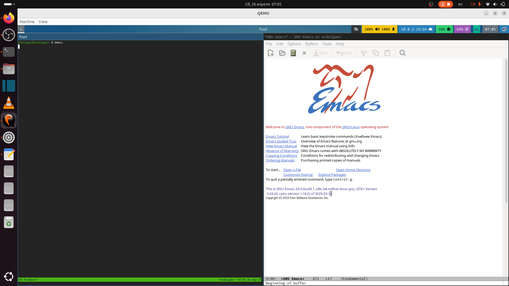{#fig:001 width=40%}

## Выполнение

Cоздим файл lab11.sh с помощью комбинации Ctrl-x Ctrl-f (C-x C-f).

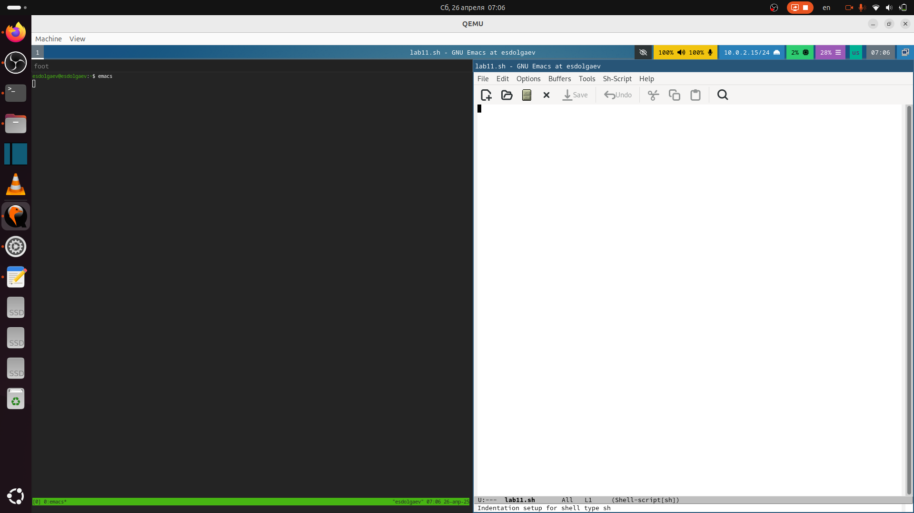{#fig:002 width=40%}

## Выполнение

Наберём текст:

```
#!/bin/bash
HELL=Hello
function hello {
LOCAL HELLO=World
echo $HELLO
}
echo $HELLO
hello
```

## Выполнение

{#fig:003 width=40%}

Сохраним файл с помощью комбинации Ctrl-x Ctrl-s (C-x C-s).

## Выполнение

# Процедуры редактирования

## Выполнение

Вырежем одной командой целую строку (С-k).

{#fig:004 width=40%}

## Выполнение

Вставим эту строку в конец файла (C-y).

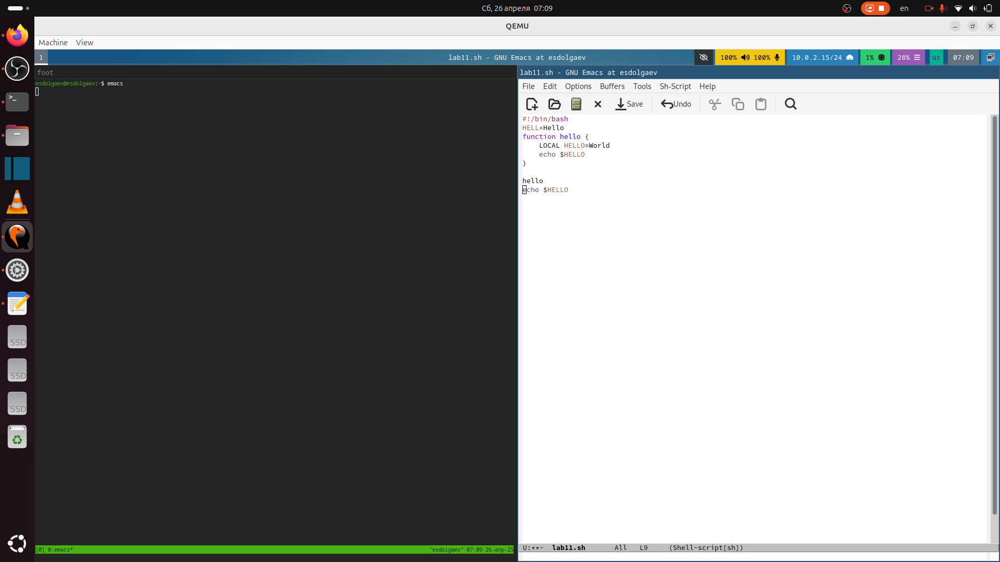{#fig:005 width=40%}

## Выполнение

Выделим область текста (C-space).

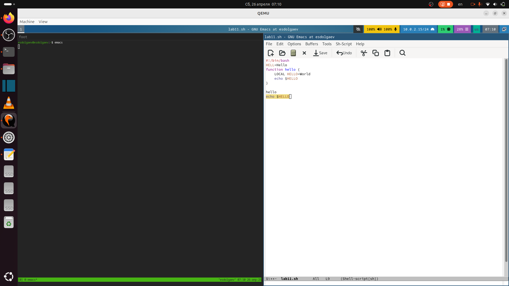{#fig:006 width=40%}

## Выполнение

Скопируем область в буфер обмена (M-w).

{#fig:007 width=40%}

## Выполнение

Вставим область в конец файла.

{#fig:008 width=40%}

## Выполнение

Вновь выделим эту область и на этот раз вырежем её (C-w).

{#fig:009 width=40%}

## Выполнение

Отменим последнее действие (C-/) .

{#fig:010 width=40%}

# Команды по перемещению курсора

Переместим курсор в начало строки (C-a).

{#fig:011 width=40%}

## Выполнение

Переместим курсор в конец строки (C-e).

{#fig:012 width=40%}

## Выполнение

Переместим курсор в начало буфера (M-<).

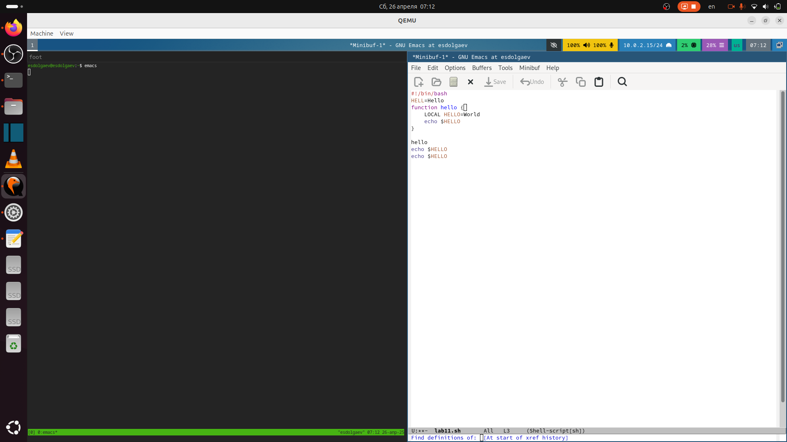{#fig:013 width=40%}

## Выполнение

Переместим курсор в конец буфера (M->).

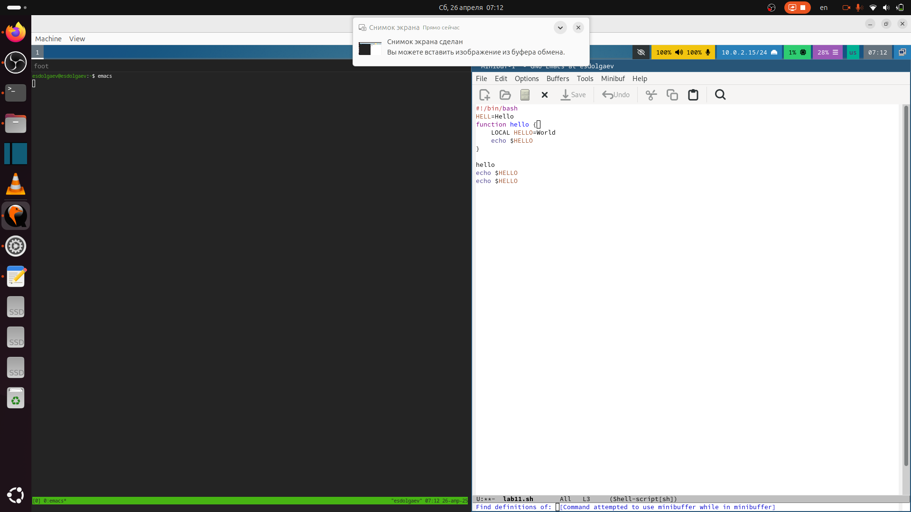{#fig:014 width=40%}

# Управление буферами

Выведем список активных буферов на экран (C-x C-b).

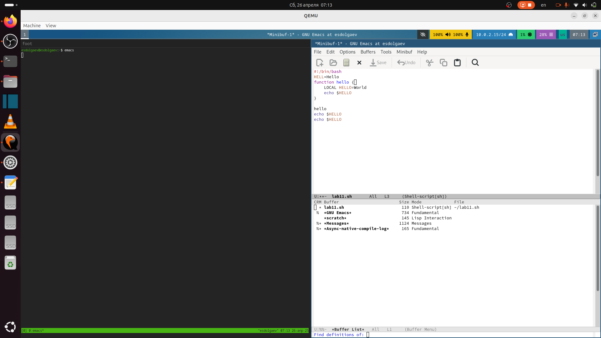{#fig:015 width=40%}

## Выполнение

Переместимся во вновь открытое окно (C-x o) со списком открытых буферов и переключимся на другой буфер.

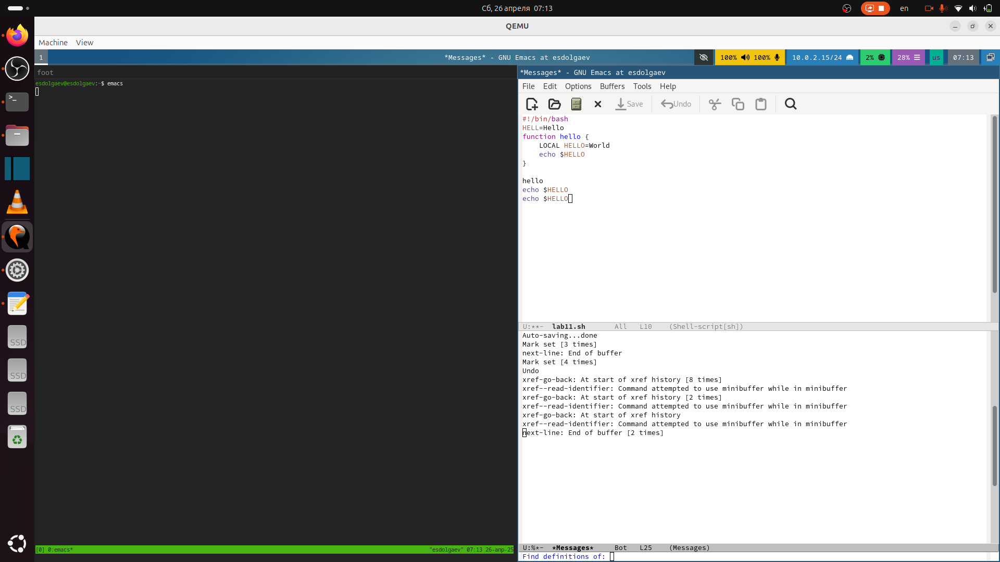{#fig:016 width=40%}

## Выполнение

Закроем это окно (C-x 0) 17.

{#fig:017 width=40%}

## Выполнение

Теперь вновь переключимся между буферами, но уже без вывода их списка на экран (C-x b).

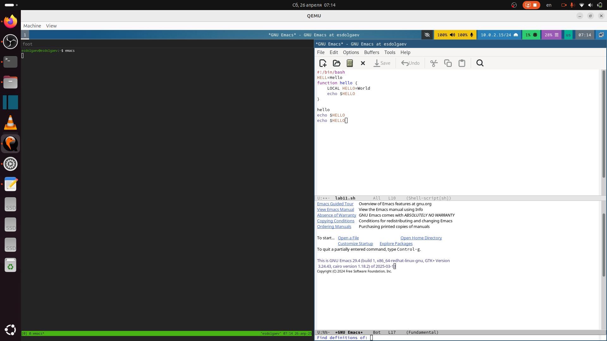{#fig:018 width=40%}

# Управление окнами

## Выполнение

Поделите фрейм на 4 части: разделим фрейм на два окна по вертикали (C-x 3), а затем каждое из этих окон на две части по горизонтали (C-x 2) 19.

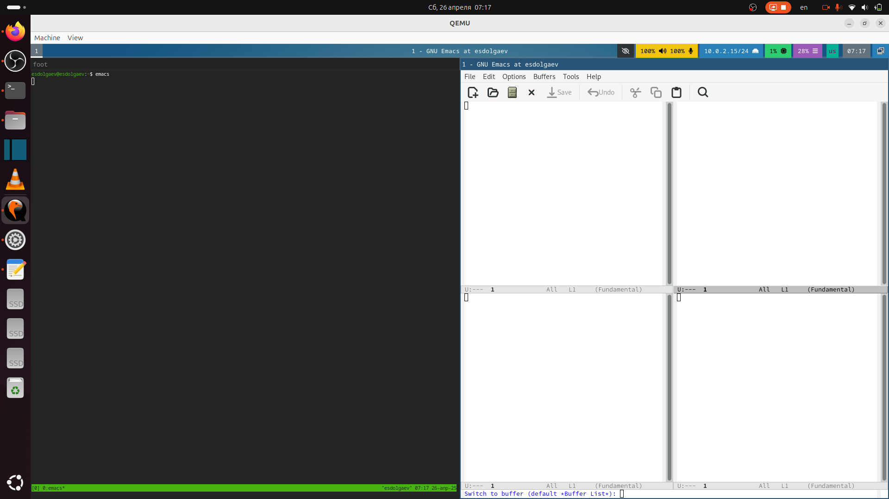{#fig:019 width=40%}

## Выполнение

В каждом из четырёх созданных окон откроем новый буфер (файл) и введём несколько строк текста.

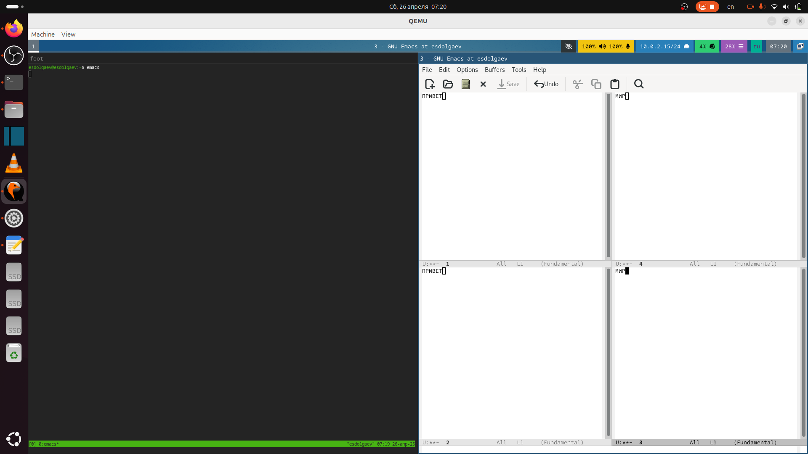{#fig:020 width=40%}

# Режим поиска

Переключимся в режим поиска (C-s) и найдём несколько слов, присутствующих в тексте.

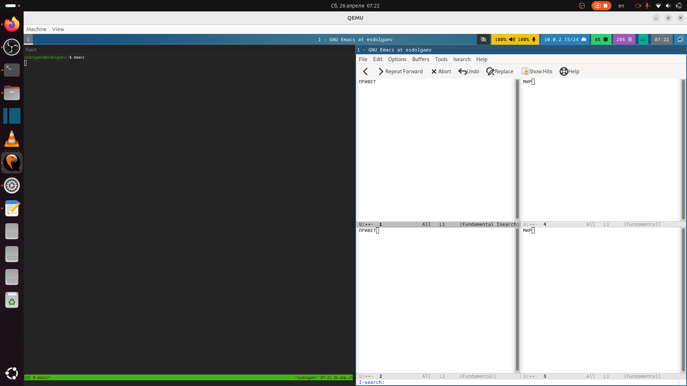{#fig:021 width=40%}

## Выполнение

Переключимся между результатами поиска, нажимая C-s.
Выйдем из режима поиска, нажав C-g.

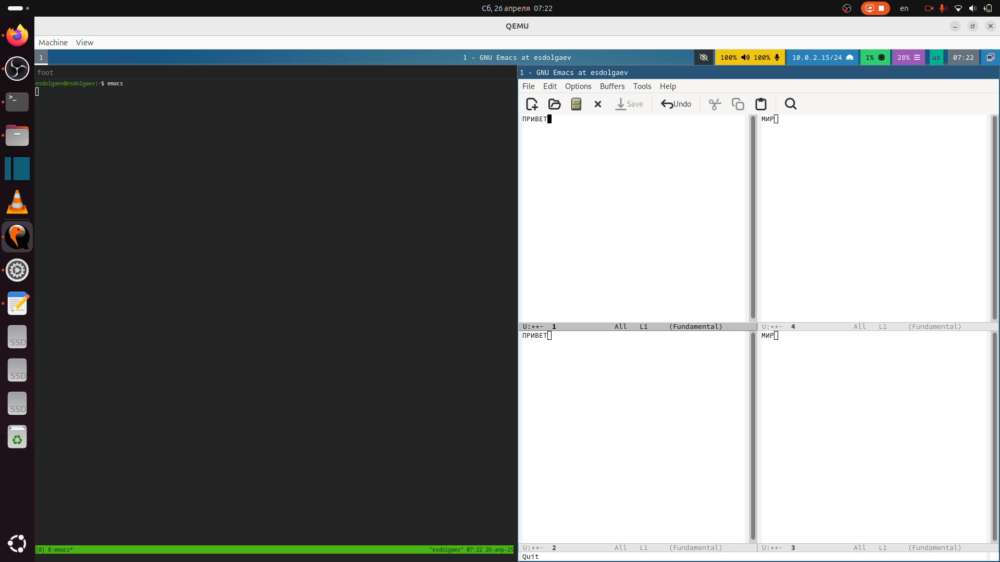{#fig:022 width=40%}

## Выполнение

Испробуем другой режим поиска, нажав M-s o. Это режим поиска показывает строки, в которых есть совпадения с тем, то мы ищем.

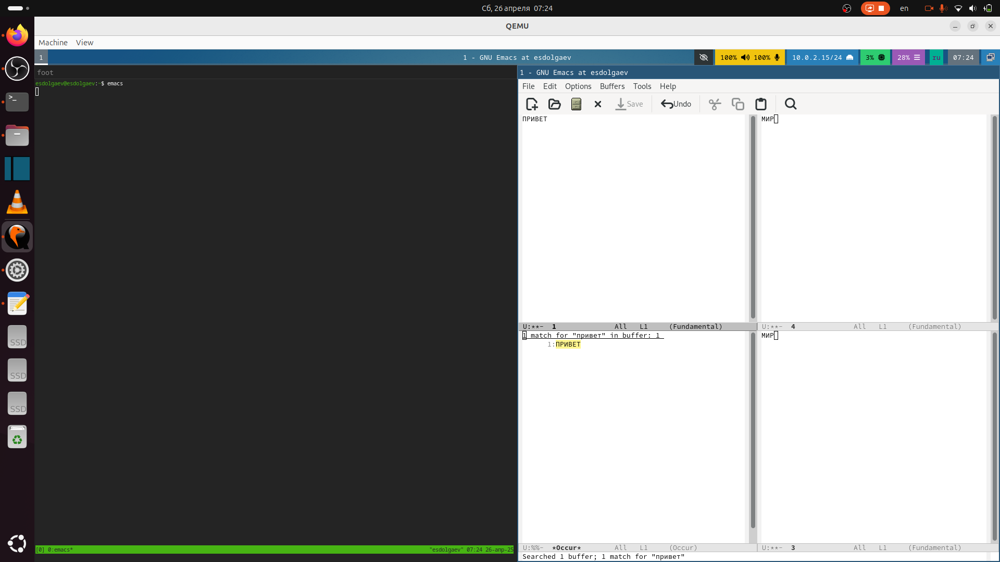{#fig:023 width=40%}

## Результаты

- Таким образом, я получил практические навыки работы с редактором Emacs.

