---
## Front matter
title: "Отчёт по лабораторной работе №11"
subtitle: "*Дисциплина: Операционные системы*"
author: "Долгаев Евгений НММбд-01-24"

## Generic otions
lang: ru-RU
toc-title: "Содержание"

## Bibliography
bibliography: bib/cite.bib
csl: pandoc/csl/gost-r-7-0-5-2008-numeric.csl

## Pdf output format
toc: true # Table of contents
toc-depth: 2
lof: true # List of figures
lot: true # List of tables
fontsize: 12pt
linestretch: 1.5
papersize: a4
documentclass: scrreprt
## I18n polyglossia
polyglossia-lang:
  name: russian
  options:
	- spelling=modern
	- babelshorthands=true
polyglossia-otherlangs:
  name: english
## I18n babel
babel-lang: russian
babel-otherlangs: english
## Fonts
mainfont: IBM Plex Serif
romanfont: IBM Plex Serif
sansfont: IBM Plex Sans
monofont: IBM Plex Mono
mathfont: STIX Two Math
mainfontoptions: Ligatures=Common,Ligatures=TeX,Scale=0.94
romanfontoptions: Ligatures=Common,Ligatures=TeX,Scale=0.94
sansfontoptions: Ligatures=Common,Ligatures=TeX,Scale=MatchLowercase,Scale=0.94
monofontoptions: Scale=MatchLowercase,Scale=0.94,FakeStretch=0.9
mathfontoptions:
## Biblatex
biblatex: true
biblio-style: "gost-numeric"
biblatexoptions:
  - parentracker=true
  - backend=biber
  - hyperref=auto
  - language=auto
  - autolang=other*
  - citestyle=gost-numeric
## Pandoc-crossref LaTeX customization
figureTitle: "Рис."
tableTitle: "Таблица"
listingTitle: "Листинг"
lofTitle: "Список иллюстраций"
lotTitle: "Список таблиц"
lolTitle: "Листинги"
## Misc options
indent: true
header-includes:
  - \usepackage{indentfirst}
  - \usepackage{float} # keep figures where there are in the text
  - \floatplacement{figure}{H} # keep figures where there are in the text
---

# Цель работы

Познакомиться с операционной системой Linux. Получить практические навыки работы с редактором Emacs.

# Задание

1. Ознакомиться с теоретическим материалом.
2. Ознакомиться с редактором emacs.
3. Выполнить упражнения.
4. Ответить на контрольные вопросы.

# Выполнение лабораторной работы

Откроем emacs (рис. [-@fig:001]).

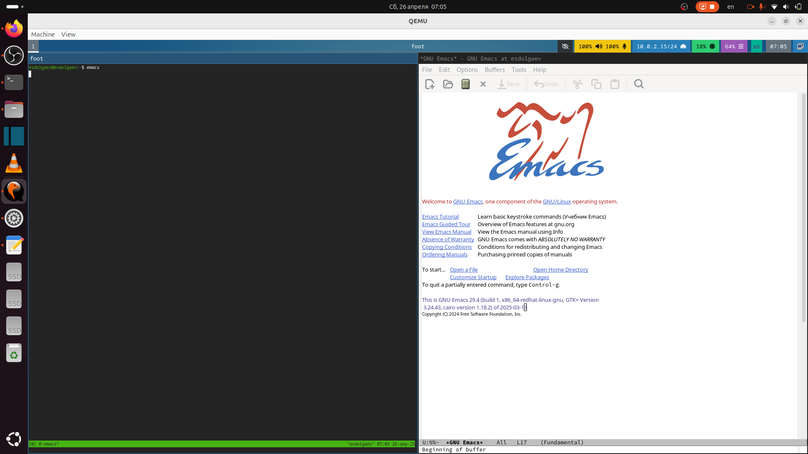{#fig:001 width=70%}

Cоздим файл lab11.sh с помощью комбинации Ctrl-x Ctrl-f (C-x C-f) (рис. [-@fig:002]).

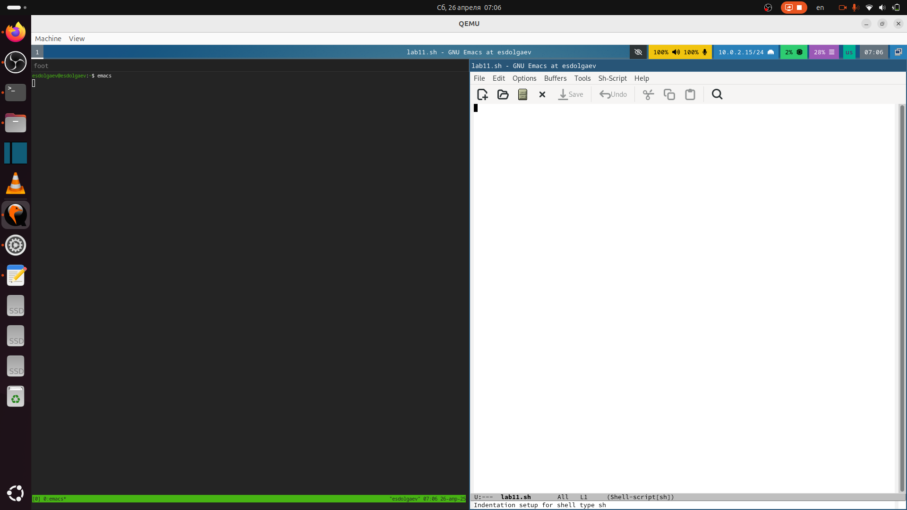{#fig:002 width=70%}

Наберите текст (рис. [-@fig:003]):

```
#!/bin/bash
HELL=Hello
function hello {
LOCAL HELLO=World
echo $HELLO
}
echo $HELLO
hello
```

{#fig:003 width=70%}

Сохраним файл с помощью комбинации Ctrl-x Ctrl-s (C-x C-s).

## Процедуры редактирования

Вырежем одной командой целую строку (С-k) (рис. [-@fig:004]).

{#fig:004 width=70%}

Вставим эту строку в конец файла (C-y) (рис. [-@fig:004]).

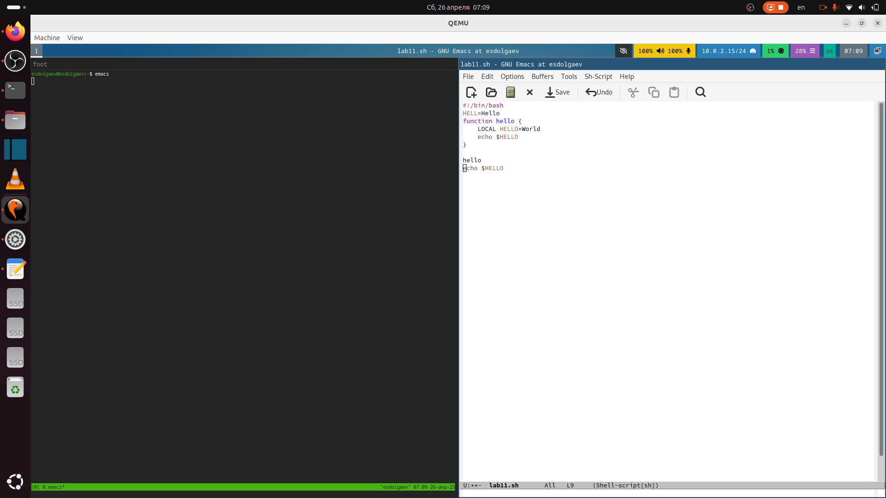{#fig:005 width=70%}

Выделим область текста (C-space) (рис. [-@fig:006]).

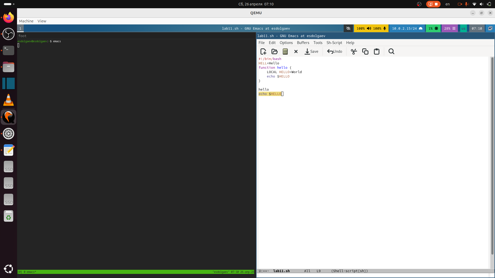{#fig:006 width=70%}

Скопируем область в буфер обмена (M-w) (рис. [-@fig:007]).

{#fig:007 width=70%}

Вставим область в конец файла (рис. [-@fig:008]).

{#fig:008 width=70%}

Вновь выделим эту область и на этот раз вырежем её (C-w) (рис. [-@fig:009]).

{#fig:009 width=70%}

Отменим последнее действие (C-/) (рис. [-@fig:010]).

{#fig:010 width=70%}

## Команды по перемещению курсора

Переместим курсор в начало строки (C-a) (рис. [-@fig:011]).

{#fig:011 width=70%}

Переместим курсор в конец строки (C-e) (рис. [-@fig:012]).

{#fig:012 width=70%}

Переместим курсор в начало буфера (M-<) (рис. [-@fig:013]).

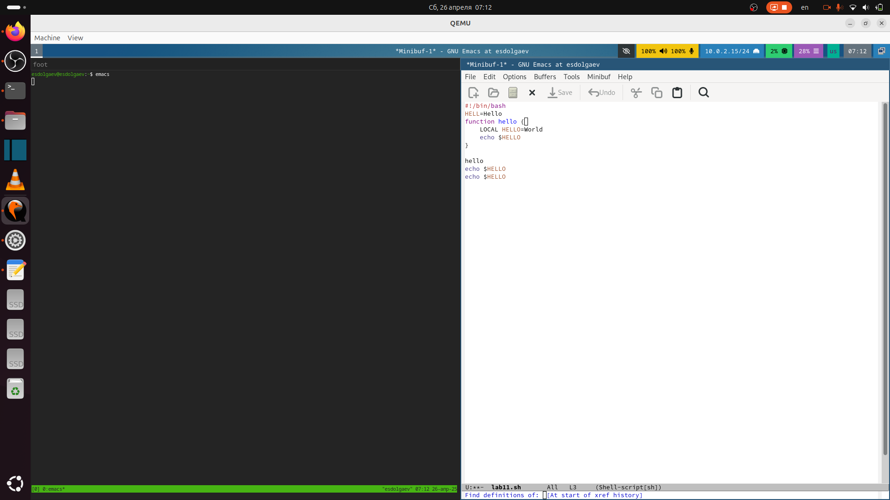{#fig:013 width=70%}

Переместим курсор в конец буфера (M->) (рис. [-@fig:014]).

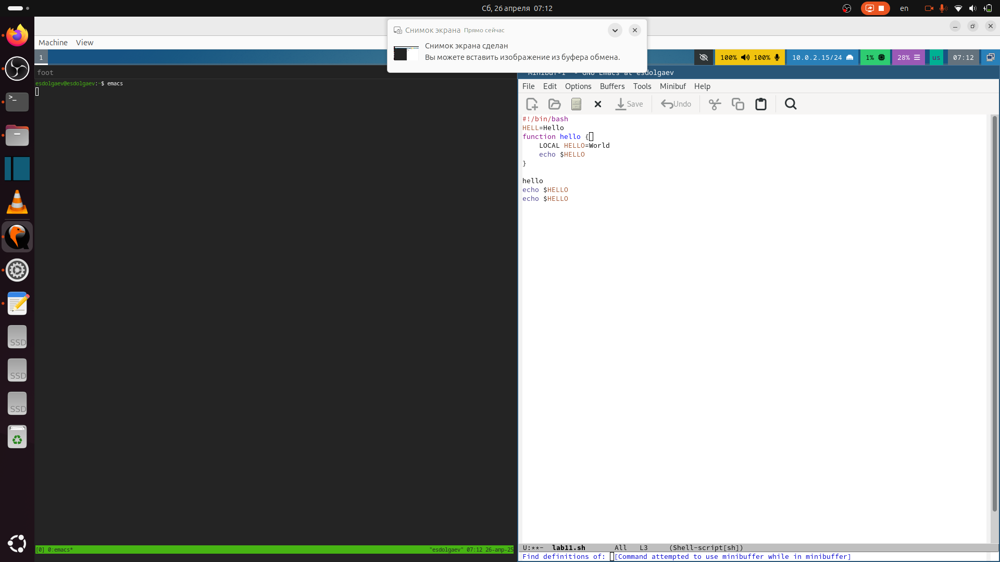{#fig:014 width=70%}

## Управление буферами

Выведем список активных буферов на экран (C-x C-b) (рис. [-@fig:015]).

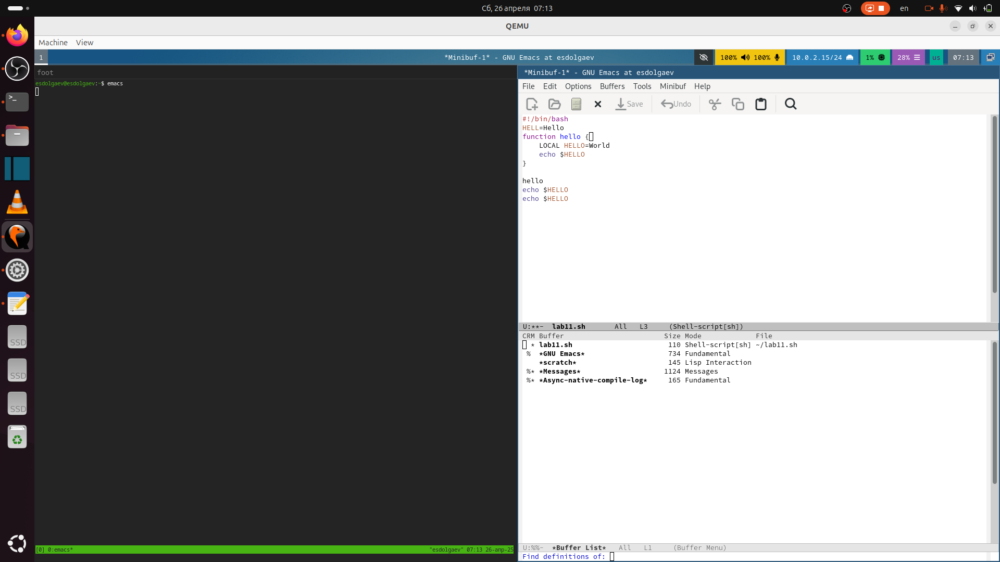{#fig:015 width=70%}

Переместимся во вновь открытое окно (C-x o) со списком открытых буферов и переключимся на другой буфер (рис. [-@fig:016]).

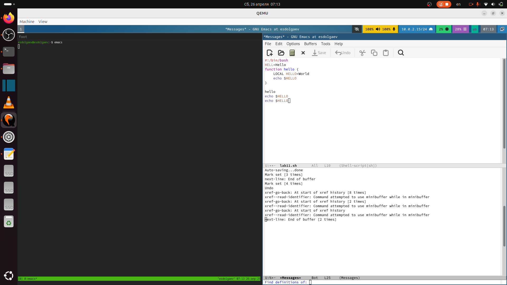{#fig:016 width=70%}

Закроем это окно (C-x 0) (рис. [-@fig:017]).

{#fig:017 width=70%}

Теперь вновь переключимся между буферами, но уже без вывода их списка на экран (C-x b) (рис. [-@fig:018]).

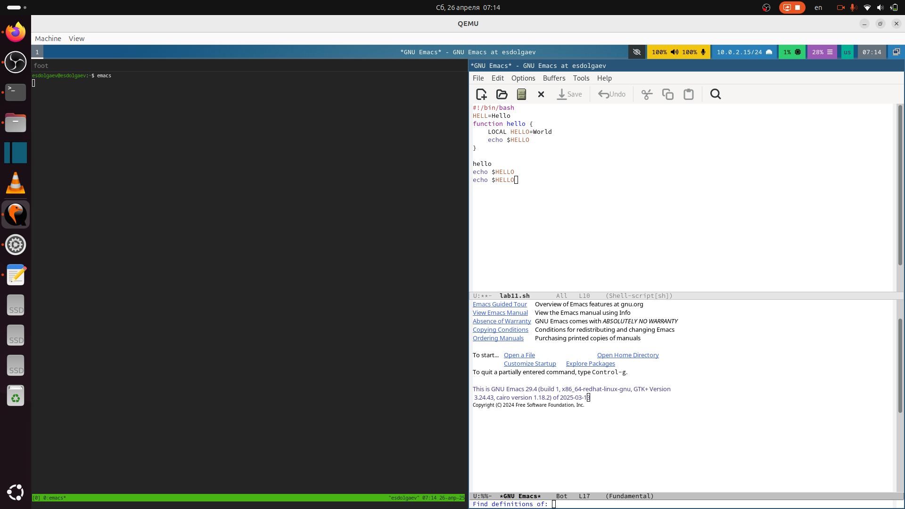{#fig:018 width=70%}

## Управление окнами

Поделите фрейм на 4 части: разделим фрейм на два окна по вертикали (C-x 3), а затем каждое из этих окон на две части по горизонтали (C-x 2) (рис. [-@fig:019]).

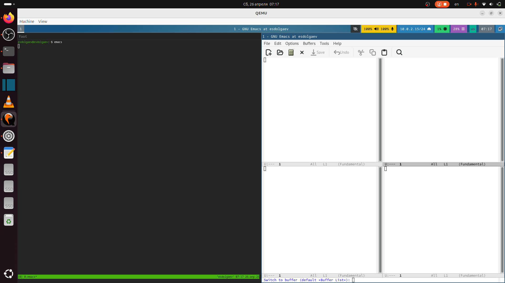{#fig:019 width=70%}

В каждом из четырёх созданных окон откроем новый буфер (файл) и введём несколько строк текста (рис. [-@fig:020]).

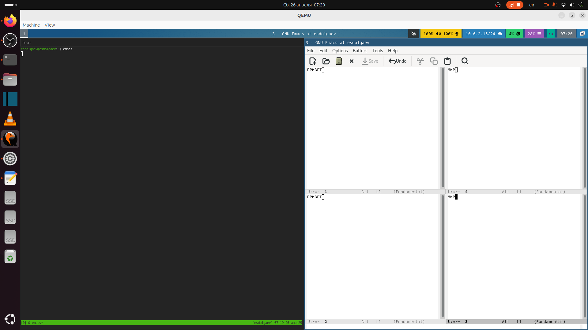{#fig:020 width=70%}

## Режим поиска

Переключимся в режим поиска (C-s) и найдём несколько слов, присутствующих в тексте (рис. [-@fig:021]).

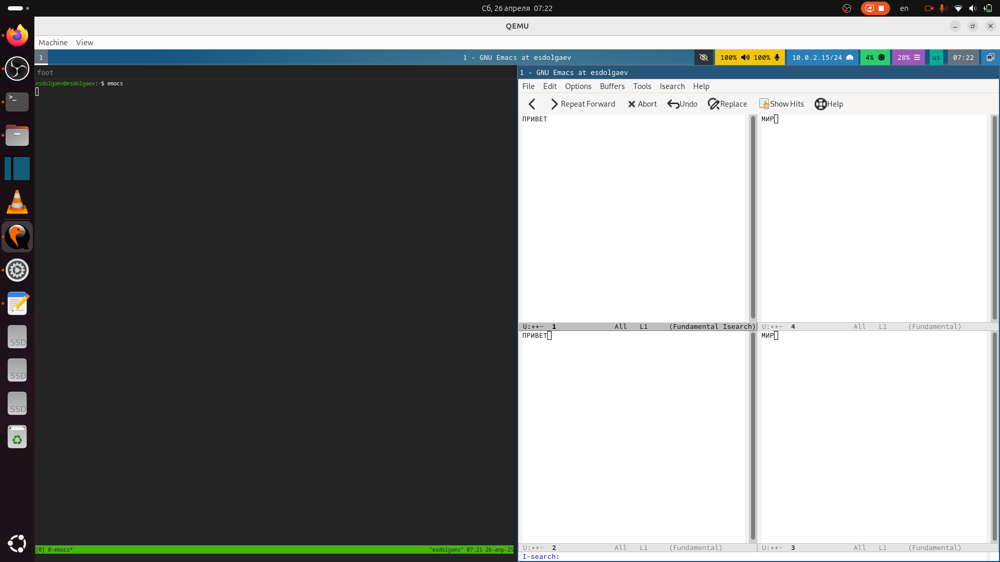{#fig:021 width=70%}

Переключимся между результатами поиска, нажимая C-s.
Выйдем из режима поиска, нажав C-g (рис. [-@fig:022]).

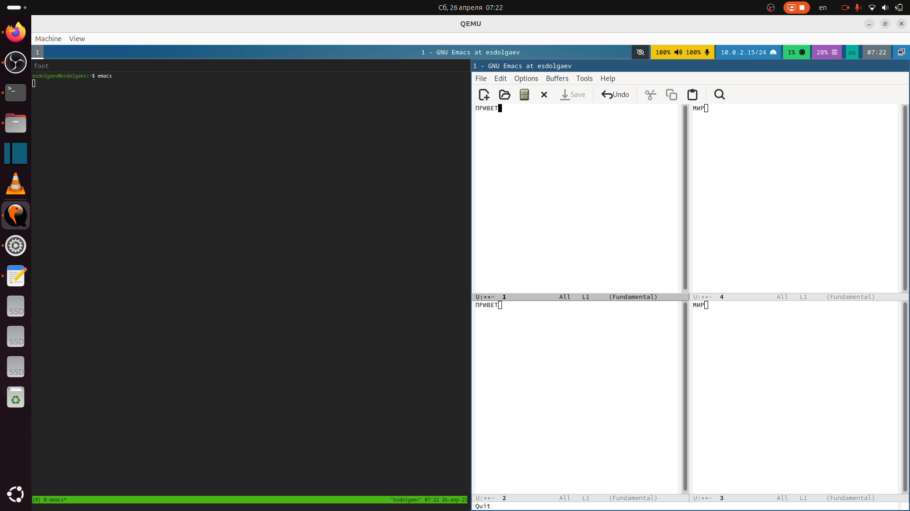{#fig:022 width=70%}

Испробуем другой режим поиска, нажав M-s o (рис. [-@fig:023]). Это режим поиска показывает строки, в которых есть совпадения с тем, то мы ищем.

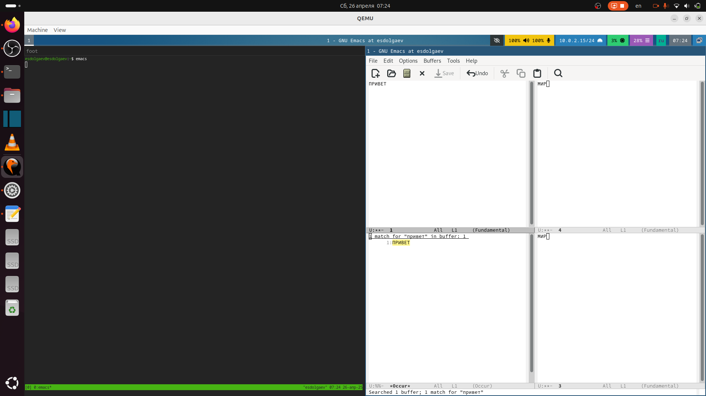{#fig:023 width=70%}

# Ответы на контрольные вопросы

1. Emacs представляет собой мощный экранный редактор текста, написанный на языке высокого уровня Elisp.
2. Количество комбинаций клавиш и принцип его работы.
3. Буфер - всё, что представляется на экране в виде текста. Окно - область экрана, в которой отображается буфер.
4. Нельзя
5. -
6. Ctrc-c c и Ctrl-c Ctrl-|
7. По вертикали - (C-x 3); По горизонтали - (C-x 2)
8. Настройки emacs хранятся в файле `.emacs`, который хранится в домашней дирректории пользователя.
9. Эта клавиша используется для перемещения по словам и её можно переназначить.
10. Более удобный мне показался редактор Emacs, так как он интуитивно понятнее и имеет больше возможностей.


# Выводы

В ходе выполнения лабораторной работы я получил практические навыки работы с редактором Emacs.

# Список литературы{.unnumbered}

::: {#refs}
:::
