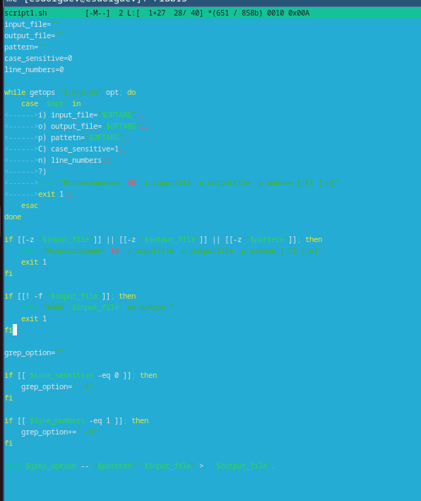
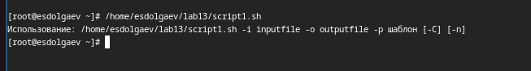
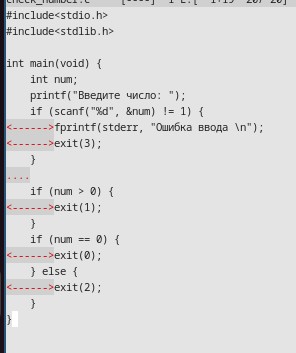
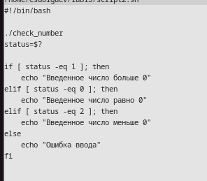
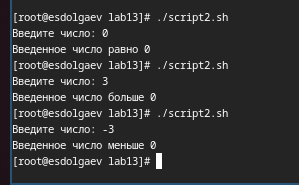
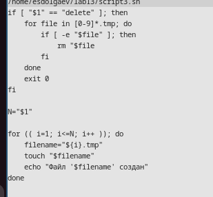
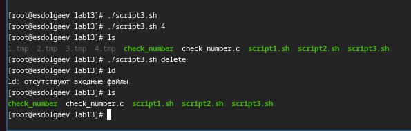
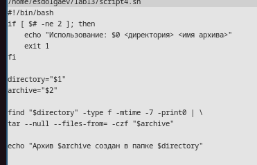
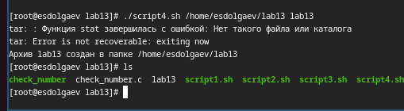

---
## Front matter
lang: ru-RU
title: "Презентация к лабораторной работе №13" 
subtitle: "*Дисциплина: Операционные системы*"
author:
  - Долгаев Е. С.
institute:
  - Российский университет дружбы народов, Москва, Россия
date: 10 мая 2025

## i18n babel
babel-lang: russian
babel-otherlangs: english

## Formatting pdf
toc: false
toc-title: Содержание
slide_level: 2
aspectratio: 169
section-titles: true
theme: metropolis
header-includes:
 - \metroset{progressbar=frametitle,sectionpage=progressbar,numbering=fraction}
---

# Информация

## Докладчик

:::::::::::::: {.columns align=center}
::: {.column width="70%"}

  * Долгаев Евгений Сергеевич
  * студент
  * Российский университет дружбы народов
  * [1132246827@rudn.ru](mailto:1132246827@rudn.ru)
  * <https://github.com/eugerne/study_2024-2024_os-intro.git>

:::
::::::::::::::

# Вводная часть

## Актуальность

- Умение писать скрипты - это мощный инструмент для автоматизации и управления операционной системой

## Цели и задачи

- Изучить основы программирования в оболочке ОС UNIX. Научится писать более сложные командные файлы с использованием логических управляющих конструкций и циклов.

## Материалы и методы

- Виртуальная машина qemu
- Языки программирования bash и C

# Выполнение лабораторной работы

## Процесс выполенния

- Далее в презентации будут показаны скриншоты выполнения работы.

## Задача 1

{#fig:001 width=50%}

## Задача 1

{#fig:002 width=50%}

## Задача 2

{#fig:003 width=50%}

## Задача 2

{#fig:004 width=50%}

## Задача 2

{#fig:005 width=50%}

## Задача 3

{#fig:006 width=50%}

## Задача 3

{#fig:007 width=50%}

## Задача 4

{#fig:008 width=50%}

## Задача 4

{#fig:009 width=50%}

## Результаты

- Таким образом, я научился писать более сложные программы с использованием логических управляющих конструкций и циклов.

