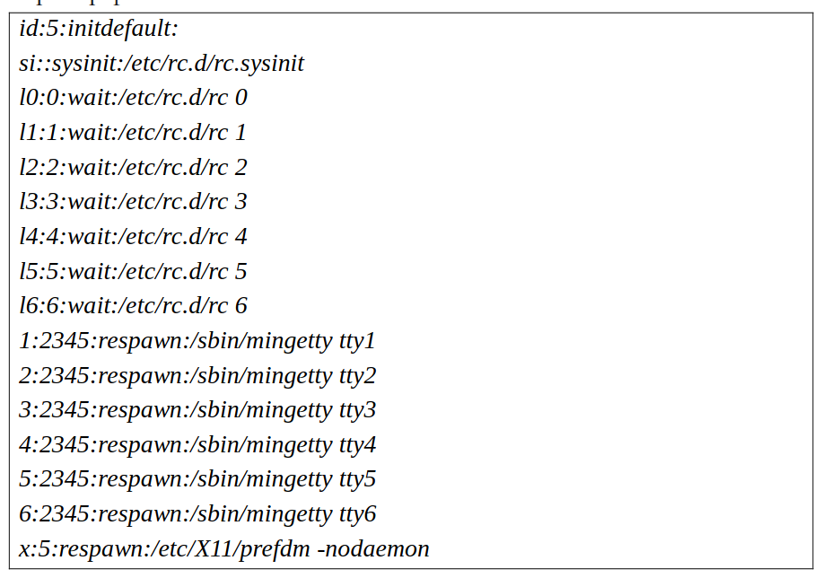

---
## Front matter
lang: ru-RU
title: "Система инициализации ruinit"
subtitle: "Дисциплина: Операционные системы"
author:
  - Долгаев Е. С.
institute:
  - Российский университет дружбы народов, Москва, Россия
date: 02 мая 2025

## i18n babel
babel-lang: russian
babel-otherlangs: english

## Formatting pdf
toc: false
toc-title: Содержание
slide_level: 2
aspectratio: 169
section-titles: true
theme: metropolis
header-includes:
 - \metroset{progressbar=frametitle,sectionpage=progressbar,numbering=fraction}
---

# Информация

## Докладчик

:::::::::::::: {.columns align=center}
::: {.column width="70%"}

  * Долгаев Евгений Сергеевич
  * студент
  * Российский университет дружбы народов
  * [1132246827@rudn.ru](mailto:1132246827@rudn.ru)
  * <https://github.com/eugerne/study_2024-2024_os-intro.git>

:::
::::::::::::::

# Введение

## Подсистема инициализации init

- init (сокращение от англ. initialization — инициализация) — подсистема инициализации в Unix и ряде Unix-подобных систем, которая запускает все остальные процессы
- В процессе загрузки после инициализации ядра, как правило, запускается /sbin/init как первый процесс пользовательского режима, и init отвечает за дальнейшую загрузку системы.

## Пример файла initlab

{#fig:001 width=70%}

# Основная часть

## ruinit

- ruinit — система инициализации. В целом он очень похож на init. Каталоги с уровнями инициализации хранятся в /etc/runit/номер_уровня. Также предоставляет следующие возможности

## ruinit

- демонизация процессов
- журналирование вывода процесса и ротация логов
- запуск, остановка, перезапуск, запрос состояния, управляющие скрипты для init.d
- выключение и запуск сервисов автоматически при появлении новых сервисов в списке либо удалении старых из списка
- возможность ведения нескольких независимых списков сервисов одновременно (например, для каждого пользователя отдельно и для системы в целом)
- удобный API для управления сервисами
- ускоренная загрузка системы по сравнению с обычной системой инициализации

## Использование

- Для дистрибутива Dragora Runit используется как система инициализации по умолчанию и является заменой традиционной Sysvinit. Был реализован в Dragora 2.0 и претендует быть системой запуска по умолчанию в будущих релизах.
- В дистрибутиве Void Linux Runit используется как родная система инициализации и как система управления сервисами.

# Заключение

## Заключение

- Runinit - это кроссплатформенная система инициализации, которая может работать в GNU Linux, Solaris, BSD и MacOS. Это отличная альтернатива для SysV с поддержкой мониторинга состояния служб.
