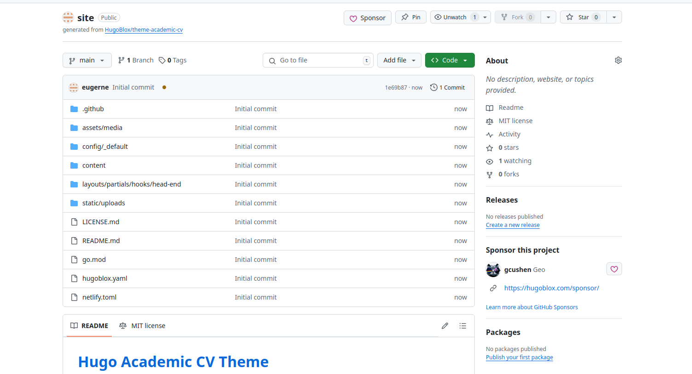
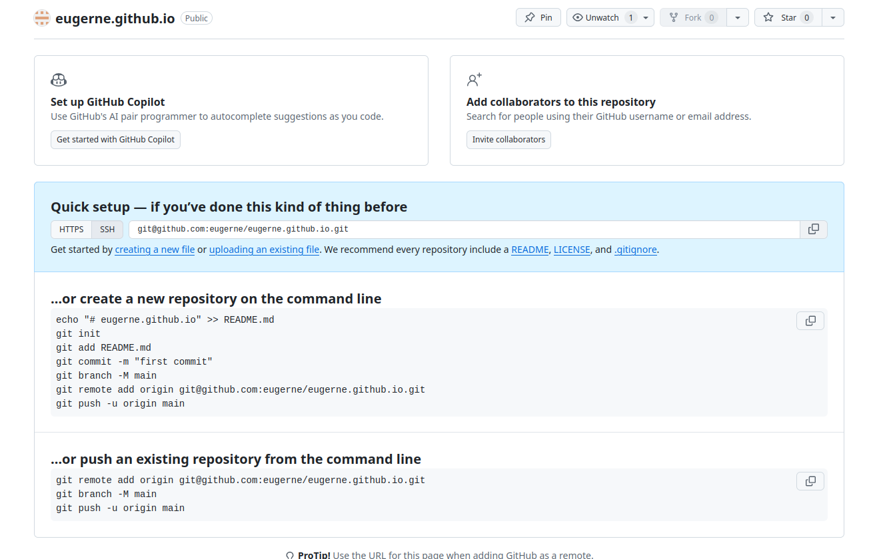

---
## Front matter
lang: ru-RU
title: Презентация по индивидуальному проекту. Этап 1.
author:
  - Долгаев Д. С.
institute:
  - Российский университет дружбы народов, Москва, Россия
date: 08 марта 2025

## i18n babel
babel-lang: russian
babel-otherlangs: english

## Formatting pdf
toc: false
toc-title: Содержание
slide_level: 2
aspectratio: 169
section-titles: true
theme: metropolis
header-includes:
 - \metroset{progressbar=frametitle,sectionpage=progressbar,numbering=fraction}
---

# Информация

## Докладчик

:::::::::::::: {.columns align=center}
::: {.column width="70%"}

  * Долгаев Евгений Сергеевич
  * студент
  * Российский университет дружбы народов
  * [1132246827@rudn.ru](mailto:1132246827@rudn.ru)
  * <https://eugerne.github.io/>

:::
::::::::::::::

# Вводная часть

## Материалы и методы

- Процессор `pandoc` для входного формата Markdown
- Результирующие форматы
	- `pdf`
	- `html`
- Автоматизация процесса создания: `Makefile`

# Создание презентации

## Процессор `pandoc`

- Pandoc: преобразователь текстовых файлов
- Сайт: <https://pandoc.org/>
- Репозиторий: <https://github.com/jgm/pandoc>

## Формат `pdf`

- Использование LaTeX
- Пакет для презентации: [beamer](https://ctan.org/pkg/beamer)
- Тема оформления: `metropolis`

## Код для формата `pdf`

```yaml
slide_level: 2
aspectratio: 169
section-titles: true
theme: metropolis
```

## Формат `html`

- Используется фреймворк [reveal.js](https://revealjs.com/)
- Используется [тема](https://revealjs.com/themes/) `beige`

## Код для формата `html`

- Тема задаётся в файле `Makefile`

```make
REVEALJS_THEME = beige 
```
# Результаты

## Получающиеся форматы

- Полученный `pdf`-файл можно демонстрировать в любой программе просмотра `pdf`
- Полученный `html`-файл содержит в себе все ресурсы: изображения, css, скрипты

# Элементы презентации

## Актуальность

- Создание визитной карточки в формате веб-сайта для наглядного представления информации о научном работнике.

## Цели и задачи

- Быстрое развертывание сайта на GitHub Pages с помощью генератора статического html Hugo.
- Размещение на Github pages заготовки для персонального сайта.
   * Установить необходимое программное обеспечение.
   * Скачать шаблон темы сайта.
   * Разместить его на хостинге git.
   * Установить параметр для URLs сайта.
   * Разместить заготовку сайта на Github pages.


## Материалы и методы

- Hugo Extended (<https://github.com/gohugoio/hugo/releases>)
- язык программирования GO

## Содержание исследования

- Лабораторная работа проходит в 3 этапа.

1) Установка необходимого ПО.
2) Подготовка макета зайта через шаблон.
3) Публикация заготовки сайта на Gtihub pages.

## Содержание исследования

- Установить Hugo Extended и Go можно через терминал с помощью команды:

```
sudo apt install golang-go hugo (эта команда работает на дистрибутиве ОС Linux Ubuntu, для других дистрибутивов она будет отличаться)
```

## Содержание исследования

- Далее нужно будет создать два репозитория на Github. Первый с помощью шаблона <https://github.com/wowchemy/starter-hugo-academic>, а второму нужно будет задать имя `username.github.io`- это нужно, чтобы после получить ссылку на наш сайт

## Содержание исследования

{width=50%}

## Содержание исследования

{width=50%}

## Содержание исследования

- После создания репизитории нужно скопировать на свой компьютер. Я сделал это в папку: ~/work/blog.

- Следующим шагом будет создание подмодуль public в папке блога командам:

```
cd ~/work/blog/site (site - папка-репозиторий)
git submodule add git@github.com:username/username.github.io.git public
```

## Содержание исследования

- Это делается, чтобы связать сайт с репозиторием.

- В завершении лабораторной работы нужно будет сгенерить проект:

```
cd ~/work/blog/site
hugo
```

## Содержание исследования

И зафиксировать изменения и отправить контент на GitHub:

```
cd public
git add .
git commit -am "rebuilding site $(date)"
git push origin master
```

После чего сайт появится в сети.	

## Результаты

- Как итог мы получаем заготовку для персонального сайта научного работника.
