---
## Front matter
title: "Отчет по выполнению индивидуального проекта. Этап 1"
author: "Евгений Сергеевич Долгаев"

## Generic otions
lang: ru-RU
toc-title: "Содержание"

## Bibliography
bibliography: bib/cite.bib
csl: pandoc/csl/gost-r-7-0-5-2008-numeric.csl

## Pdf output format
toc: true # Table of contents
toc-depth: 2
lof: true # List of figures
lot: true # List of tables
fontsize: 12pt
linestretch: 1.5
papersize: a4
documentclass: scrreprt
## I18n polyglossia
polyglossia-lang:
  name: russian
  options:
	- spelling=modern
	- babelshorthands=true
polyglossia-otherlangs:
  name: english
## I18n babel
babel-lang: russian
babel-otherlangs: english
## Fonts
mainfont: IBM Plex Serif
romanfont: IBM Plex Serif
sansfont: IBM Plex Sans
monofont: IBM Plex Mono
mathfont: STIX Two Math
mainfontoptions: Ligatures=Common,Ligatures=TeX,Scale=0.94
romanfontoptions: Ligatures=Common,Ligatures=TeX,Scale=0.94
sansfontoptions: Ligatures=Common,Ligatures=TeX,Scale=MatchLowercase,Scale=0.94
monofontoptions: Scale=MatchLowercase,Scale=0.94,FakeStretch=0.9
mathfontoptions:
## Biblatex
biblatex: true
biblio-style: "gost-numeric"
biblatexoptions:
  - parentracker=true
  - backend=biber
  - hyperref=auto
  - language=auto
  - autolang=other*
  - citestyle=gost-numeric
## Pandoc-crossref LaTeX customization
figureTitle: "Рис."
tableTitle: "Таблица"
listingTitle: "Листинг"
lofTitle: "Список иллюстраций"
lotTitle: "Список таблиц"
lolTitle: "Листинги"
## Misc options
indent: true
header-includes:
  - \usepackage{indentfirst}
  - \usepackage{float} # keep figures where there are in the text
  - \floatplacement{figure}{H} # keep figures where there are in the text
---

# Цель работы

Быстрое развертывание сайта на GitHub Pages с помощью генератора статического html Hugo.

# Задание

- Размещение на Github pages заготовки для персонального сайта.
   * Установить необходимое программное обеспечение.
   * Скачать шаблон темы сайта.
   * Разместить его на хостинге git.
   * Установить параметр для URLs сайта.
   * Разместить заготовку сайта на Github pages.

# Выполнение лабораторной работы

Для начала необходимо установить програмное обеспечение для генерации сайта. Нам нужны Hugo Extended и GO  (рис. [-@fig:001], [-@fig:002]).

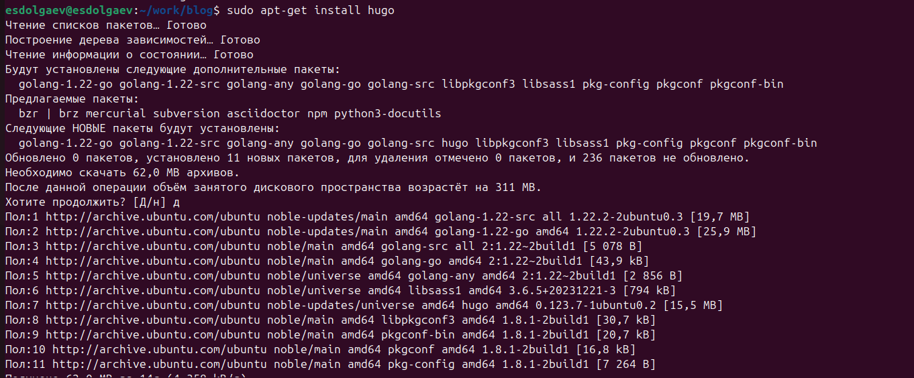{#fig:001 width=70%}

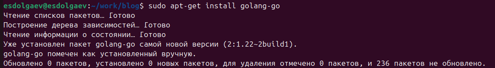{#fig:002 width=70%}

Далее необходимо создать репозиторий по следующему шаблону: <https://github.com/HugoBlox/theme-academic-cv>. С помощью него мы будем создавать сайт (рис. [-@fig:003]).

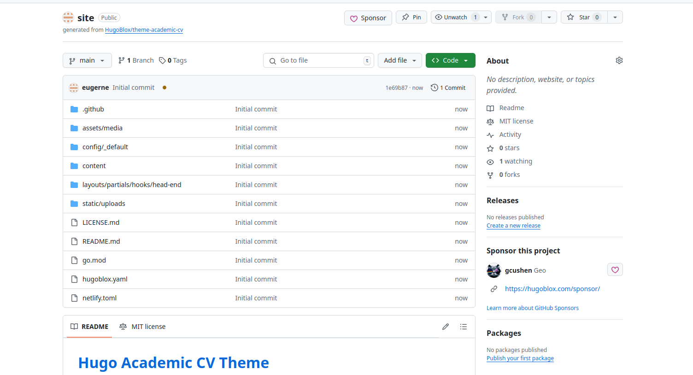{#fig:003 width=70%}

Скопируем репизиторий к себе на компьютер. Пусть он будет храниться в каталоге: ~/work/blog. Создадим этот каталог с помощью `mkdir ~/work/blog`(рис. [-@fig:004]). 

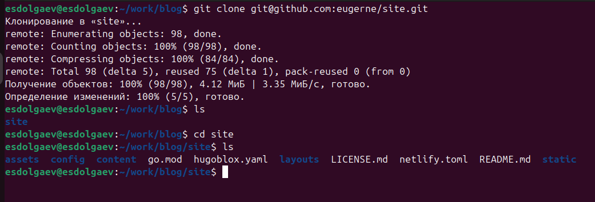{#fig:004 width=70%}

Перейдем в каталог site, в котором храниться репозиторий и запустим команду `hugo server`(рис. [-@fig:005]).

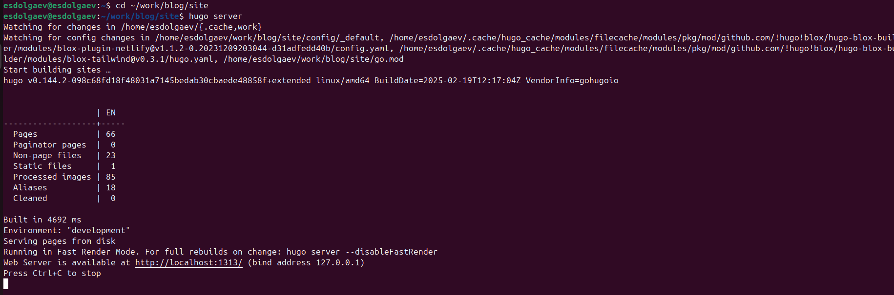{#fig:005 width=70%}

Перейдем по ссылке и увидим макет будущего сайта (рис. [-@fig:006]).

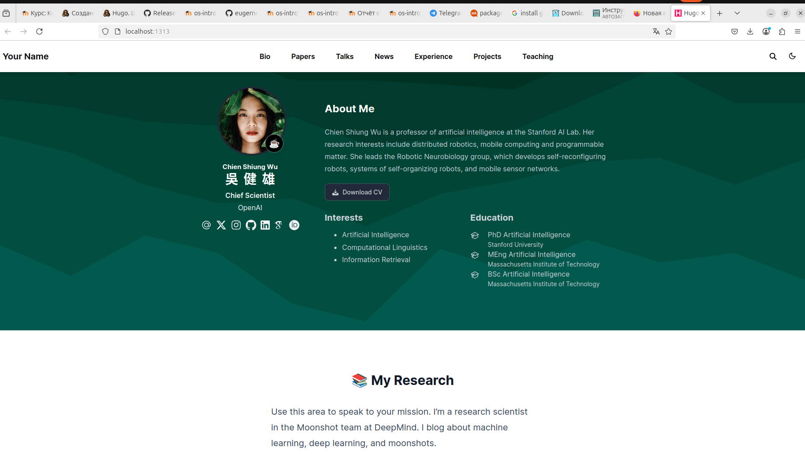{#fig:006 width=70%}

Создадим ещё один репозиторий с именем `username.github.io`. В моём случае вместо `username` нужно написать `eugerne` (рис. [-@fig:007]).

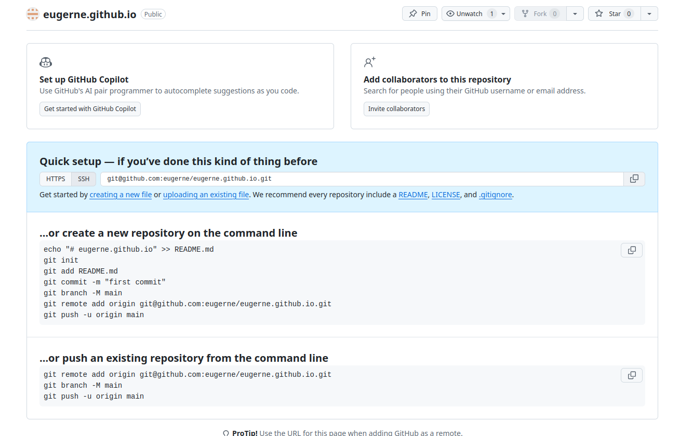{#fig:007 width=70%}

Скопируем его в каталог: ~/work/blog (рис. [-@fig:008]).

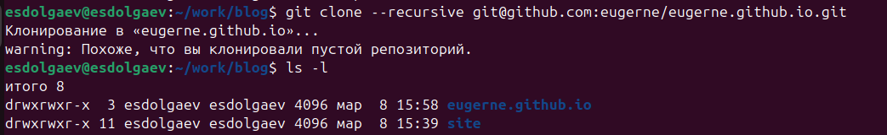{#fig:008 width=70%}

Создадим ветку main (рис. [-@fig:009]).

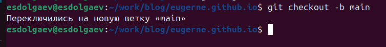{#fig:009 width=70%}

Создадим файл README.md и загрузим всё на github (рис. [-@fig:010]).

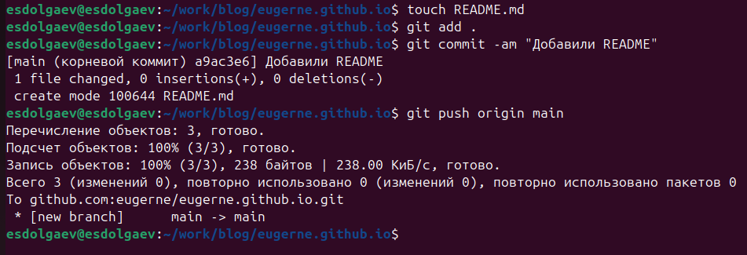{#fig:010 width=70%}

Свяжем созданный репозиторий с папкой public, с помощью которой в будущем будем настраивать сайт. И проверим всё ли связано. (рис. [-@fig:011], [-@fig:012]).

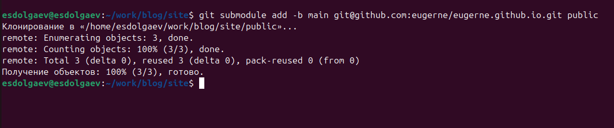{#fig:011 width=70%}

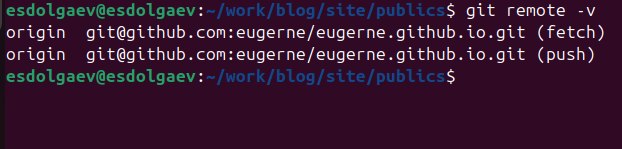{#fig:012 width=70%}

Снова добавим всё на github (рис. [-@fig:013], [-@fig:014]).

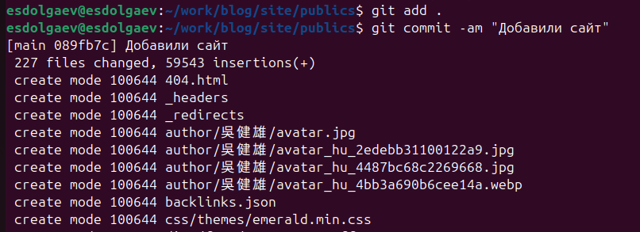{#fig:013 width=70%}

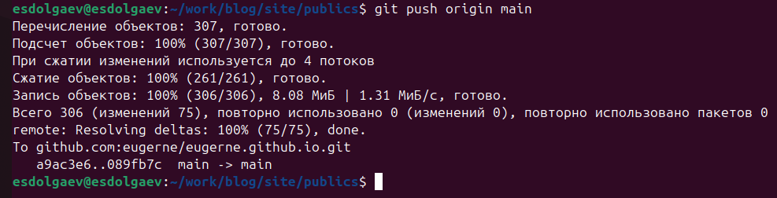{#fig:014 width=70%}

Репозиторий будет выглядеть вот так (рис. [-@fig:015]):

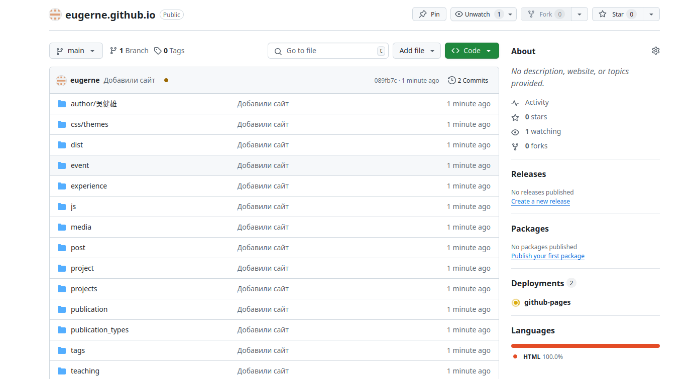{#fig:015 width=70%}

Теперь сайт появился в сети (рис. [-@fig:016]).

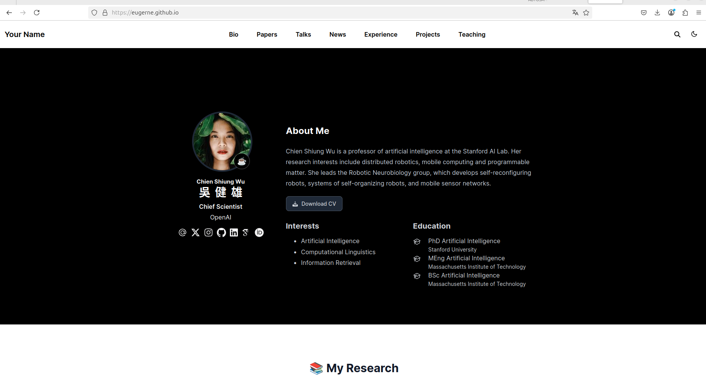{#fig:016 width=70%}

# Выводы

Как итог мы получаем заготовку для персонального сайта научного работника.

# Список литературы{.unnumbered}

::: {#refs}
:::
