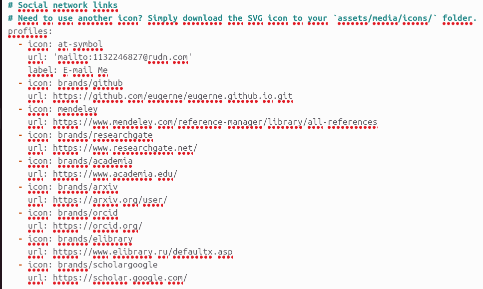
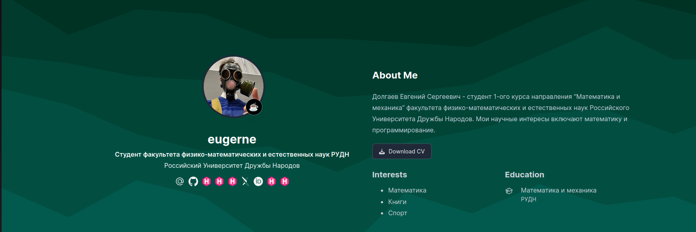
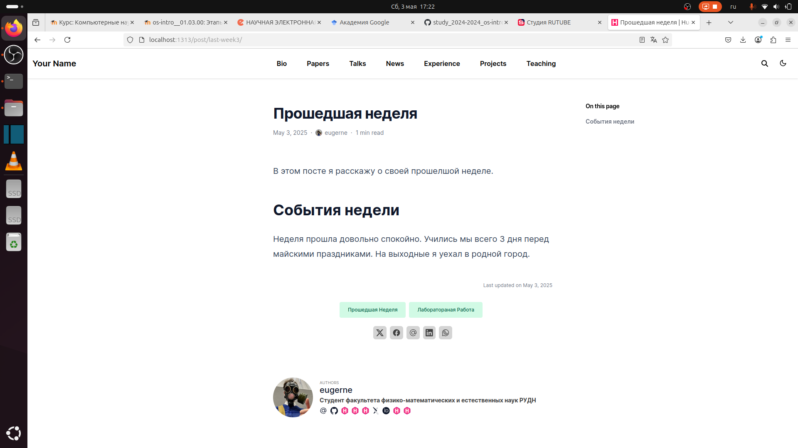
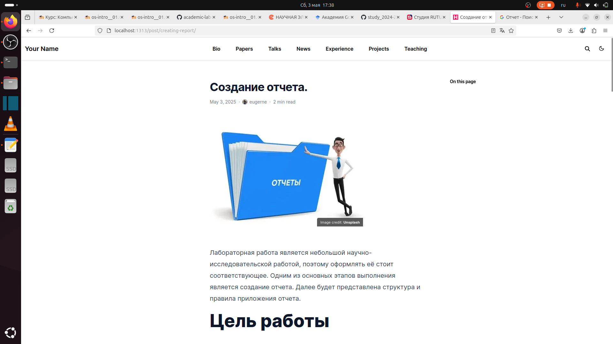

---
## Front matter
lang: ru-RU
title: "Индивидуальный проект. Этап 4"
subtitle: "*Дисциплина: Операционные системы*"
author:
  - Долгаев Е. С.
institute:
  - Российский университет дружбы народов, Москва, Россия
date: 03 мая 2025

## i18n babel
babel-lang: russian
babel-otherlangs: english

## Formatting pdf
toc: false
toc-title: Содержание
slide_level: 2
aspectratio: 169
section-titles: true
theme: metropolis
header-includes:
 - \metroset{progressbar=frametitle,sectionpage=progressbar,numbering=fraction}
---

# Информация

## Докладчик

:::::::::::::: {.columns align=center}
::: {.column width="70%"}

  * Долгаев Евгений Сергеевич
  * студент
  * Российский университет дружбы народов
  * [1132246827@rudn.ru](mailto:1132246827@rudn.ru)
  * <https://github.com/eugerne/study_2024-2024_os-intro.git>

:::
::::::::::::::

# Вводная часть

## Актуальность

- Создание визитной карточки в формате веб-сайта для наглядного представления информации о научном работнике.

## Цели и задачи

- Создать персональный сайт научного работника.

# Индивидуальный проект

## Выполнение работы

- Работа начинается с регистрации на ресурсах указанных в разделе "Задания" и размещения ссылок на них. Я разместил их в описании научного работника.

## Выполнение работы

{#fig:001 width=70%}

## Выполнение работы

{#fig:002 width=70%}

## Выполнение работы

- Далее нужно было сделать два поста: о прошедшей неделе и на тему по выбору.

{#fig:003 width=70%}

## Выполнение работы

{#fig:004 width=70%}

## Результаты

- Таким образом, мы дополнили наш сайт научного работника новыми ссылками и двумя постами.

