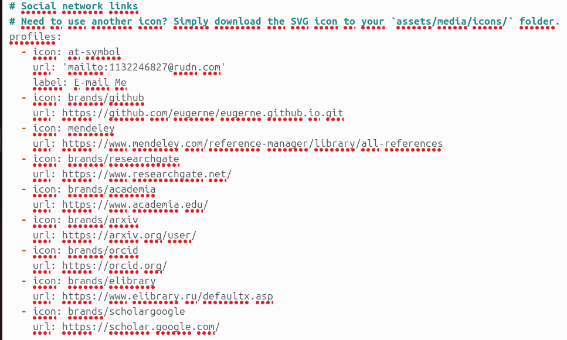

---
## Front matter
title: "Отчет по индивидуальному проету. Этап 4."
subtitle: "*Дисциплина: Операционные системы*"
author: "Долгаев Евгений НММбд-01-24"

## Generic otions
lang: ru-RU
toc-title: "Содержание"

## Bibliography
bibliography: bib/cite.bib
csl: pandoc/csl/gost-r-7-0-5-2008-numeric.csl

## Pdf output format
toc: true # Table of contents
toc-depth: 2
lof: true # List of figures
lot: true # List of tables
fontsize: 12pt
linestretch: 1.5
papersize: a4
documentclass: scrreprt
## I18n polyglossia
polyglossia-lang:
  name: russian
  options:
	- spelling=modern
	- babelshorthands=true
polyglossia-otherlangs:
  name: english
## I18n babel
babel-lang: russian
babel-otherlangs: english
## Fonts
mainfont: IBM Plex Serif
romanfont: IBM Plex Serif
sansfont: IBM Plex Sans
monofont: IBM Plex Mono
mathfont: STIX Two Math
mainfontoptions: Ligatures=Common,Ligatures=TeX,Scale=0.94
romanfontoptions: Ligatures=Common,Ligatures=TeX,Scale=0.94
sansfontoptions: Ligatures=Common,Ligatures=TeX,Scale=MatchLowercase,Scale=0.94
monofontoptions: Scale=MatchLowercase,Scale=0.94,FakeStretch=0.9
mathfontoptions:
## Biblatex
biblatex: true
biblio-style: "gost-numeric"
biblatexoptions:
  - parentracker=true
  - backend=biber
  - hyperref=auto
  - language=auto
  - autolang=other*
  - citestyle=gost-numeric
## Pandoc-crossref LaTeX customization
figureTitle: "Рис."
tableTitle: "Таблица"
listingTitle: "Листинг"
lofTitle: "Список иллюстраций"
lotTitle: "Список таблиц"
lolTitle: "Листинги"
## Misc options
indent: true
header-includes:
  - \usepackage{indentfirst}
  - \usepackage{float} # keep figures where there are in the text
  - \floatplacement{figure}{H} # keep figures where there are in the text
---

# Цель работы

Создать персональный сайт научного работника.

# Задание

- Зарегистрироваться на соответствующих ресурсах и разместить на них ссылки на сайте:
	* eLibrary : https://elibrary.ru/;
	* Google Scholar : https://scholar.google.com/;
	* ORCID : https://orcid.org/;
	* Mendeley : https://www.mendeley.com
	* ResearchGate : https://www.researchgate.net/;
	* Academia.edu : https://www.academia.edu/;
	* arXiv : https://arxiv.org/;
	* github : https://github.com/.
- Сделать пост по прошедшей неделе.
- Добавить пост на тему по выбору.

# Выполнение работы

Работа начинается с регистрации на ресурсах указанных в разделе "Задания" и размещения ссылок на них. Я разместил их в описании научного работника (рис. [-@fig:001], [-@fig:002]).

{#fig:001 width=70%}

{#fig:002 width=70%}

Далее нужно было сделать два поста: о прошедшей неделе и на тему по выбору (рис. [-@fig:003], [-@fig:004]).

{#fig:003 width=70%}

{#fig:004 width=70%}

# Выводы

Таким образом, мы дополнили наш сайт научного работника новыми ссылками и двумя постами.

